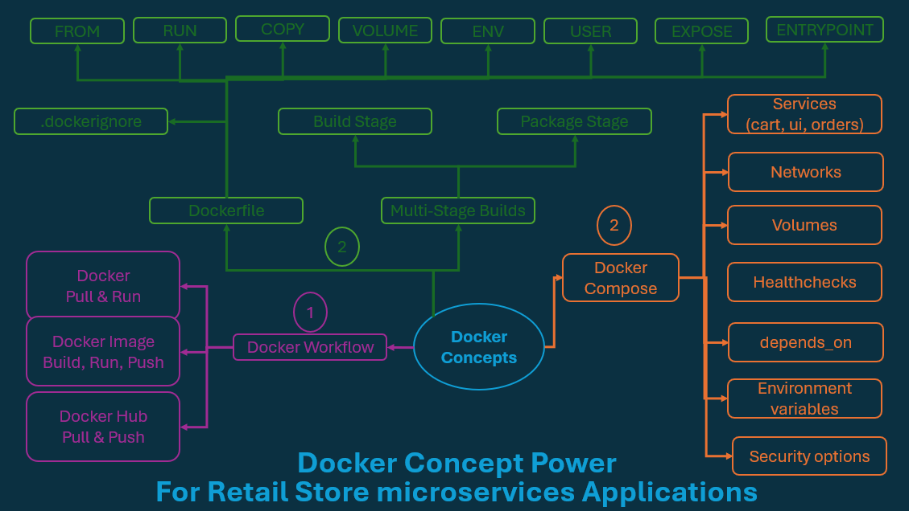

# Docker commands

## After installing Docker




```sh
docker version
Client: Docker Engine - Community
 Version:           29.5.2
 API version:       1.54
 Go version:        go1.26.3
 Git commit:        79eb04c
 Built:             Wed May 20 14:41:26 2026
 OS/Arch:           linux/amd64
 Context:           default

Server: Docker Engine - Community
 Engine:
  Version:          29.5.2
  API version:      1.54 (minimum version 1.40)
  Go version:       go1.26.3
  Git commit:       568f755
  Built:            Wed May 20 14:37:33 2026
  OS/Arch:          linux/amd64
  Experimental:     false
 containerd:
  Version:          v2.2.4
  GitCommit:        193637f7ee8ae5f5aa5248f49e7baa3e6164966e
 runc:
  Version:          1.3.5
  GitCommit:        v1.3.5-0-g488fc13e
 docker-init:
  Version:          0.19.0
  GitCommit:        de40ad0
```

```sh
sudo docker run hello-world

Hello from Docker!
This message shows that your installation appears to be working correctly.

To generate this message, Docker took the following steps:
 1. The Docker client contacted the Docker daemon.
 2. The Docker daemon pulled the "hello-world" image from the Docker Hub.
    (amd64)
 3. The Docker daemon created a new container from that image which runs the
    executable that produces the output you are currently reading.
 4. The Docker daemon streamed that output to the Docker client, which sent it
    to your terminal.

To try something more ambitious, you can run an Ubuntu container with:
 $ docker run -it ubuntu bash

Share images, automate workflows, and more with a free Docker ID:
 https://hub.docker.com/

For more examples and ideas, visit:
 https://docs.docker.com/get-started/

```

## Docker Terminology

```sh
docker version
Client: Docker Engine - Community
 Version:           29.5.2
 API version:       1.54
 Go version:        go1.26.3
 Git commit:        79eb04c
 Built:             Wed May 20 14:41:26 2026
 OS/Arch:           linux/amd64
 Context:           default

Server: Docker Engine - Community
 Engine:
  Version:          29.5.2
  API version:      1.54 (minimum version 1.40)
  Go version:       go1.26.3
  Git commit:       568f755
  Built:            Wed May 20 14:37:33 2026
  OS/Arch:          linux/amd64
  Experimental:     false
 containerd:
  Version:          v2.2.4
  GitCommit:        193637f7ee8ae5f5aa5248f49e7baa3e6164966e
 runc:
  Version:          1.3.5
  GitCommit:        v1.3.5-0-g488fc13e
 docker-init:
  Version:          0.19.0
  GitCommit:        de40ad0
```


```sh

```


```sh

```


```sh

```


```sh

```


```sh

```


```sh

```


```sh

```


```sh

```


```sh

```


```sh

```


```sh

```


```sh

```


```sh

```


```sh

```


```sh

```


```sh

```


```sh

```


```sh

```


```sh

```


```sh

```


```sh

```


