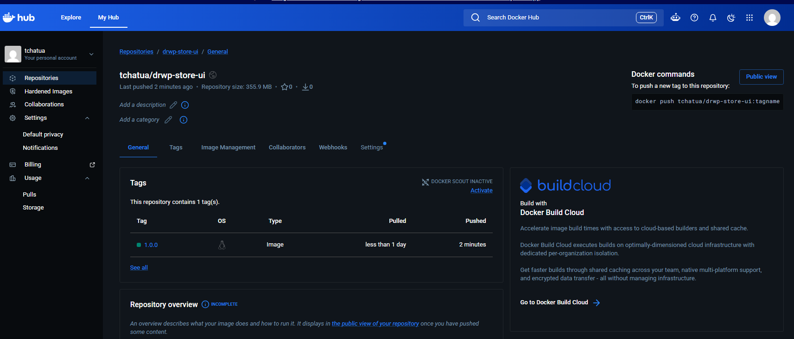

# Build Docker Image and Push to Docker hub

## Docker Hub Account

> https://hub.docker.com/repositories/tchatua

```sh
docker login

USING WEB-BASED LOGIN

i Info → To sign in with credentials on the command line, use 'docker login -u <username>'


Your one-time device confirmation code is: JDRR-WSDP
Press ENTER to open your browser or submit your device code here: https://login.docker.com/activate

Waiting for authentication in the browser…

WARNING! Your credentials are stored unencrypted in '/home/ec2-user/.docker/config.json'.
Configure a credential helper to remove this warning. See
https://docs.docker.com/go/credential-store/

Login Succeeded
```

> Install wget
```sh
sudo dnf update -y
sudo dnf install wget -y
sudo dnf install unzip -y
sudo dnf install git -y

```

```sh
wget https://github.com/aws-containers/retail-store-sample-app/archive/refs/tags/v1.2.4.zip
--2026-06-01 02:28:03--  https://github.com/aws-containers/retail-store-sample-app/archive/refs/tags/v1.2.4.zip
Resolving github.com (github.com)... 140.82.112.3
Connecting to github.com (github.com)|140.82.112.3|:443... connected.
HTTP request sent, awaiting response... 302 Found
Location: https://codeload.github.com/aws-containers/retail-store-sample-app/zip/refs/tags/v1.2.4 [following]
--2026-06-01 02:28:03--  https://codeload.github.com/aws-containers/retail-store-sample-app/zip/refs/tags/v1.2.4
Resolving codeload.github.com (codeload.github.com)... 140.82.113.10
Connecting to codeload.github.com (codeload.github.com)|140.82.113.10|:443... connected.
HTTP request sent, awaiting response... 200 OK
Length: unspecified [application/zip]
Saving to: ‘v1.2.4.zip’

v1.2.4.zip                            [  <=>                                                        ]   7.04M  19.6MB/s    in 0.4s

2026-06-01 02:28:04 (19.6 MB/s) - ‘v1.2.4.zip’ saved [7387444]

```

```Dockerfile
# Build Stage
FROM public.ecr.aws/amazonlinux/amazonlinux:2023 AS build-env

# We tell DNF not to install Recommends and Suggests packages, keeping our
# installed set of packages as minimal as possible.
RUN dnf --setopt=install_weak_deps=False install -q -y \
    maven \
    java-21-amazon-corretto-headless \
    which \
    tar \
    gzip \
    && \
    dnf clean all

VOLUME /tmp
WORKDIR /

COPY .mvn .mvn
COPY mvnw .
COPY pom.xml .

RUN ./mvnw dependency:go-offline -B -q

COPY ./src ./src

RUN ./mvnw -DskipTests package -q && \
    mv /target/ui-0.0.1-SNAPSHOT.jar /app.jar

# Package Stage
FROM public.ecr.aws/amazonlinux/amazonlinux:2023

# We tell DNF not to install Recommends and Suggests packages, which are
# weak dependencies in DNF terminology, thus keeping our installed set of
# packages as minimal as possible.
RUN dnf --setopt=install_weak_deps=False install -q -y \
    java-21-amazon-corretto-headless \
    shadow-utils \
    && \
    dnf clean all

# use curl-full to use "telnet://" scheme
# https://docs.aws.amazon.com/linux/al2023/ug/curl-minimal.html
RUN dnf -q -y swap libcurl-minimal libcurl-full \
    && dnf -q -y swap curl-minimal curl-full

ENV APPUSER=appuser
ENV APPUID=1000
ENV APPGID=1000

RUN useradd \
    --home "/app" \
    --create-home \
    --user-group \
    --uid "$APPUID" \
    "$APPUSER"

ENV JAVA_TOOL_OPTIONS=
ENV SPRING_PROFILES_ACTIVE=prod

WORKDIR /app
USER appuser

COPY ./ATTRIBUTION.md ./LICENSES.md
COPY --chown=appuser:appuser --from=build-env /app.jar .

EXPOSE 8080

ENTRYPOINT ["sh", "-c", "java $JAVA_OPTS -jar /app/app.jar"]
```

## Build Docker image

```sh
docker build -t drwp-store-ui:1.0.0 .
[+] Building 148.9s (19/19) FINISHED                                                      docker:default
 => [internal] load build definition from Dockerfile                                                0.0s
 => => transferring dockerfile: 1.69kB                                                              0.0s
 => [internal] load metadata for public.ecr.aws/amazonlinux/amazonlinux:2023                        0.0s
 => [internal] load .dockerignore                                                                   0.0s
 => => transferring context: 180B                                                                   0.0s
 => [internal] load build context                                                                   0.1s
 => => transferring context: 34.20kB                                                                0.1s
 => CACHED [build-env 1/9] FROM public.ecr.aws/amazonlinux/amazonlinux:2023@sha256:0179112c7edfde7  0.0s
 => => resolve public.ecr.aws/amazonlinux/amazonlinux:2023@sha256:0179112c7edfde771da73dd5cd50ddd5  0.0s
 => [build-env 2/9] RUN dnf --setopt=install_weak_deps=False install -q -y     maven     java-21-  53.5s
 => [stage-1 2/7] RUN dnf --setopt=install_weak_deps=False install -q -y     java-21-amazon-corre  45.9s
 => [stage-1 3/7] RUN dnf -q -y swap libcurl-minimal libcurl-full     && dnf -q -y swap curl-mini  28.4s
 => [build-env 3/9] COPY .mvn .mvn                                                                  0.1s
 => [build-env 4/9] COPY mvnw .                                                                     0.0s
 => [build-env 5/9] COPY pom.xml .                                                                  0.0s
 => [build-env 6/9] RUN ./mvnw dependency:go-offline -B -q                                         52.0s
 => [stage-1 4/7] RUN useradd     --home "/app"     --create-home     --user-group     --uid "1000  0.4s
 => [stage-1 5/7] WORKDIR /app                                                                      0.1s
 => [stage-1 6/7] COPY ./ATTRIBUTION.md ./LICENSES.md                                               0.1s
 => [build-env 7/9] COPY ./src ./src                                                                0.3s
 => [build-env 8/9] RUN ./mvnw -DskipTests package -q &&     mv /target/ui-0.0.1-SNAPSHOT.jar /ap  18.7s
 => [stage-1 7/7] COPY --chown=appuser:appuser --from=build-env /app.jar .                          0.1s
 => exporting to image                                                                             23.2s
 => => exporting layers                                                                            17.9s
 => => exporting manifest sha256:1fd2361789394f1a2be30c0b9595cedd2e3c0f2e64e792056d9e15753cb3c9e3   0.0s
 => => exporting config sha256:bbf9f350c57f7c04409d9ccc0a404373ff183e45de5ee1fe2c4ad16b75e39086     0.0s
 => => exporting attestation manifest sha256:4ee10e6c3ffb4523aa470c9bd552bc01a25fdfd95b94a07f8288a  0.0s
 => => exporting manifest list sha256:10936774f09612222c679742363e1d183a3416be73c1b559c3a46113fad1  0.0s
 => => naming to docker.io/library/drwp-store-ui:1.0.0                                              0.0s
 => => unpacking to docker.io/library/drwp-store-ui:1.0.0                                           5.2s


[ec2-user@ansiblecontroller ui]$ docker images
IMAGE                                         ID             DISK USAGE   CONTENT SIZE   EXTRA
drwp-store-ui:1.0.0                           10936774f096       1.07GB          373MB
```

## Run Docker container - Tag and Push Docker image to Docker Hub

```sh
# Run the Docker container and verify
docker run --name <CONTAINER-NAME> -p <HOST_PORT>:<CONTAINER_PORT> -d <IMAGE_NAME>:<TAG>
```

```sh
docker run --name appui -p 8089:8080 -d drwp-store-ui:1.0.0
8d8c090179c7ef7c62002e4255daba401cbf9ef7664ac9bf0864a5e3cc6d21a1

docker ps
CONTAINER ID   IMAGE                 COMMAND                  CREATED         STATUS         PORTS                                         NAMES
8d8c090179c7   drwp-store-ui:1.0.0   "sh -c 'java $JAVA_O…"   2 minutes ago   Up 2 minutes   0.0.0.0:8089->8080/tcp, [::]:8089->8080/tcp   appui
```

## Tag and Push Docker image to Docker Hub

```sh
docker login

```

```sh
docker login
Authenticating with existing credentials... [Username: tchatua]

i Info → To login with a different account, run 'docker logout' followed by 'docker login'


Login Succeeded
```

```sh
docker images
IMAGE                                        ID             DISK USAGE   CONTENT SIZE   EXTRA
drwp-store-ui:1.0.0                          10936774f096       1.07GB          373MB    U

docker tag drwp-store-ui:1.0.0 tchatua/drwp-store-ui:1.0.0

docker images
IMAGE                                        ID             DISK USAGE   CONTENT SIZE   EXTRA
drwp-store-ui:1.0.0                          10936774f096       1.07GB          373MB    U
tchatua/drwp-store-ui:1.0.0                  10936774f096       1.07GB          373MB    U

# ---------------------------------------------------------------------------------------------------------
docker push tchatua/drwp-store-ui:1.0.0
The push refers to repository [docker.io/tchatua/drwp-store-ui]
4f4fb700ef54: Mounted from stacksimplify/retail-store-sample-ui
25040210d6ef: Pushed
c7345fb8c651: Pushed
0421a40cd7cc: Pushed
ff1ac7564546: Pushed
fedc2ba9f4e8: Pushed
734e942c63b9: Pushed
2d4ff03a49c8: Pushed
1.0.0: digest: sha256:10936774f09612222c679742363e1d183a3416be73c1b559c3a46113fad120dc size: 856
```


