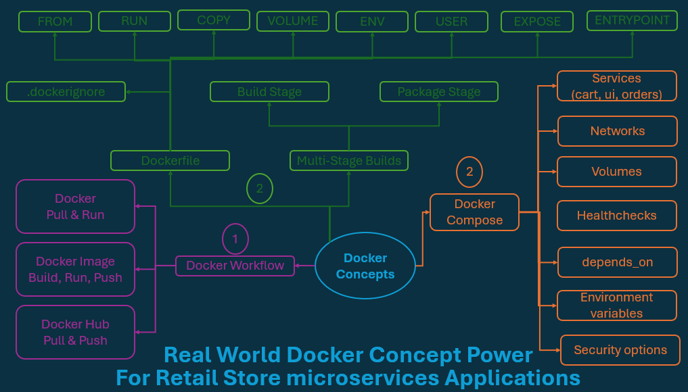
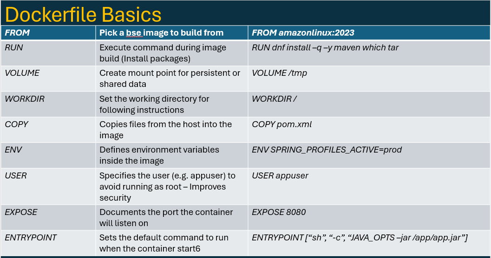
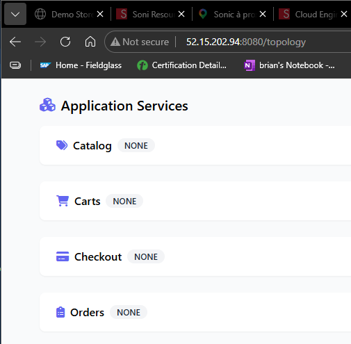

# Dockerfile




## Will be develop here:

- ✅ Write a **multi-stage Dockerfile** using Amazon Linux 2023 as the base image
- ✅ Build and package a Java (Spring Boot) app using **Maven**
- ✅ Secure your container by creating a **non-root user**
- ✅ Use **.dockerignore** to keep the image clean and fast to build
- ✅ Understand **Docker layer caching** and how to structure builds efficiently
- ✅ Validate my image using **docker exec** and inspect the container contents
- ✅ Rebuild from scratch using **--no-cache**
- ✅ Clean up all Docker build artifacts and **system clutter (prune)**
- ✅ Grasp the “why” behind multi-stage builds for smaller, safer, and faster images

## Understand Dockerfile instructions



## Multi-Stage Docker Builds

## Remove ALL Build Cache (including unused images and layers)

> This will clear all cache layers, including those from old builds or untagged images.

- Add -f to confirm without prompt:

```sh
docker builder prune --all
WARNING! This will remove all build cache. Are you sure you want to continue? [y/N] y
ID                                              RECLAIMABLE     SIZE            LAST ACCESSED
ju29sqx94a549khs048g8o5m2*                      true            0B              15 hours ago
y7754h8f5xynalma6gabmswog*                      true    4.096kB         8 hours ago
ycuif5p96hmazdpdynlt8jbba*                      true    4.096kB         15 hours ago
685e5u1veuvt9emibwx8d3k9b*                      true    83.65MB         8 hours ago
w0ik1ujx3biest2hbwzrff3vm*                      true    3.662MB         15 hours ago
ppsckktemh33xpr47klslizv3*                      true    4.096kB         8 hours ago
w1m2l9drhdxauxr4jft2iusym*                      true    5.431MB         8 hours ago
4jbyxn6t1btm6yumj17q7x80t                       true    117MB           8 hours ago
641h88gp8rdod6sqzuwo8nl9o                       true    3.092MB         8 hours ago
pkyjfgm6pc8bacakc0i5dn9k2                       true    2.358MB         8 hours ago
15hqdrjq335v0z2v3z69miria                       true    32B             8 hours ago
k0dimaeqv3xzpudoga1tmpu2n                       true    235.5MB         8 hours ago
d71hrqsjdl6rpnz8b3kihhsp6                       true    12.29kB         8 hours ago
ory27s2jfveflm7osbzi0c82i                       true    58.86kB         8 hours ago
p26r85nr1qahrzim26qr10a8o                       true    12.29kB         8 hours ago
4z9zi3nozvq5lwdm5lzz883l2                       true    283.1MB         8 hours ago
xp9htxtvb3l33ucczm86nmdze                       true    450.3MB         8 hours ago
wpjz9zkmo2j8p87loac0ycs6l                       true    4.096kB         8 hours ago
kc2v9otgde1ryiacn77pftr39                       true    570.8MB         8 hours ago
omsfakms6znlpfenkqfm2l1zr                       true    217.6MB         8 hours ago
Total:  1.972GB
```

## Docker build cache, Builder Prune, and System Prune

```sh
docker build -t retail-ui:9.0.0 .
[+] Building 146.1s (19/19) FINISHED                                                            docker:default
 => [internal] load build definition from Dockerfile                                                      0.0s
 => => transferring dockerfile: 1.69kB                                                                    0.0s
 => [internal] load metadata for public.ecr.aws/amazonlinux/amazonlinux:2023                              0.4s
 => [internal] load .dockerignore                                                                         0.0s
 => => transferring context: 180B                                                                         0.0s
 => [internal] load build context                                                                         0.3s
 => => transferring context: 5.02MB                                                                       0.2s
 => [build-env 1/9] FROM public.ecr.aws/amazonlinux/amazonlinux:2023@sha256:0179112c7edfde771da73dd5cd50  0.1s
 => => resolve public.ecr.aws/amazonlinux/amazonlinux:2023@sha256:0179112c7edfde771da73dd5cd50ddd5a2f0e9  0.0s
 => [stage-1 2/7] RUN dnf --setopt=install_weak_deps=False install -q -y     java-21-amazon-corretto-he  41.6s
 => [build-env 2/9] RUN dnf --setopt=install_weak_deps=False install -q -y     maven     java-21-amazon  50.2s
 => [stage-1 3/7] RUN dnf -q -y swap libcurl-minimal libcurl-full     && dnf -q -y swap curl-minimal cu  28.2s
 => [build-env 3/9] COPY .mvn .mvn                                                                        0.1s
 => [build-env 4/9] COPY mvnw .                                                                           0.0s
 => [build-env 5/9] COPY pom.xml .                                                                        0.0s
 => [build-env 6/9] RUN ./mvnw dependency:go-offline -B -q                                               51.6s
 => [stage-1 4/7] RUN useradd     --home "/app"     --create-home     --user-group     --uid "1000"       0.5s
 => [stage-1 5/7] WORKDIR /app                                                                            0.1s
 => [stage-1 6/7] COPY ./ATTRIBUTION.md ./LICENSES.md                                                     0.0s
 => [build-env 7/9] COPY ./src ./src                                                                      0.2s
 => [build-env 8/9] RUN ./mvnw -DskipTests package -q &&     mv /target/ui-0.0.1-SNAPSHOT.jar /app.jar   19.1s
 => [stage-1 7/7] COPY --chown=appuser:appuser --from=build-env /app.jar .                                0.1s
 => exporting to image                                                                                   23.5s
 => => exporting layers                                                                                  18.8s
 => => exporting manifest sha256:cf88cdc3c20785d999aec6430a4955cfb67e1087101b176fa81e3fe355eeddb1         0.0s
 => => exporting config sha256:09458937421718e0b36008475335a999d8f9633b1e05a406bf1ba51d5ff85b3f           0.0s
 => => exporting attestation manifest sha256:eb328f0586d68c5028e3e8c05abe36ac31a1e7b38fded3f2f78a87c22e9  0.0s
 => => exporting manifest list sha256:d7be7cd1885716a539f4dbe19ec426ea627041db68acc7c85626969fc75407b8    0.0s
 => => naming to docker.io/library/retail-ui:9.0.0                                                        0.0s
 => => unpacking to docker.io/library/retail-ui:9.0.0                                                     4.6s
# ------------------------------------------------------------------------------------------------------------------------
docker run --name app1-v9 -p 8080:8080 -d retail-ui:9.0.0
689565a2a9fcd1c94418ebee23dc7d9bced791924cd50e8dc84ccabee292e5f7
# ------------------------------------------------------------------------------------------------------------------------
docker ps
CONTAINER ID   IMAGE                                        COMMAND                  CREATED          STATUS          PORTS                                         NAMES
689565a2a9fc   retail-ui:9.0.0                              "sh -c 'java $JAVA_O…"   35 seconds ago   Up 35 seconds   0.0.0.0:8080->8080/tcp, [::]:8080->8080/tcp   app1-v9
8d8c090179c7   drwp-store-ui:1.0.0                          "sh -c 'java $JAVA_O…"   8 hours ago      Up 8 hours      0.0.0.0:8089->8080/tcp, [::]:8089->8080/tcp   appui

```

http://52.15.202.94:8080/actuator/health
http://52.15.202.94:8080/topology


## Inspect final Image

```sh
# ------------------------------------------------------------------------------------------------------------------------
docker ps
CONTAINER ID   IMAGE                                        COMMAND                  CREATED          STATUS          PORTS                                         NAMES
689565a2a9fc   retail-ui:9.0.0                              "sh -c 'java $JAVA_O…"   35 seconds ago   Up 35 seconds   0.0.0.0:8080->8080/tcp, [::]:8080->8080/tcp   app1-v9
f079de93503e   stacksimplify/retail-store-sample-ui:2.0.0   "sh -c 'java $JAVA_O…"   8 hours ago      Up 8 hours      0.0.0.0:8082->8080/tcp, [::]:8082->8080/tcp   appui2
8d8c090179c7   drwp-store-ui:1.0.0                          "sh -c 'java $JAVA_O…"   8 hours ago      Up 8 hours      0.0.0.0:8089->8080/tcp, [::]:8089->8080/tcp   appui
# ------------------------------------------------------------------------------------------------------------------------
[ec2-user@ansiblecontroller ui]$ docker exec -it app1-v9 sh
# ------------------------------------------------------------------------------------------------------------------------
sh-5.2$ ls -al
total 62436
drwx------. 1 appuser appuser       21 Jun  1 18:15 .
drwxr-xr-x. 1 root    root          17 Jun  1 18:21 ..
-rw-r--r--. 1 appuser appuser       18 Jan 28  2023 .bash_logout
-rw-r--r--. 1 appuser appuser      141 Jan 28  2023 .bash_profile
-rw-r--r--. 1 appuser appuser      492 Jan 28  2023 .bashrc
-rw-r--r--. 1 root    root     2307784 Aug 13  2025 LICENSES.md
-rw-r--r--. 1 appuser appuser 61608427 Jun  1 18:15 app.jar
# ------------------------------------------------------------------------------------------------------------------------
sh-5.2$ ls -al /
total 0
drwxr-xr-x.   1 root    root     17 Jun  1 18:21 .
drwxr-xr-x.   1 root    root     17 Jun  1 18:21 ..
-rwxr-xr-x.   1 root    root      0 Jun  1 18:21 .dockerenv
drwx------.   1 appuser appuser  21 Jun  1 18:15 app
lrwxrwxrwx.   1 root    root      7 Jan 30  2023 bin -> usr/bin
dr-xr-xr-x.   2 root    root      6 Jan 30  2023 boot
drwxr-xr-x.   5 root    root    340 Jun  1 18:21 dev
drwxr-xr-x.   1 root    root     66 Jun  1 18:21 etc
drwxr-xr-x.   2 root    root      6 Jan 30  2023 home
lrwxrwxrwx.   1 root    root      7 Jan 30  2023 lib -> usr/lib
lrwxrwxrwx.   1 root    root      9 Jan 30  2023 lib64 -> usr/lib64
drwxr-xr-x.   2 root    root      6 May 20 23:38 local
drwxr-xr-x.   2 root    root      6 Jan 30  2023 media
drwxr-xr-x.   2 root    root      6 Jan 30  2023 mnt
drwxr-xr-x.   2 root    root      6 Jan 30  2023 opt
dr-xr-xr-x. 186 root    root      0 Jun  1 18:21 proc
dr-xr-x---.   2 root    root      6 Jan 30  2023 root
drwxr-xr-x.   5 root    root     60 May 20 23:39 run
lrwxrwxrwx.   1 root    root      8 Jan 30  2023 sbin -> usr/sbin
drwxr-xr-x.   2 root    root      6 Jan 30  2023 srv
dr-xr-xr-x.  13 root    root      0 Jun  1 09:53 sys
drwxrwxrwt.   1 root    root     32 Jun  1 18:21 tmp
drwxr-xr-x.   1 root    root     81 May 20 23:39 usr
drwxr-xr-x.   1 root    root     19 May 20 23:39 var
# ------------------------------------------------------------------------------------------------------------------------
id
uid=1000(appuser) gid=1000(appuser) groups=1000(appuser)

```

> caching

```sh
docker build -t retail-ui:9.0.0 .
[+] Building 5.2s (19/19) FINISHED                                                              docker:default
 => [internal] load build definition from Dockerfile                                                      0.0s
 => => transferring dockerfile: 1.69kB                                                                    0.0s
 => [internal] load metadata for public.ecr.aws/amazonlinux/amazonlinux:2023                              0.3s
 => [internal] load .dockerignore                                                                         0.0s
 => => transferring context: 180B                                                                         0.0s
 => [build-env 1/9] FROM public.ecr.aws/amazonlinux/amazonlinux:2023@sha256:0179112c7edfde771da73dd5cd50  0.0s
 => => resolve public.ecr.aws/amazonlinux/amazonlinux:2023@sha256:0179112c7edfde771da73dd5cd50ddd5a2f0e9  0.0s
 => [internal] load build context                                                                         0.0s
 => => transferring context: 34.20kB                                                                      0.0s
 => CACHED [stage-1 2/7] RUN dnf --setopt=install_weak_deps=False install -q -y     java-21-amazon-corre  0.0s
 => CACHED [stage-1 3/7] RUN dnf -q -y swap libcurl-minimal libcurl-full     && dnf -q -y swap curl-mini  0.0s
 => CACHED [stage-1 4/7] RUN useradd     --home "/app"     --create-home     --user-group     --uid "100  0.0s
 => CACHED [stage-1 5/7] WORKDIR /app                                                                     0.0s
 => CACHED [stage-1 6/7] COPY ./ATTRIBUTION.md ./LICENSES.md                                              0.0s
 => CACHED [build-env 2/9] RUN dnf --setopt=install_weak_deps=False install -q -y     maven     java-21-  0.0s
 => CACHED [build-env 3/9] COPY .mvn .mvn                                                                 0.0s
 => CACHED [build-env 4/9] COPY mvnw .                                                                    0.0s
 => CACHED [build-env 5/9] COPY pom.xml .                                                                 0.0s
 => CACHED [build-env 6/9] RUN ./mvnw dependency:go-offline -B -q                                         0.0s
 => CACHED [build-env 7/9] COPY ./src ./src                                                               0.0s
 => CACHED [build-env 8/9] RUN ./mvnw -DskipTests package -q &&     mv /target/ui-0.0.1-SNAPSHOT.jar /ap  0.0s
 => CACHED [stage-1 7/7] COPY --chown=appuser:appuser --from=build-env /app.jar .                         0.0s
 => exporting to image                                                                                    4.7s
 => => exporting layers                                                                                   0.0s
 => => exporting manifest sha256:cf88cdc3c20785d999aec6430a4955cfb67e1087101b176fa81e3fe355eeddb1         0.0s
 => => exporting config sha256:09458937421718e0b36008475335a999d8f9633b1e05a406bf1ba51d5ff85b3f           0.0s
 => => exporting attestation manifest sha256:679abe062075042e655ad09e9d7216f75a174b5e6a60e9aa5567071b0d7  0.0s
 => => exporting manifest list sha256:ffa42f882bd759932dc0edd176424bbffa79b8bace2b41aa3eec63f0e5b23c8c    0.0s
 => => naming to docker.io/library/retail-ui:9.0.0                                                        0.0s
 => => unpacking to docker.io/library/retail-ui:9.0.0     
```

> build with no cache

```sh
docker build --no-cache -t retail-ui:10.0.0 .
```

## Remove all build cache

```sh
docker builder prune
WARNING! This will remove all dangling build cache. Are you sure you want to continue? [y/N] y
ID                                              RECLAIMABLE     SIZE            LAST ACCESSED
igiezf2bc7xfbs0cpp57t5g88*                      true            5.431MB         55 seconds ago
qwggssthrth9v3tikuaw5mfpt*                      true    4.096kB         55 seconds ago
g008xilzqidsgpd8q2ef6kcxd*                      true    83.65MB         55 seconds ago
n1m8atbnslau8c94b7l6hrwb8*                      true    4.096kB         55 seconds ago
zq77ye4z3ahnx1orlqbfdh7m7                       true    3.092MB         55 seconds ago
m8qz156s3ysbsloa0x29ktfn1                       true    235.5MB         55 seconds ago
cuja4a6v895dtf1b830tqfwj1                       true    12.29kB         55 seconds ago
ai085y4kg5uf9sumngdvqxa0p                       true    12.29kB         55 seconds ago
jn4dh21mgge6cfs63gqto0f87                       true    4.096kB         55 seconds ago
qtwtloja34nob38ful8gsoc8m                       true    570.8MB         55 seconds ago
Total:  898.4MB
```

## remove all build cache (including unused images and layers)

```sh
 docker builder prune --all -f
ID                                              RECLAIMABLE     SIZE            LAST ACCESSED
8hqsmruduwpcw7c6zda3ugsqa                       true            117MB           2 minutes ago
txdt3dlcli3jtr4z1wwlg0itu                       true    117MB           8 minutes ago
o1wm33hmavlq74n1y6eqkmk1x                       true    2.358MB         28 minutes ago
lv26d0sqlnszl3a0mrrc5vm42                       true    2.358MB         2 minutes ago
m8sb18chs4npwx6qsucsrte7y                       true    32B             28 minutes ago
x53a5gi8xe9ixwqinmrmckqrs                       true    32B             2 minutes ago
s0u9mdmoxux9omow1xkgvce83                       true    58.86kB         28 minutes ago
43vis6z7z842gjvgec6vqeivp                       true    58.87kB         2 minutes ago
3zhymxpfbmc9krrmlfwofn3jl                       true    283.1MB         28 minutes ago
eq8nfz4qhmgumam4wopxdz67k                       true    283.1MB         2 minutes ago
kicpdtdvux6tve30b8ov708ge                       true    450.3MB         2 minutes ago
sm03libe4nk8rnrs6t2ljqli3                       true    450.3MB         28 minutes ago
zebr2eju560n14lxmy42q9r06                       true    54.57MB         2 minutes ago
Total:  1.76GB
```

## To clean everything including volumes:

```sh
docker system prune --volumes
```

## Clean Everything Unused (Stopped containers, volumes, networks, cache, images)

```sh
# List Images
docker images

# Full Clean-Up (DISASTER OPTION)
docker system prune -a --volumes -f

# List Images
docker images
```


