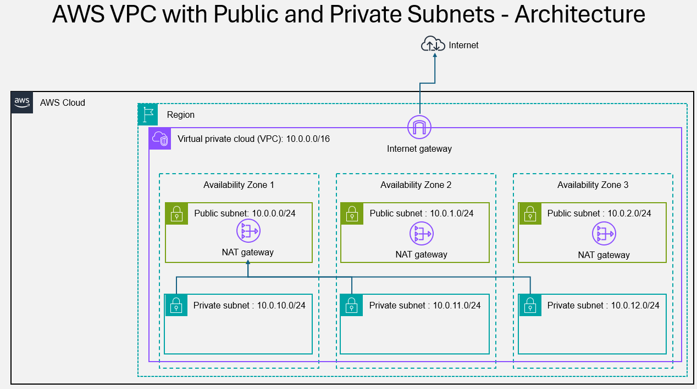

# VPC Project using Terraform

## AWS VPC Architecture




```sh
$ terraform console
> slice(["a", "b", "c", "d"], 1, 3)
[
  "b",
  "c",
]

> slice(["a", "b", "c", "d"], 0, 3)
[
  "a",
  "b",
  "c",
]

> values({a=3, b=4, c=5})
[
  3,
  4,
  5,
]

```

a02_VPC
├── README.md
├── a01_providers.tf
├── a02_Global_Variables.tf
├── a03_Global_Locals.tf
├── a04_Datasources.tf
├── a05_VPC.tf
└── a06_Outputs.tf


