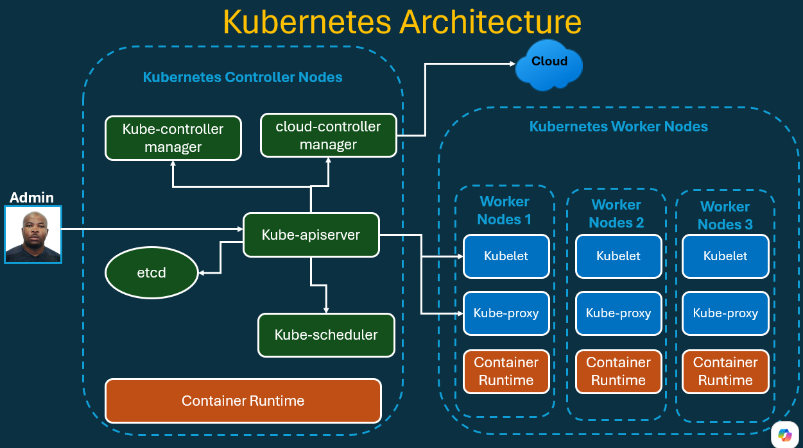
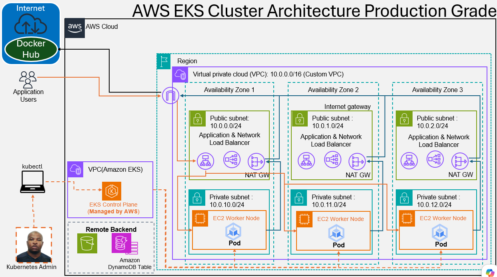
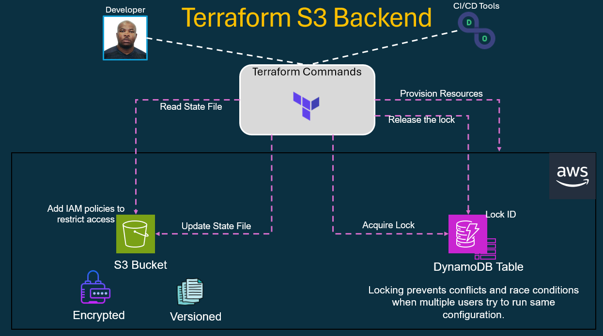

# AWS EKS Cluster Creation with Terraform

Production-ready Amazon EKS cluster using Terraform. Build step by step, covering IAM roles, networking, node groups, and outputs.

## Kubernetes Architecture



## AWS Elastic Kubernetes Services Architecture



## Terraform S3 Backend



## Browse EKS Cluster features on AWS Console

- Go to AWS Console -> EKS
- Review Tabs
    - Overview
    - Resources
    - Compute
    - Networking
    - Add-ons
    - Access
    - Observability
    - Update history
    - Tags

```sh
# aws eks --region us-east-2 update-kubeconfig --name south-jersey-eks-tchatua-dev-eks-control-plane

# ------------------------------------------------------------------------------------------------------------------------------------
kubectl version
Client Version: v1.32.2
Kustomize Version: v5.5.0
Unable to connect to the server: dial tcp: lookup 394663CFE2B888CF698E5759FFA6E81E.gr7.us-east-2.eks.amazonaws.com: no such host

# ------------------------------------------------------------------------------------------------------------------------------------
aws eks --region us-east-2 update-kubeconfig --name south-jersey-eks-tchatua-dev-eks-control-plane
Added new context arn:aws:eks:us-east-2:088354478627:cluster/south-jersey-eks-tchatua-dev-eks-control-plane to C:\Users\tchat\.kube\config

# ------------------------------------------------------------------------------------------------------------------------------------
kubectl version
Client Version: v1.32.2
Kustomize Version: v5.5.0
Server Version: v1.34.8-eks-0247562
WARNING: version difference between client (1.32) and server (1.34) exceeds the supported minor version skew of +/-1

# ------------------------------------------------------------------------------------------------------------------------------------
kubectl get nodes
NAME                                           STATUS   ROLES    AGE   VERSION
ip-192-168-10-141.us-east-2.compute.internal   Ready    <none>   12m   v1.34.8-eks-3385e9b
ip-192-168-11-135.us-east-2.compute.internal   Ready    <none>   12m   v1.34.8-eks-3385e9b
ip-192-168-12-145.us-east-2.compute.internal   Ready    <none>   12m   v1.34.8-eks-3385e9b


# ------------------------------------------------------------------------------------------------------------------------------------
kubectl get nodes -o wide
NAME                                           STATUS   ROLES    AGE   VERSION               INTERNAL-IP      EXTERNAL-IP   OS-IMAGE                        KERNEL-VERSION                    CONTAINER-RUNTIME
ip-192-168-10-141.us-east-2.compute.internal   Ready    <none>   12m   v1.34.8-eks-3385e9b   192.168.10.141   <none>        Amazon Linux 2023.11.20260526   6.12.88-119.157.amzn2023.x86_64   containerd://2.2.3+unknown
ip-192-168-11-135.us-east-2.compute.internal   Ready    <none>   12m   v1.34.8-eks-3385e9b   192.168.11.135   <none>        Amazon Linux 2023.11.20260526   6.12.88-119.157.amzn2023.x86_64   containerd://2.2.3+unknown
ip-192-168-12-145.us-east-2.compute.internal   Ready    <none>   12m   v1.34.8-eks-3385e9b   192.168.12.145   <none>        Amazon Linux 2023.11.20260526   6.12.88-119.157.amzn2023.x86_64   containerd://2.2.3+unknown

# ------------------------------------------------------------------------------------------------------------------------------------
kubectl get namespace
NAME              STATUS   AGE
default           Active   16m
kube-node-lease   Active   16m
kube-public       Active   16m
kube-system       Active   16m

# ------------------------------------------------------------------------------------------------------------------------------------
kubectl get all -n kube-system
NAME                          READY   STATUS    RESTARTS   AGE
pod/aws-node-4cc44            2/2     Running   0          23m
pod/aws-node-ll62r            2/2     Running   0          23m
pod/aws-node-tbqwp            2/2     Running   0          23m
pod/coredns-64ff95db9-dz78x   1/1     Running   0          24m
pod/coredns-64ff95db9-fb7cv   1/1     Running   0          24m
pod/kube-proxy-cjggq          1/1     Running   0          23m
pod/kube-proxy-fm2q2          1/1     Running   0          23m
pod/kube-proxy-mp8bz          1/1     Running   0          23m

NAME                                TYPE        CLUSTER-IP       EXTERNAL-IP   PORT(S)                  AGE
service/eks-extension-metrics-api   ClusterIP   172.20.127.248   <none>        443/TCP                  25m
service/kube-dns                    ClusterIP   172.20.0.10      <none>        53/UDP,53/TCP,9153/TCP   24m

NAME                        DESIRED   CURRENT   READY   UP-TO-DATE   AVAILABLE   NODE SELECTOR   AGE
daemonset.apps/aws-node     3         3         3       3            3           <none>          24m
daemonset.apps/kube-proxy   3         3         3       3            3           <none>          24m

NAME                      READY   UP-TO-DATE   AVAILABLE   AGE
deployment.apps/coredns   2/2     2            2           24m

NAME                                DESIRED   CURRENT   READY   AGE
replicaset.apps/coredns-64ff95db9   2         2         2       24m

# ------------------------------------------------------------------------------------------------------------------------------------
kubectl get ds -n kube-system
NAME         DESIRED   CURRENT   READY   UP-TO-DATE   AVAILABLE   NODE SELECTOR   AGE
aws-node     3         3         3       3            3           <none>          37m
kube-proxy   3         3         3       3            3           <none>          37m

# ------------------------------------------------------------------------------------------------------------------------------------
kubectl edit configmap -n kube-system aws-auth
```