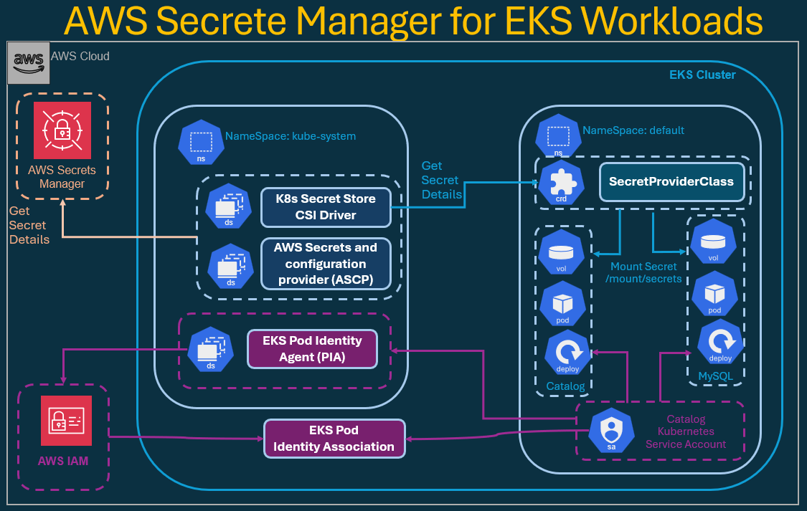

# Integrate AWS Secrets Manager with Catalog Microservice (EKS Pod Identity)

In the previous step, I installed the Secrets Store CSI Driver and AWS Secrets Provider (ASCP). 
Now, let’s use that setup to mount secrets directly from AWS Secrets Manager into our Catalog microservice.

In this section, I’ll securely connect AWS Secrets Manager with my Kubernetes Pods to provide MySQL credentials without ever storing them inside Kubernetes Secrets. 
This is the production-grade, zero-trust setup 
Credentials live only in AWS, and are fetched dynamically inside the container via the AWS Secrets and Configuration Provider (ASCP).

## Objectives

- Create an AWS Secrets Manager secret (catalog-db-secret-1) with MySQL credentials.
- Define a SecretProviderClass that retrieves this secret using EKS Pod Identity.
- Update both the MySQL StatefulSet and Catalog Deployment to mount and use these secrets.
- Achieve no plaintext credentials or Kubernetes Secrets stored in etcd.

## Architecture Diagram



## Create AWS Secret in Secrets Manager

Before deploying Kubernetes manifests, create my AWS secret containing MySQL credentials.


```sh
# Replace <REGION> with your AWS Region (e.g., us-east-1)
export AWS_REGION="us-east-2"
# -----------------------------------------------------------------------------------------------------
# Create Secret 
aws secretsmanager create-secret \
  --name catalog-db-secret-1 \
  --region $AWS_REGION \
  --description "MySQL credentials for Catalog microservice" \
  --secret-string '{
      "MYSQL_USER": "mydbadmin",
      "MYSQL_PASSWORD": "MapleShadeNJ2026"
  }'
# -----------------------------------------------------------------------------------------------------
# List all secrets in your account (filtered by name)
aws secretsmanager list-secrets --region $AWS_REGION --query "SecretList[?contains(Name, 'catalog-db-secret-1')].[Name,ARN]" --output table

# -----------------------------------------------------------------------------------------------------
# Describe the Secret for Details
aws secretsmanager describe-secret \
  --secret-id catalog-db-secret-1 \
  --region $AWS_REGION
# -----------------------------------------------------------------------------------------------------
# Retrieve Secret Value (for testing only)
aws secretsmanager get-secret-value \
  --secret-id catalog-db-secret-1 \
  --region $AWS_REGION \
  --query SecretString --output text
```


```sh
# Create Secret 
aws secretsmanager create-secret \
  --name catalog-db-secret-1 \
  --region $AWS_REGION \
  --description "MySQL credentials for Catalog microservice" \
  --secret-string '{
      "MYSQL_USER": "mydbadmin",
      "MYSQL_PASSWORD": "MapleShadeNJ2026"
  }'
{
    "ARN": "arn:aws:secretsmanager:us-east-2:088354478627:secret:catalog-db-secret-1-ARC4KN",
    "Name": "catalog-db-secret-1",
    "VersionId": "4e505e4b-62b1-4e38-94bc-f12494b2d630"
}
# -----------------------------------------------------------------------------------------------------
# List all secrets in your account (filtered by name)
aws secretsmanager list-secrets --region $AWS_REGION --query "SecretList[?contains(Name, 'catalog-db-secret-1')].[Name,ARN]" --output table
------------------------------------------------------------------------------------------------------------
|                                                ListSecrets                                               |
+---------------------+------------------------------------------------------------------------------------+
|  catalog-db-secret-1|  arn:aws:secretsmanager:us-east-2:088354478627:secret:catalog-db-secret-1-ARC4KN   |
+---------------------+------------------------------------------------------------------------------------+

# -----------------------------------------------------------------------------------------------------
# Describe the Secret for Details
aws secretsmanager describe-secret \
  --secret-id catalog-db-secret-1 \
  --region $AWS_REGION
{
    "ARN": "arn:aws:secretsmanager:us-east-2:088354478627:secret:catalog-db-secret-1-ARC4KN",
    "Name": "catalog-db-secret-1",
    "Description": "MySQL credentials for Catalog microservice",
    "LastChangedDate": "2026-06-12T07:24:27.878000-04:00",
    "LastAccessedDate": "2026-06-11T20:00:00-04:00",
    "VersionIdsToStages": {
        "4e505e4b-62b1-4e38-94bc-f12494b2d630": [
            "AWSCURRENT"
        ]
    },
    "CreatedDate": "2026-06-12T07:24:27.677000-04:00"
}

# -----------------------------------------------------------------------------------------------------
# Retrieve Secret Value (for testing only)
aws secretsmanager get-secret-value \
  --secret-id catalog-db-secret-1 \
  --region $AWS_REGION \
  --query SecretString --output text
{
      "MYSQL_USER": "mydbadmin",
      "MYSQL_PASSWORD": "MapleShadeNJ2026"
  }
```

## Create the SecretProviderClass

This tells ASCP which AWS secret to fetch and how to make it available to the container.


```sh
# -----------------------------------------------------------------------------------------------------

# -----------------------------------------------------------------------------------------------------

# -----------------------------------------------------------------------------------------------------

# -----------------------------------------------------------------------------------------------------

# -----------------------------------------------------------------------------------------------------

# -----------------------------------------------------------------------------------------------------

# -----------------------------------------------------------------------------------------------------

```