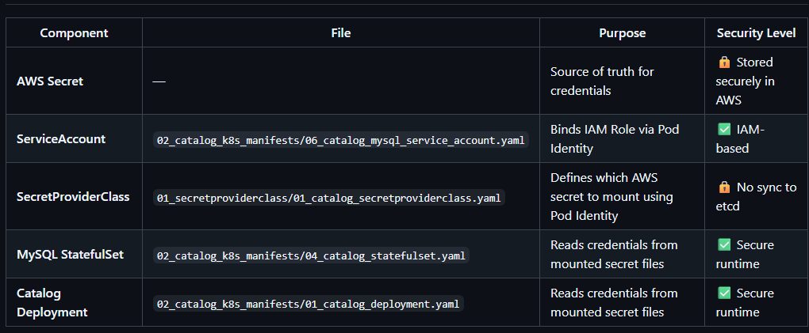

# Ctalog Deployment


## -----------------------------------------------------------------------------------
- Prerequisites
## -----------------------------------------------------------------------------------


```sh
#
helm version
version.BuildInfo{Version:"v4.1.4", GitCommit:"05fa37973dc9e42b76e1d2883494c87174b6074f", GitTreeState:"clean", GoVersion:"go1.25.9", KubeClientVersion:"v1.35"}
# ------------------------------------------------------------------------------

# Add Helm Repositories
helm repo add secrets-store-csi-driver https://kubernetes-sigs.github.io/secrets-store-csi-driver/charts
helm repo add aws-secrets-manager https://aws.github.io/secrets-store-csi-driver-provider-aws
# ------------------------------------------------------------------------------

helm repo update
Hang tight while we grab the latest from your chart repositories...
...Successfully got an update from the "aws-secrets-manager" chart repository
...Successfully got an update from the "secrets-store-csi-driver" chart repository
Update Complete. ⎈Happy Helming!⎈

# ------------------------------------------------------------------------------
helm repo list
NAME                            URL
secrets-store-csi-driver        https://kubernetes-sigs.github.io/secrets-store-csi-driver/charts
aws-secrets-manager             https://aws.github.io/secrets-store-csi-driver-provider-aws
# ------------------------------------------------------------------------------
```

## Install the Secrets Store CSI Driver 

```sh
# Install the Secrets Store CSI Driver 
helm install csi-secrets-store \
  secrets-store-csi-driver/secrets-store-csi-driver \
  --namespace kube-system \
  --set tokenRequests[0].audience="pods.eks.amazonaws.com"
# ------------------------------------------------------------------------------

# To verify that Secrets Store CSI Driver has started, run:
kubectl --namespace=kube-system get pods -l "app=secrets-store-csi-driver"
NAME                                               READY   STATUS    RESTARTS   AGE
csi-secrets-store-secrets-store-csi-driver-4gllb   3/3     Running   0          47s
csi-secrets-store-secrets-store-csi-driver-pbwjh   3/3     Running   0          47s

# ------------------------------------------------------------------------------
helm list -n kube-system
helm status csi-secrets-store -n kube-system
kubectl get pods -n kube-system -l app=secrets-store-csi-driver
helm list --all-namespaces
kubectl --namespace=kube-system get pods -l "app=secrets-store-csi-driver"
helm list -n kube-system
helm status csi-secrets-store -n kube-system
```

## Install the AWS Secrets Manager CSI Driver Provider in the kube-system namespace.


```sh
# Install the AWS Secrets Manager CSI Driver Provider in the kube-system namespace.
helm install secrets-provider-aws \
  aws-secrets-manager/secrets-store-csi-driver-provider-aws \
  --namespace kube-system \
  --set secrets-store-csi-driver.install=false
```


```sh
# ------------------------------------------------------------------------------
kubectl get daemonset -n kube-system | grep secrets-store
kubectl describe daemonset secrets-provider-aws-secrets-store-csi-driver-provider-aws -n kube-system
kubectl get all,sa,cm,ds,deploy,pod -n kube-system -l "app.kubernetes.io/instance=secrets-provider-aws"
```

## Create the policy:

```sh
cd e09_Setup_IAM_Policy_Role_EKS_PIA_Association/

aws iam create-policy \
  --policy-name catalog-db-secret-policy \
  --policy-document file://a09_catalog_db_secret_policy.json

# ------------------------------------------------------------------------------
aws iam create-role --role-name catalog-db-secrets-role --assume-role-policy-document file://a10_trust_policy.json

# ------------------------------------------------------------------------------
aws iam attach-role-policy \
  --role-name catalog-db-secrets-role \
  --policy-arn arn:aws:iam::${AWS_ACCOUNT_ID}:policy/catalog-db-secret-policy
```

##  Create Pod Identity Association


```sh
aws eks list-clusters
{
    "clusters": [
        "south-jersey-eks-tchatua-dev-eks-control-plane"
    ]
}

EKS_CLUSTER_NAME="south-jersey-eks-tchatua-dev-eks-control-plane"
# # -----------------------------------------------------------------------------------------------------

# Create Pod Identity Association
aws eks create-pod-identity-association \
  --cluster-name ${EKS_CLUSTER_NAME} \
  --namespace default \
  --service-account catalog-mysql-sa \
  --role-arn arn:aws:iam::${AWS_ACCOUNT_ID}:role/catalog-db-secrets-role
```


## Apply All Kubernetes Manifests

```sh
# First: Deploy Secret Provider Class
kubectl apply -f e10_AWS_Secrets_Manager_Secret_and_SecretProviderClass
# ------------------------------------------------------------------------------
# Second: Deploy all our Catalog k8s Manifests
kubectl apply -f e11_StatefilSet_Volume_VolumeMounts_and_ARGs
```


```sh
kubectl apply -f e10_AWS_Secrets_Manager_Secret_and_SecretProviderClass
secretproviderclass.secrets-store.csi.x-k8s.io/catalog-db-secrets created

kubectl apply -f e11_StatefilSet_Volume_VolumeMounts_and_ARGs
deployment.apps/catalog created
service/catalog-service created
configmap/catalog created
statefulset.apps/catalog-mysql created
service/catalog-mysql created
serviceaccount/catalog-mysql-sa created

kubectl get pods
NAME                      READY   STATUS    RESTARTS   AGE
catalog-99cc6fbf4-mgxks   1/1     Running   0          6s
catalog-mysql-0           1/1     Running   0          64s
```

## Verify if Secrets mounted in pods or not

```sh
# MySQL Pod
kubectl exec -it <mysql-pod-name> -- ls /mnt/secrets-store
kubectl exec -it <mysql-pod-name> -- cat /mnt/secrets-store/MYSQL_USER
kubectl exec -it <mysql-pod-name> -- cat /mnt/secrets-store/MYSQL_PASSWORD
# ------------------------------------------------------------------------------
# Catalog Pod
kubectl exec -it <catalog-pod-name> -- ls /mnt/secrets-store
kubectl exec -it <catalog-pod-name> -- cat /mnt/secrets-store/MYSQL_USER
kubectl exec -it <catalog-pod-name> -- cat /mnt/secrets-store/MYSQL_PASSWORD
```

```sh
 kubectl get pods
NAME                      READY   STATUS    RESTARTS   AGE
catalog-99cc6fbf4-mgxks   1/1     Running   0          6s
catalog-mysql-0           1/1     Running   0          64s
# ------------------------------------------------------------------------------

kubectl exec -it catalog-mysql-0 -- sh
sh-5.1# ls /mnt/
secrets-store
sh-5.1# ls /mnt/secrets-store/
MYSQL_PASSWORD  MYSQL_USER  catalog-db-secret-1
sh-5.1# ls /mnt/secrets-store/catalog-db-secret-1
/mnt/secrets-store/catalog-db-secret-1
sh-5.1# cat /mnt/secrets-store/catalog-db-secret-1
{
      "MYSQL_USER": "mydbadmin",
      "MYSQL_PASSWORD": "MapleShadeNJ2026"
  }sh-5.1#

# ------------------------------------------------------------------------------
kubectl exec -it catalog-mysql-0 -- ls /mnt/secrets-store
kubectl exec -it catalog-mysql-0 -- cat //mnt/secrets-store/MYSQL_USER
kubectl exec -it catalog-mysql-0 -- cat //mnt/secrets-store/MYSQL_PASSWORD
# ------------------------------------------------------------------------------
kubectl exec -it catalog-99cc6fbf4-mgxks -- ls //mnt/secrets-store
kubectl exec -it catalog-99cc6fbf4-mgxks -- cat //mnt/secrets-store/MYSQL_USER
kubectl exec -it catalog-99cc6fbf4-mgxks -- cat //mnt/secrets-store/MYSQL_PASSWORD
```

## Verify Catalog Microservice Application

```sh
# List Pods
kubectl get pods

# ------------------------------------------------------------------------------
# Port-forward
kubectl port-forward svc/catalog-service 7080:8080

# ------------------------------------------------------------------------------
# Acess Catalog Endpoints
http://localhost:7080/topology
http://localhost:7080/health
http://localhost:7080/catalog/products
http://localhost:7080/catalog/size
http://localhost:7080/catalog/tags
# ------------------------------------------------------------------------------

# ------------------------------------------------------------------------------

# ------------------------------------------------------------------------------

# ------------------------------------------------------------------------------

# ------------------------------------------------------------------------------

# ------------------------------------------------------------------------------

# ------------------------------------------------------------------------------

# ------------------------------------------------------------------------------

# ------------------------------------------------------------------------------


# ------------------------------------------------------------------------------

# ------------------------------------------------------------------------------

# ------------------------------------------------------------------------------

```

