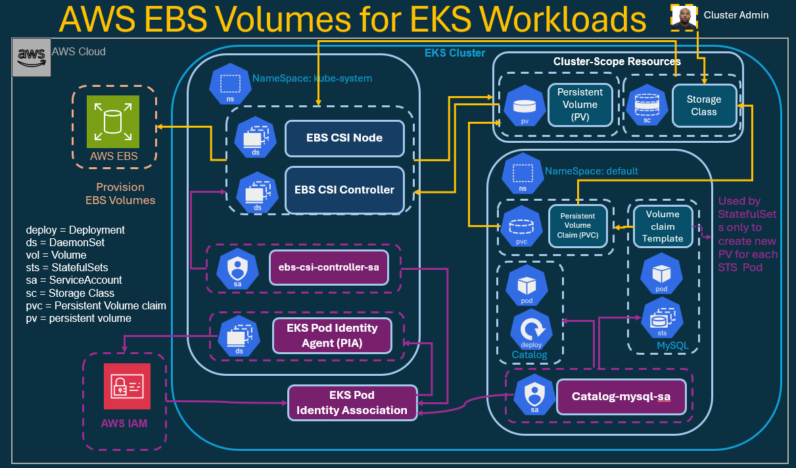
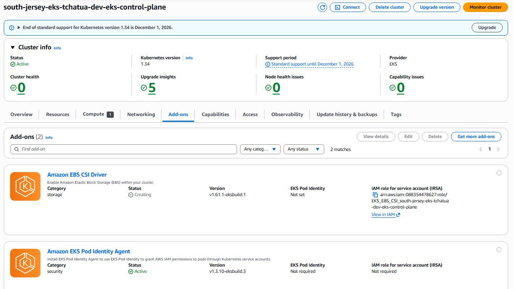
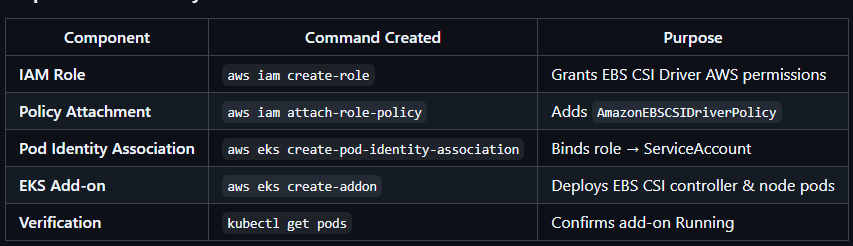

# Amazon EBS CSI Driver Installation on EKS (with Pod Identity)

- EBS: Elastic Block Storage
- CSI: Container Storage Interface

## Tasks:

- Create a **trust policy file** for the **EBS CSI Driver IAM Role**.
- Create the **IAM Role** and attach the **AmazonEBSCSIDriverPolicy managed policy**.
- Create a **Pod Identity Association** for the **EBS CSI controller ServiceAccount**.
- Install the **Amazon EBS CSI Driver add-on** using **AWS CLI**.
- **Verify installation** using kubectl.

## AWS EBS CSI Driver Architecture



## Install Amazon EBS CSI Driver using AWS CLI

```sh
# List my cluster name
aws eks list-clusters
# -------------------------------------------------------------------------------------------------
# Replace the placeholders below with your actual values
export AWS_REGION="us-east-2"
export EKS_CLUSTER_NAME="south-jersey-eks-tchatua-dev-eks-control-plane"
export AWS_ACCOUNT_ID=$(aws sts get-caller-identity --query Account --output text)
# -------------------------------------------------------------------------------------------------
# Confirm values
echo $AWS_REGION
echo $EKS_CLUSTER_NAME
echo $AWS_ACCOUNT_ID
```

> Use case

```sh
aws eks list-clusters
{
    "clusters": [
        "south-jersey-eks-tchatua-dev-eks-control-plane"
    ]
}

# -------------------------------------------------------------------------------------------------
export AWS_REGION="us-east-2"
export EKS_CLUSTER_NAME="south-jersey-eks-tchatua-dev-eks-control-plane"
export AWS_ACCOUNT_ID=$(aws sts get-caller-identity --query Account --output text)

# -------------------------------------------------------------------------------------------------
echo $AWS_REGION
echo $EKS_CLUSTER_NAME
echo $AWS_ACCOUNT_ID
us-east-2
south-jersey-eks-tchatua-dev-eks-control-plane
083511147827
```

## Create Trust Policy File

```sh
mkdir -p f01_IAM_Policy_JSON_Files
cd f01_IAM_Policy_JSON_Files

# -------------------------------------------------------------------------------------------------
cat <<EOF > a01_ebs_csi_driver_trust_policy.json
{
  "Version": "2012-10-17",
  "Statement": [
    {
      "Effect": "Allow",
      "Principal": {
        "Service": "pods.eks.amazonaws.com"
      },
      "Action": [
        "sts:AssumeRole",
        "sts:TagSession"
      ]
    }
  ]
}
EOF
```

## Create IAM Role and Attach Policy

```sh
# -------------------------------------------------------------------------------------------------
# Create IAM Role

# aws iam create-role \
#   --role-name AmazonEKS_EBS_CSI_DriverRole_${EKS_CLUSTER_NAME} \
#   --assume-role-policy-document file://a01_ebs_csi_driver_trust_policy.json
  
aws iam create-role \
  --role-name EKS_EBS_CSI_${EKS_CLUSTER_NAME} \
  --assume-role-policy-document file://a01_ebs_csi_driver_trust_policy.json

# -------------------------------------------------------------------------------------------------
# Attach IAM Policy to IAM Role

aws iam attach-role-policy \
  --role-name EKS_EBS_CSI_${EKS_CLUSTER_NAME} \
  --policy-arn arn:aws:iam::aws:policy/service-role/AmazonEBSCSIDriverPolicy

# -------------------------------------------------------------------------------------------------
# Verify:

aws iam list-attached-role-policies \
  --role-name EKS_EBS_CSI_${EKS_CLUSTER_NAME}
```

> Use Case:

```sh
aws iam create-role \
  --role-name EKS_EBS_CSI_${EKS_CLUSTER_NAME} \
  --assume-role-policy-document file://a01_ebs_csi_driver_trust_policy.json
{
    "Role": {
        "Path": "/",
        "RoleName": "EKS_EBS_CSI_south-jersey-eks-tchatua-dev-eks-control-plane",
        "RoleId": "AROARJESWLIRQX7BJC7T2",
        "Arn": "arn:aws:iam::088354478627:role/EKS_EBS_CSI_south-jersey-eks-tchatua-dev-eks-control-plane",
        "CreateDate": "2026-06-12T23:12:36+00:00",
        "AssumeRolePolicyDocument": {
            "Version": "2012-10-17",
            "Statement": [
                {
                    "Effect": "Allow",
                    "Principal": {
                        "Service": "pods.eks.amazonaws.com"
                    },
                    "Action": [
                        "sts:AssumeRole",
                        "sts:TagSession"
                    ]
                }
            ]
        }
    }
}
# -------------------------------------------------------------------------------------------------
aws iam attach-role-policy \
  --role-name EKS_EBS_CSI_${EKS_CLUSTER_NAME} \
  --policy-arn arn:aws:iam::aws:policy/service-role/AmazonEBSCSIDriverPolicy
# -------------------------------------------------------------------------------------------------
aws iam list-attached-role-policies \
  --role-name EKS_EBS_CSI_${EKS_CLUSTER_NAME}
{
    "AttachedPolicies": [
        {
            "PolicyName": "AmazonEBSCSIDriverPolicy",
            "PolicyArn": "arn:aws:iam::aws:policy/service-role/AmazonEBSCSIDriverPolicy"
        }
    ]
}
```

## Create Pod Identity Association (required for CLI install)

This binds the IAM role to the ebs-csi-controller-sa ServiceAccount so the EBS CSI Driver can obtain credentials through the Pod Identity Agent.

```sh
# Create EKS Pod Identity Assocication
aws eks create-pod-identity-association \
  --cluster-name ${EKS_CLUSTER_NAME} \
  --namespace kube-system \
  --service-account ebs-csi-controller-sa \
  --role-arn arn:aws:iam::${AWS_ACCOUNT_ID}:role/EKS_EBS_CSI_${EKS_CLUSTER_NAME}
```

> Use Case

```sh
aws eks create-pod-identity-association \
  --cluster-name ${EKS_CLUSTER_NAME} \
  --namespace kube-system \
  --service-account ebs-csi-controller-sa \
  --role-arn arn:aws:iam::${AWS_ACCOUNT_ID}:role/EKS_EBS_CSI_${EKS_CLUSTER_NAME}
{
    "association": {
        "clusterName": "south-jersey-eks-tchatua-dev-eks-control-plane",
        "namespace": "kube-system",
        "serviceAccount": "ebs-csi-controller-sa",
        "roleArn": "arn:aws:iam::088354478627:role/EKS_EBS_CSI_south-jersey-eks-tchatua-dev-eks-control-plane",        "associationArn": "arn:aws:eks:us-east-2:088354478627:podidentityassociation/south-jersey-eks-tchatua-dev-eks-control-plane/a-c5eygrpaem29xs41w",
        "associationId": "a-c5eygrpaem29xs41w",
        "tags": {},
        "createdAt": "2026-06-12T19:21:00.041000-04:00",
        "modifiedAt": "2026-06-12T19:21:00.041000-04:00",
        "disableSessionTags": false
    }
}
```

## Install the EBS CSI Driver Add-on

- This commands will:
    - Installs the Amazon EBS CSI Driver add-on on your EKS cluster.
    - Associates it with the IAM Role you created earlier.
    - Deploys the following components automatically:
        - ebs-csi-controller (Deployment)
        - ebs-csi-node (DaemonSet)

```sh
# List existing EKS add-ons
aws eks list-addons --cluster-name ${EKS_CLUSTER_NAME}

# -------------------------------------------------------------------------------------------------
# Install EKS EBS CSI Addon

aws eks create-addon \
  --cluster-name ${EKS_CLUSTER_NAME} \
  --addon-name aws-ebs-csi-driver \
  --service-account-role-arn arn:aws:iam::${AWS_ACCOUNT_ID}:role/EKS_EBS_CSI_${EKS_CLUSTER_NAME}

# -------------------------------------------------------------------------------------------------
```

> Use case

```sh
aws eks list-addons --cluster-name ${EKS_CLUSTER_NAME}
{
    "addons": [
        "eks-pod-identity-agent"
    ]
}
# -------------------------------------------------------------------------------------------------
aws eks create-addon \
  --cluster-name ${EKS_CLUSTER_NAME} \
  --addon-name aws-ebs-csi-driver \
  --service-account-role-arn arn:aws:iam::${AWS_ACCOUNT_ID}:role/EKS_EBS_CSI_${EKS_CLUSTER_NAME}
{
    "addon": {
        "addonName": "aws-ebs-csi-driver",
        "clusterName": "south-jersey-eks-tchatua-dev-eks-control-plane",
        "status": "CREATING",
        "addonVersion": "v1.61.1-eksbuild.1",
        "health": {
            "issues": []
        },
        "addonArn": "arn:aws:eks:us-east-2:088354478627:addon/south-jersey-eks-tchatua-dev-eks-control-plane/aws-ebs-csi-driver/98cf5f15-27db-90e9-a4d1-5c927192f0f1",
        "createdAt": "2026-06-12T19:28:24.626000-04:00",
        "modifiedAt": "2026-06-12T19:28:24.638000-04:00",
        "serviceAccountRoleArn": "arn:aws:iam::088354478627:role/EKS_EBS_CSI_south-jersey-eks-tchatua-dev-eks-control-plane",
        "tags": {},
        "namespaceConfig": {
            "namespace": "kube-system"
        }
    }
}
```



## Verify Installation

```sh
# List EKS add-ons (after install)
aws eks list-addons --cluster-name ${EKS_CLUSTER_NAME}

# -------------------------------------------------------------------------------------------------
# Describe Addon - Verify Status

aws eks describe-addon \
  --cluster-name ${EKS_CLUSTER_NAME} \
  --addon-name aws-ebs-csi-driver \
  --query "addon.status" --output text

# -------------------------------------------------------------------------------------------------

kubectl get pods -n kube-system | grep ebs-csi
kubectl get ds   -n kube-system | grep ebs-csi
kubectl get deploy -n kube-system | grep ebs-csi
```

> Use Case

```sh
 aws eks list-addons --cluster-name ${EKS_CLUSTER_NAME}
{
    "addons": [
        "aws-ebs-csi-driver",
        "eks-pod-identity-agent"
    ]
}

# -------------------------------------------------------------------------------------------------

aws eks describe-addon \
  --cluster-name ${EKS_CLUSTER_NAME} \
  --addon-name aws-ebs-csi-driver \
  --query "addon.status" --output text

ACTIVE

# -------------------------------------------------------------------------------------------------

kubectl get pods -n kube-system | grep ebs-csi
ebs-csi-controller-6fc4855ddf-5x88l                               6/6     Running   0          6m32s
ebs-csi-controller-6fc4855ddf-f8f9v                               6/6     Running   0          6m32s
ebs-csi-node-6w95r                                                3/3     Running   0          6m32s
ebs-csi-node-swrfz   

# -------------------------------------------------------------------------------------------------

kubectl get ds   -n kube-system | grep ebs-csi
ebs-csi-node                                                 2         2         2       2            2           kubernetes.io/os=linux     7m57s
ebs-csi-node-windows                                         0         0         0       0            0           kubernetes.io/os=windows   7m57s

# -------------------------------------------------------------------------------------------------

kubectl get deploy -n kube-system | grep ebs-csi
ebs-csi-controller   2/2     2            2           9m9s
```


