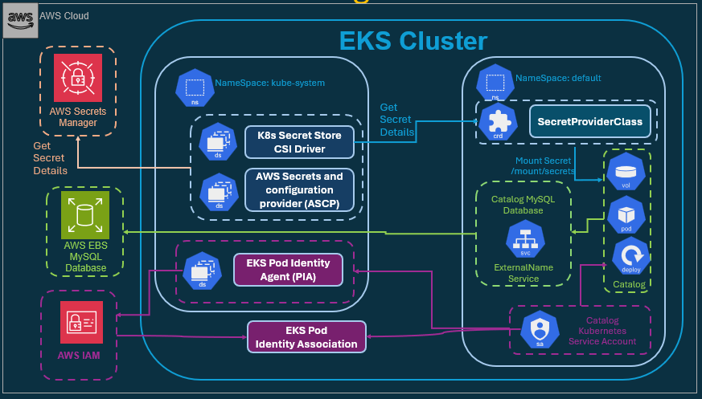
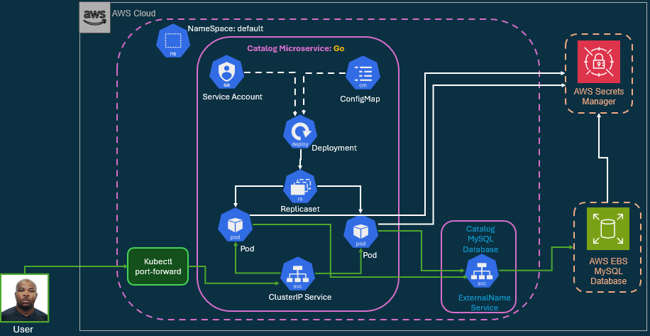

# Create and Integrate Amazon RDS MySQL Database with Catalog Microservice

## --------------------------------------------------------------------
##               I - Integrate Amazon RDS Database 
## --------------------------------------------------------------------


I will integrate my Catalog microservice with an Amazon RDS MySQL database instead of the in-cluster MySQL StatefulSet used in previous lab.

## Tasks Objectives:

In this section, I will drive myself to:

- How to connect a Kubernetes application to a managed RDS MySQL database.
- Replace in-cluster MySQL StatefulSet with a private RDS endpoint.
- Use AWS Secrets Manager and the Secrets Store CSI Driver to retrieve credentials securely.
- Configure ExternalName Service for DNS-based access to RDS.
- Validate connectivity between your Catalog microservice and RDS instance.

## Why Running Databases Inside Kubernetes Is Not Ideal 

While Kubernetes is excellent for orchestrating stateless microservices, it is not designed to manage full fledged databases. 
Running MySQL inside Kubernetes introduces several challenges:

1. Backups
    - I must manually configure:
        - Snapshot schedules
        - Retention policies
        - Restore procedures

2. Patching & Upgrades
    - I'm responsible for:
        - Applying MySQL security patches
        - Version upgrades
        - Rolling updates without data loss

3. Replication
    - Kubernetes does not understand:
        - Master/Slave replication
        - Failover
        - Read replicas
    - I must manually configure and maintain all of this.

4. High Availability
    - Databases require:
        - Automatic failover
        - Synchronous replication
        - Multi AZ support
    - Kubernetes does not provide these database specific features.

5. Recovery
    - Databases need:
        - point in time recovery
        - automated backups
        - transaction logs

> Again, Kubernetes does not handle this.
> In short: Kubernetes is great for microservices, not for managing database internals.

## Why Cloud Databases Solve These Problems

- Cloud providers like **AWS, Azure, and GCP offer fully managed database services**. 
- In AWS, this is Amazon RDS.

    - RDS automatically handles:
        - backups
        - patching
        - replication
        - high availability
        - failover
        - recovery

- This eliminates the operational burden on my microservices team.
- So instead of running MySQL inside Kubernetes, I will integrate my catalog microservice with Amazon RDS MySQL.

## AWS Secrete Manager for EKS Workloads High Level Architecture



## Integrate Catalog Microservices with AWS RDS MySQL



## --------------------------------------------------------------------
##           II - Create Amazon RDS Database (via AWS Console)
## --------------------------------------------------------------------

## Prerequisites:

### Create VPC Security Group (for RDS)

I need a Security Group that allows the RDS database to accept traffic only from our EKS cluster.

## EKS Cluster Security Group

Running the following command to find my EKS Cluster Security Group ID:

```sh
# List all EKS clusters (default region)
# ------------------------------------------------------------------------------------------

aws eks list-clusters

# ------------------------------------------------------------------------------------------
# Find your EKS Cluster Security Group ID

aws eks describe-cluster \
  --name retail-dev-eksdemo1 \
  --query "cluster.resourcesVpcConfig.clusterSecurityGroupId" \
  --output text
```

> Outputs

```tf
sg-0d3d376e7ee56dfef
```

### 1 - Creating RSD Security Group:

- On AWS Console: EC2 → Security Groups → Create security group
    - Name: drwp-rds-db-mysql-sg
    - Description: DRWP AWS RDS Security Group
    - VPC: Select the same VPC as my EKS cluster
    - Inbound rules (choose one):
        - Recommended:
            - Type: MySQL/Aurora (3306)
            - Protocol: TCP 
            - Type: MySQL/Aurora
            - Source: EKS Cluster Security Group ID (e.g., sg-0d3d376e7ee56dfef)
        - Alternative (lab-only):
            - Type: MySQL/Aurora (3306)
            - Source: 192.168.0.0/16
            - Outbound rules: Allow all (default)
    - Create security group

- *Using the EKS Cluster Security Group is the most secure option for production. The CIDR-based rule (10.0.0.0/16) is fine for quick local lab testing.*

### 2 - Create DB Subnet Group (private subnets)

- On AWS Console: RDS → Subnet groups → Create DB subnet group
    - Name: drwp-rds-db-private-subnets
    - Description:  DRWP AWS RDS Database Private Subnet
    - VPC: Select the EKS VPC
    - Availability Zones: Add all availability zones (at least 2 AZs)
    - Subnets: Add all private subnets 
    - Create

### 3 Create the RDS MySQL Instance

- Console: RDS → Databases → Create database 
    - Method: Full configuration
    - Engine: MySQL (8.0)
    - Templates: Free tier or Dev/Test
    - DB instance identifier: drwprdsdb
    - Master username: *on AWS console, go to: AWS Secrets Manager > Secrets > catalog-db-secret-1 > retrieve and view the secret value*
    - Master password: *on AWS console, go to: AWS Secrets Manager > Secrets > catalog-db-secret-1 > retrieve and view the secret value*
    - Instance class: db.t3.micro
    - Storage: (default is fine)
    - Connectivity:
        - VPC: EKS VPC
        - DB Subnet group: drwp-rds-db-private-subnets
        - Public access: No
        - VPC security group: Choose existing → drwp-rds-db-mysql-sg
    - (Optional) Disable Delete protection for easy cleanup
    - I just remove the automated baxckup. i don't need it in my Lab
    - Create database
> I'm intentionally reusing the same creds mydbadmin and password for continuity.

## Connect to RDS and Create Database Schema

Once the database is available, connect to the RDS instance from within your EKS cluster using a temporary MySQL client pod.


```sh
kubectl run mysql-client --rm -it \
  --image=mysql:8.0 \
  --restart=Never \
  -- mysql -h mydb3.cxojydmxwly6.us-east-1.rds.amazonaws.com -u mydbadmin -p
```

When prompted, enter the password:

- Inside the MySQL shell, create the catalogdb schema:

```sh
CREATE DATABASE catalogdb;
SHOW DATABASES;
EXIT;
```


