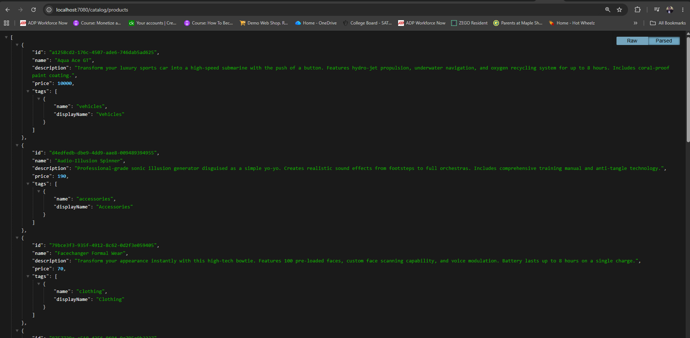

# Deploy Catalog Microservice with RDS Database

## Connect to RDS and Create Database Schema


```sh
# List all RDS DB instances
aws rds describe-db-instances
aws rds describe-db-instances | grep DBInstanceIdentifier

# List all RDS DB endpoints (simple, clean output)
aws rds describe-db-instances \
  --query "DBInstances[].Endpoint.Address" \
  --output text
```

> Outputs

```tf
aws rds describe-db-instances | grep DBInstanceIdentifier
            "DBInstanceIdentifier": "drwprdsdb",
            "ReadReplicaDBInstanceIdentifiers": [],

# ------------------------------------------------------------------------------------------

aws rds describe-db-instances \
  --query "DBInstances[].Endpoint.Address" \
  --output text
drwprdsdb.c7oescqy4eh4.us-east-2.rds.amazonaws.com
```

Once the database is available, connect to the RDS instance from within your EKS cluster using a temporary MySQL client pod.


```sh
# ------------------------------------------------------------------------------------------
kubectl run mysql-client --rm -it \
  --image=mysql:8.0 \
  --restart=Never \
  -- mysql -h drwprdsdb.c7oescqy4eh4.us-east-2.rds.amazonaws.com -u mydbadmin -p
```

> Outputs

When prompted, enter the password.

```sh
kubectl run mysql-client --rm -it \
  --image=mysql:8.0 \
  --restart=Never \
  -- mysql -h drwprdsdb.c7oescqy4eh4.us-east-2.rds.amazonaws.com -u mydbadmin -p
If you don't see a command prompt, try pressing enter.

Welcome to the MySQL monitor.  Commands end with ; or \g.
Your MySQL connection id is 33
Server version: 8.4.8 Source distribution

Copyright (c) 2000, 2026, Oracle and/or its affiliates.

Oracle is a registered trademark of Oracle Corporation and/or its
affiliates. Other names may be trademarks of their respective
owners.

Type 'help;' or '\h' for help. Type '\c' to clear the current input statement.
```


> Inside the MySQL shell, create the catalogdb schema:

```sh
CREATE DATABASE catalogdb;
SHOW DATABASES;
EXIT;
```

> Outputs

```sh
mysql> show databases;
+--------------------+
| Database           |
+--------------------+
| information_schema |
| mysql              |
| performance_schema |
| sys                |
+--------------------+
4 rows in set (0.02 sec)

# ------------------------------------------------------------------------------------------
mysql> create create database catalogbd;
ERROR 1064 (42000): You have an error in your SQL syntax; check the manual that corresponds to your MySQL server version for the right syntax to use near 'create database catalogbd' at line 1
mysql> create database catalogbd;
Query OK, 1 row affected (0.02 sec)

# ------------------------------------------------------------------------------------------
mysql> show databases;
+--------------------+
| Database           |
+--------------------+
| catalogbd          |
| information_schema |
| mysql              |
| performance_schema |
| sys                |
+--------------------+
5 rows in set (0.01 sec)
```

## -------------------------------------------------
## Update Kubernetes Manifests
## -------------------------------------------------

I'll replace  in the cluster MySQL Service with an ExternalName Service that points to the RDS endpoint.

- **Service Account Usage:** The catalog-mysql-sa Service Account is associated with EKS Pod Identity, which grants the Catalog microservice permission to access AWS Secrets Manager. Through the Secrets Store CSI Driver, this service account enables the Catalog pod to securely retrieve database credentials at runtime without embedding or managing any static secrets inside Kubernetes.

> **New:**  a05_catalog_mysql_externalname_service.yaml

```yml
--- 
apiVersion: v1
kind: Service
metadata:
  name: catalog-mysql
spec:
  type: ExternalName
  externalName: drwprdsdb.c7oescqy4eh4.us-east-2.rds.amazonaws.com
  ports:
    - port: 3306
```

> Update the Configmap manifest file

```yml
apiVersion: v1
kind: ConfigMap
metadata:
  name: catalog
data:
  RETAIL_CATALOG_PERSISTENCE_PROVIDER: "mysql"
  RETAIL_CATALOG_PERSISTENCE_ENDPOINT: "catalog-mysql:3306"
  RETAIL_CATALOG_PERSISTENCE_DB_NAME: "catalogdb"
  RETAIL_CATALOG_PERSISTENCE_CONNECT_TIMEOUT: "5"
```

## Deploy Resources

Deploy in the following order:

```sh
# Deploy Secret Provider Class
kubectl apply -f e10_AWS_Secrets_Manager_Secret_and_SecretProviderClass/

# Deploy Catalog Application
kubectl apply -f e15_Deploy_Catalog_Microservice_with_RDS_Database/
```

> Outputs

```sh
kubectl get pods
No resources found in default namespace.

# ------------------------------------------------------------------------------------------
kubectl apply -f e10_AWS_Secrets_Manager_Secret_and_SecretProviderClass/
secretproviderclass.secrets-store.csi.x-k8s.io/catalog-db-secrets created

# ------------------------------------------------------------------------------------------
kubectl apply -f e15_Deploy_Catalog_Microservice_with_RDS_Database/
deployment.apps/catalog created
service/catalog-service created
configmap/catalog created
serviceaccount/catalog-mysql-sa created
service/catalog-mysql created

# ------------------------------------------------------------------------------------------
kubectl get pods
NAME                      READY   STATUS             RESTARTS      AGE
catalog-99cc6fbf4-4lngd   0/1     CrashLoopBackOff   1 (13s ago)   15s

# ------------------------------------------------------------------------------------------
kubectl logs -f catalog-99cc6fbf4-4lngd
Starting Catalog service with secure DB credentials
Using mysql database catalog-mysql:3306

2026/06/13 15:03:58 /appsrc/repository/repository.go:28
[error] failed to initialize database, got error Error 1049 (42000): Unknown database 'catalogdb'
panic: failed to connect database

goroutine 1 [running]:
github.com/aws-containers/retail-store-sample-app/catalog/repository.NewRepository({{0xc0000380b4, 0x5}, {0xc000042024, 0x12}, {0xc000038233, 0x9}, {0xc000038170, 0x9}, {0xc000042064, 0x10}, ...})
        /appsrc/repository/repository.go:44 +0x9d8
main.main()
        /appsrc/main.go:78 +0x145

```
>  There is a type in the database name. connect to the RDS DB and modify the DB name as needed. Delete the deploy and apply it again. Voila!!!

```
kubectl get pods
NAME                      READY   STATUS    RESTARTS   AGE
catalog-99cc6fbf4-xvts7   1/1     Running   0          6s
mysql-client              1/1     Running   0          2m13s
```

## Verify Application

Port-forward and access Catalog service endpoints:

```sh
# kubectl port-forward
kubectl port-forward svc/catalog-service 7080:8080

# ------------------------------------------------------------------------------------------
# Additional Note
Port-forward local desktop 7080 → Kubernetes Cluster IP service 8080
```

> Outputs

```sh
 kubectl port-forward svc/catalog-service 7080:8080
Forwarding from 127.0.0.1:7080 -> 8080
Forwarding from [::1]:7080 -> 8080

# ------------------------------------------------------------------------------------------
http://localhost:7080/health
http://localhost:7080/catalog/products
```



```sh
mysql> use catalogdb;
Reading table information for completion of table and column names
You can turn off this feature to get a quicker startup with -A

Database changed

# ------------------------------------------------------------------------------------------
mysql> show tables;
+---------------------+
| Tables_in_catalogdb |
+---------------------+
| product_tags        |
| products            |
| tags                |
+---------------------+
3 rows in set (0.00 sec)

# ------------------------------------------------------------------------------------------
mysql> select * from products;
+--------------------------------------+-------------------------+---------------------------------------------------------------------------------------------------------------------------------------------------------------------------------------------------------------------------------------------------------+-------+
| id                                   | name                    | description

                                                                                             | price |
+--------------------------------------+-------------------------+---------------------------------------------------------------------------------------------------------------------------------------------------------------------------------------------------------------------------------------------------------+-------+
| 1ca35e86-4b4c-4124-b6b5-076ba4134d0d | The Forgetter MK-II     | These stylish shades pack a powerful amnesia-inducing flash that erases the last 60 seconds of memory from anyone in view. Includes UV protection and auto-darkening lenses. Not recommended for use during important meetings.                         |   225 |
| 4f18544b-70a5-4352-8e19-0d070f46745d | Levitator Oxfords       | Classic Oxford-style shoes concealing cutting-edge anti-gravity technology. Features wall-walking capability, ceiling-escape mode, and auto-stabilization. Available in black or brown. Not recommended for formal dances. 
# ------------------------------------------------------------------------------------------

mysql> select * from product_tags;
+--------------------------------------+-------------+
| product_id                           | tag_name    |
+--------------------------------------+-------------+
| 1ca35e86-4b4c-4124-b6b5-076ba4134d0d | accessories |
| 631a3db5-ac07-492c-a994-8cd56923c112 | accessories |
| cc789f85-1476-452a-8100-9e74502198e0 | accessories |
| d27cf49f-b689-4a75-a249-d373e0330bb5 | accessories |
| d4edfedb-dbe9-4dd9-aae8-009489394955 | accessories |
| 4f18544b-70a5-4352-8e19-0d070f46745d | clothing    |
| 79bce3f3-935f-4912-8c62-0d2f3e059405 | clothing    |
| 87e89b11-d319-446d-b9be-50adcca5224a | clothing    |
| 8757729a-c518-4356-8694-9e795a9b3237 | food        |
| a1258cd2-176c-4507-ade6-746dab5ad625 | vehicles    |
| d3104128-1d14-4465-99d3-8ab9267c687b | vehicles    |
| d77f9ae6-e9a8-4a3e-86bd-b72af75cbc49 | vehicles    |
+--------------------------------------+-------------+
12 rows in set (0.00 sec)
```

## Cleaning Up:

> Remoove Kubernetes resources

```sh
# Delete Secret Provider Class
kubectl apply -f e10_AWS_Secrets_Manager_Secret_and_SecretProviderClass/

# Delete Catalog Application
kubectl apply -f e15_Deploy_Catalog_Microservice_with_RDS_Database/
```

> Delete RED Instance

1. From the AWS Console → RDS → Databases → mydb3 → Delete.
2. From the AWS Console → RDS → Subnet groups → rds-private-subnets → Delete.

## Summary

- In this Lab, I successfully:

- Connected the Catalog microservice to an Amazon RDS MySQL database.
- Used ExternalName Service for RDS endpoint resolution.
- Retrieved credentials securely from AWS Secrets Manager via EKS Pod Identity + CSI Driver.
- Verified full end-to-end connectivity and cleaned up all resources.
- This completes my transition from in-cluster MySQL to managed RDS MySQL in a real-world production setup.

