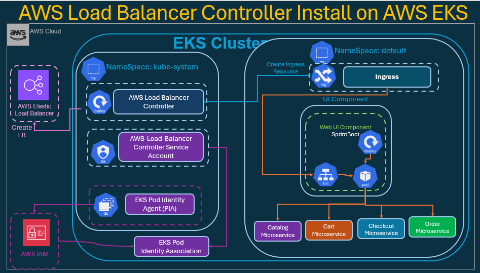
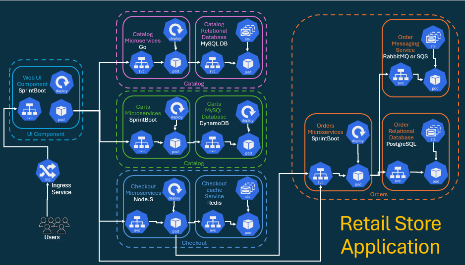
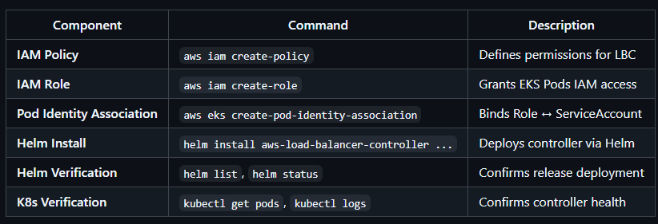

# AWS Load Balancer Controller (LBC) on EKS (with Pod Identity)

## Objectives:

- By the end of this Lab, I will:

- Create a trust policy file for the Load Balancer Controller IAM Role.
- Create and attach the AWSLoadBalancerControllerIAMPolicy to that role.
- Create an EKS Pod Identity Association between the IAM Role and ServiceAccount.
- Install the AWS Load Balancer Controller using Helm.
- Verify successful deployment.

## AWS Load Balancer Controller Architecture



## Ingress



## IAM Role and Policy Setup

### Export Environment Variables

```sh
# List all EKS clusters (default region)
aws eks list-clusters

# -------------------------------------------------------------------------------------------------------------
# Replace the placeholders below with your actual values
export AWS_REGION="us-east-2"
export EKS_CLUSTER_NAME="south-jersey-eks-tchatua-dev-eks-control-plane"
export AWS_ACCOUNT_ID=$(aws sts get-caller-identity --query Account --output text)

# -------------------------------------------------------------------------------------------------------------

# Confirm values
echo $AWS_REGION
echo $EKS_CLUSTER_NAME
echo $AWS_ACCOUNT_ID
```


## Create IAM Policy for LBC

> Download the official IAM policy:

```sh
curl -o aws-load-balancer-controller-policy.json \
https://raw.githubusercontent.com/kubernetes-sigs/aws-load-balancer-controller/main/docs/install/iam_policy.json
```

> Output

```tf
curl -o aws-load-balancer-controller-policy.json \
https://raw.githubusercontent.com/kubernetes-sigs/aws-load-balancer-controller/main/docs/install/iam_policy.json
  % Total    % Received % Xferd  Average Speed   Time    Time     Time  Current
                                 Dload  Upload   Total   Spent    Left  Speed
100  8955 100  8955   0     0 56693     0  --:--:-- --:--:-- --:--:-- 57774


```

> Create the policy in IAM:


```sh
aws iam create-policy \
  --policy-name AWSLoadBalancerControllerIAMPolicy_${EKS_CLUSTER_NAME} \
  --policy-document file://aws-load-balancer-controller-policy.json
```

- This policy allows the Load Balancer Controller to manage AWS resources such as Elastic Load Balancers, Target Groups, and Security Groups.

> Outputs

```sh
aws iam create-policy \
  --policy-name AWSLoadBalancerControllerIAMPolicy_${EKS_CLUSTER_NAME} \
  --policy-document file://aws-load-balancer-controller-policy.json
{
    "Policy": {
        "PolicyName": "AWSLoadBalancerControllerIAMPolicy_south-jersey-eks-tchatua-dev-eks-control-plane",
        "PolicyId": "ANPARJESWLIR4KJZNTS3T",
        "Arn": "arn:aws:iam::088354478627:policy/AWSLoadBalancerControllerIAMPolicy_south-jersey-eks-tchatua-dev-eks-control-plane",
        "Path": "/",
        "DefaultVersionId": "v1",
        "AttachmentCount": 0,
        "PermissionsBoundaryUsageCount": 0,
        "IsAttachable": true,
        "CreateDate": "2026-06-14T15:24:01+00:00",
        "UpdateDate": "2026-06-14T15:24:01+00:00"
    }
}
```

## Create Trust Policy File

```sh
cat <<EOF > aws-load-balancer-controller-trust-policy.json
{
  "Version": "2012-10-17",
  "Statement": [
    {
      "Effect": "Allow",
      "Principal": {
        "Service": "pods.eks.amazonaws.com"
      },
      "Action": [
        "sts:AssumeRole",
        "sts:TagSession"
      ]
    }
  ]
}
EOF
```

- This trust policy allows the EKS Pod Identity Agent to assume this role on behalf of the Load Balancer Controller Pod.


## Create IAM Role and Attach Policy


```sh
# Create the IAM Role
aws iam create-role \
  --role-name EKS_LBC_Role_${EKS_CLUSTER_NAME} \
  --assume-role-policy-document file://a01_AWS_Load_Balancer_Controller_Trust_Policy.json

# Attach the LBC IAM Policy
aws iam attach-role-policy \
  --role-name EKS_LBC_Role_${EKS_CLUSTER_NAME} \
  --policy-arn arn:aws:iam::${AWS_ACCOUNT_ID}:policy/AWSLoadBalancerControllerIAMPolicy_${EKS_CLUSTER_NAME}

# Verify attachment
aws iam list-attached-role-policies \
  --role-name EKS_LBC_Role_${EKS_CLUSTER_NAME}
```

## Create EKS Pod Identity Association

```sh
aws eks create-pod-identity-association \
  --cluster-name ${EKS_CLUSTER_NAME} \
  --namespace kube-system \
  --service-account aws-load-balancer-controller \
  --role-arn arn:aws:iam::${AWS_ACCOUNT_ID}:role/EKS_LBC_Role_${EKS_CLUSTER_NAME}
```

- This securely links the aws-load-balancer-controller ServiceAccount to the IAM Role via EKS Pod Identity.

## Install AWS Load Balancer Controller (Helm)

> Add and update the helm repos
```sh
helm repo add eks https://aws.github.io/eks-charts
helm repo update
```

## Install Load Balancer Controller

```sh
# Get VPC ID
VPC_ID=$(aws eks describe-cluster \
  --name ${EKS_CLUSTER_NAME} \
  --query "cluster.resourcesVpcConfig.vpcId" \
  --output text)

# Verify VPC ID
echo $VPC_ID

# Install AWS Load Balancer Controller using HELM
helm install aws-load-balancer-controller eks/aws-load-balancer-controller \
  -n kube-system \
  --set clusterName=${EKS_CLUSTER_NAME} \
  --set region=${AWS_REGION} \
  --set vpcId=${VPC_ID} \
  --set serviceAccount.create=true \
  --set serviceAccount.name=aws-load-balancer-controller  
```

> Output

```sh
helm install aws-load-balancer-controller eks/aws-load-balancer-controller \
  -n kube-system \
  --set clusterName=${EKS_CLUSTER_NAME} \
  --set region=${AWS_REGION} \
  --set vpcId=${VPC_ID} \
  --set serviceAccount.create=true \
  --set serviceAccount.name=aws-load-balancer-controller
NAME: aws-load-balancer-controller
LAST DEPLOYED: Sun Jun 14 12:47:15 2026
NAMESPACE: kube-system
STATUS: deployed
REVISION: 1
DESCRIPTION: Install complete
TEST SUITE: None
NOTES:
AWS Load Balancer controller installed!
```

> Explanation:

- **serviceAccount.create=true** → Creates the ServiceAccount automatically during Helm installation.
- **serviceAccount.name** → Uses the same ServiceAccount name linked to your Pod Identity association.
- **clusterName** → Specifies the name of your EKS cluster.
- **vpcId** → Supplies the EKS cluster’s VPC ID manually (required when IMDS auto-detection is restricted).
- **region** → Explicitly sets the AWS Region to help the controller locate cluster and network resources when IMDS access is limited.

## Verify Helm Release

- List Helm releases:

```sh
helm list -n kube-system
```

> Outputs

```sh
 helm list -n kube-system
NAME                            NAMESPACE       REVISION        UPDATED                                 STATUS        CHART                                           APP VERSION
aws-load-balancer-controller    kube-system     1               2026-06-14 12:47:15.4742623 -0400 EDT   deployed       aws-load-balancer-controller-3.4.0              v3.4.0
csi-secrets-store               kube-system     1               2026-06-12 09:37:19.4761343 -0400 EDT   deployed       secrets-store-csi-driver-1.6.0                  1.6.0
secrets-provider-aws            kube-system     1               2026-06-12 09:44:02.5480673 -0400 EDT   deployed       secrets-store-csi-driver-provider-aws-3.1.1

```

- Check Helm status:

```sh
helm status aws-load-balancer-controller -n kube-system
```

> Outputs

```sh
helm status aws-load-balancer-controller -n kube-system
NAME: aws-load-balancer-controller
LAST DEPLOYED: Sun Jun 14 12:47:15 2026
NAMESPACE: kube-system
STATUS: deployed
REVISION: 1
DESCRIPTION: Install complete
RESOURCES:
==> v1/MutatingWebhookConfiguration
NAME                        WEBHOOKS   AGE
aws-load-balancer-webhook   6          3m16s

==> v1/IngressClass
NAME   CONTROLLER            PARAMETERS   AGE
alb    ingress.k8s.aws/alb   <none>       3m16s

==> v1/ServiceAccount
NAME                           SECRETS   AGE
aws-load-balancer-controller   0         3m17s

==> v1/RoleBinding
NAME                                                       ROLE
     AGE
aws-load-balancer-controller-leader-election-rolebinding   Role/aws-load-balancer-controller-leader-election-role   3m16s

==> v1/Service
NAME                                TYPE        CLUSTER-IP       EXTERNAL-IP   PORT(S)   AGE
aws-load-balancer-webhook-service   ClusterIP   172.20.155.169   <none>        443/TCP   3m16s

==> v1/ValidatingWebhookConfiguration
NAME                        WEBHOOKS   AGE
aws-load-balancer-webhook   3          3m16s

==> v1beta1/IngressClassParams
NAME   GROUP-NAME   SCHEME   IP-ADDRESS-TYPE   AGE
alb                                            3m16s

==> v1/Secret
NAME                    TYPE                DATA   AGE
aws-load-balancer-tls   kubernetes.io/tls   3      3m16s

==> v1/ClusterRole
NAME                                CREATED AT
aws-load-balancer-controller-role   2026-06-14T16:47:18Z

==> v1/ClusterRoleBinding
NAME                                       ROLE                                            AGE
aws-load-balancer-controller-rolebinding   ClusterRole/aws-load-balancer-controller-role   3m16s

==> v1/Role
NAME                                                CREATED AT
aws-load-balancer-controller-leader-election-role   2026-06-14T16:47:18Z

==> v1/Deployment
NAME                           READY   UP-TO-DATE   AVAILABLE   AGE
aws-load-balancer-controller   2/2     2            2           3m16s

==> v1/Pod(related)
NAME                                            READY   STATUS    RESTARTS   AGE
aws-load-balancer-controller-55c9b7ff74-9z9m9   1/1     Running   0          3m16s
aws-load-balancer-controller-55c9b7ff74-g8mdc   1/1     Running   0          3m16s


TEST SUITE: None
NOTES:
AWS Load Balancer controller installed!
```

## Verify Controller Deployment

```sh
# List Pods
kubectl get pods -n kube-system -l app.kubernetes.io/name=aws-load-balancer-controller

# -------------------------------------------------------------------------------------------------------------
# Check deployment and logs:
kubectl get deployment -n kube-system aws-load-balancer-controller
kubectl logs -n kube-system -l app.kubernetes.io/name=aws-load-balancer-controller
```

> Outputs

```sh
kubectl get deployment -n kube-system aws-load-balancer-controller
NAME                           READY   UP-TO-DATE   AVAILABLE   AGE
aws-load-balancer-controller   2/2     2            2           5m50s

# -------------------------------------------------------------------------------------------------------------
kubectl get pods -n kube-system -l app.kubernetes.io/name=aws-load-balancer-controller
NAME                                            READY   STATUS    RESTARTS   AGE
aws-load-balancer-controller-55c9b7ff74-9z9m9   1/1     Running   0          6m26s
aws-load-balancer-controller-55c9b7ff74-g8mdc   1/1     Running   0          6m26s

# -------------------------------------------------------------------------------------------------------------
kubectl logs -n kube-system -l app.kubernetes.io/name=aws-load-balancer-controller
{"level":"info","ts":"2026-06-14T16:47:23Z","logger":"setup","msg":"starting collect cache size"}
{"level":"info","ts":"2026-06-14T16:47:23Z","logger":"setup","msg":"starting collect top talkers"}
{"level":"info","ts":"2026-06-14T16:47:23Z","logger":"controller-runtime.metrics","msg":"Starting metrics server"}
{"level":"info","ts":"2026-06-14T16:47:23Z","msg":"starting server","name":"health probe","addr":"[::]:61779"}
{"level":"info","ts":"2026-06-14T16:47:23Z","logger":"controller-runtime.webhook","msg":"Starting webhook server"}
{"level":"info","ts":"2026-06-14T16:47:23Z","logger":"controller-runtime.metrics","msg":"Serving metrics server","bindAddress":":8080","secure":false}
{"level":"info","ts":"2026-06-14T16:47:23Z","logger":"controller-runtime.certwatcher","msg":"Updated current TLS certificate","cert":"/tmp/k8s-webhook-server/serving-certs/tls.crt","key":"/tmp/k8s-webhook-server/serving-certs/tls.key"}
{"level":"info","ts":"2026-06-14T16:47:23Z","logger":"controller-runtime.webhook","msg":"Serving webhook server","host":"","port":9443}
{"level":"info","ts":"2026-06-14T16:47:23Z","logger":"controller-runtime.certwatcher","msg":"Starting certificate poll+watcher","cert":"/tmp/k8s-webhook-server/serving-certs/tls.crt","key":"/tmp/k8s-webhook-server/serving-certs/tls.key","interval":10}
{"level":"info","ts":"2026-06-14T16:47:24Z","msg":"Attempting to acquire leader lease...","lock":"kube-system/aws-load-balancer-controller-leader"}
{"level":"info","ts":"2026-06-14T16:47:23Z","msg":"Starting EventSource","controller":"targetGroupBinding","controllerGroup":"elbv2.k8s.aws","controllerKind":"TargetGroupBinding","source":"kind source: *v1.Service"}
{"level":"info","ts":"2026-06-14T16:47:23Z","msg":"Starting EventSource","controller":"targetGroupBinding","controllerGroup":"elbv2.k8s.aws","controllerKind":"TargetGroupBinding","source":"*k8s.TypedInformer[*sigs.k8s.io/aws-load-balancer-controller/pkg/k8s.PodInfo]"}
{"level":"info","ts":"2026-06-14T16:47:23Z","msg":"Starting EventSource","controller":"targetGroupBinding","controllerGroup":"elbv2.k8s.aws","controllerKind":"TargetGroupBinding","source":"kind source: *v1.EndpointSlice"}
{"level":"info","ts":"2026-06-14T16:47:23Z","msg":"Starting EventSource","controller":"targetGroupBinding","controllerGroup":"elbv2.k8s.aws","controllerKind":"TargetGroupBinding","source":"kind source: *v1.Node"}
{"level":"info","ts":"2026-06-14T16:47:23Z","msg":"Starting Controller","controller":"service"}
{"level":"info","ts":"2026-06-14T16:47:23Z","msg":"Starting workers","controller":"service","worker count":3}
{"level":"info","ts":"2026-06-14T16:47:24Z","msg":"Starting Controller","controller":"targetGroupBinding","controllerGroup":"elbv2.k8s.aws","controllerKind":"TargetGroupBinding"}
{"level":"info","ts":"2026-06-14T16:47:24Z","msg":"Starting workers","controller":"targetGroupBinding","controllerGroup":"elbv2.k8s.aws","controllerKind":"TargetGroupBinding","worker count":3}
{"level":"info","ts":"2026-06-14T16:47:24Z","msg":"Starting Controller","controller":"ingress"}
{"level":"info","ts":"2026-06-14T16:47:24Z","msg":"Starting workers","controller":"ingress","worker count":3}
```

- I should see:
    - Pod Running
    - No permission or assume-role errors



> **Final Result:** I’ve successfully installed the AWS Load Balancer Controller using EKS Pod Identity (no IRSA). 
> It’s now fully configured to provision and manage Application Load Balancers (ALB) and Network Load Balancers (NLB) in my EKS environment 
> Production-ready, secure, and following the latest AWS best practices.

