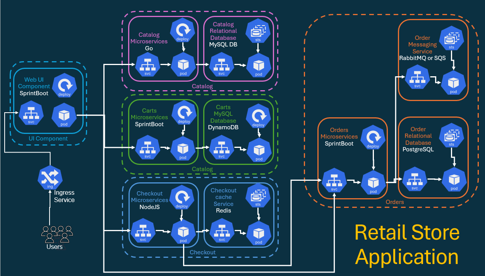
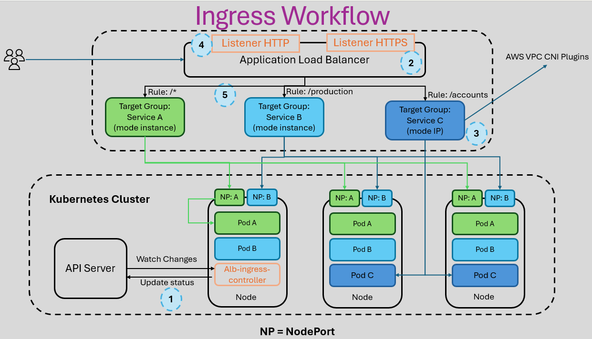

# Kubernetes Ingress - HTTP

## Deploy HTTP Ingress, test end-to-end and Undeploy HTTP objects.

> Ingress and Retail Store Sample Application





```sh
kubectl get pods -n kube-system
NAME                                                              READY   STATUS    RESTARTS   AGE
aws-load-balancer-controller-55c9b7ff74-9z9m9                     1/1     Running   0          100m
aws-load-balancer-controller-55c9b7ff74-g8mdc                     1/1     Running   0          100m
aws-node-lncwq                                                    2/2     Running   0          2d7h
aws-node-xb4fg                                                    2/2     Running   0          2d7h
coredns-64ff95db9-bq4v6                                           1/1     Running   0          2d7h
coredns-64ff95db9-shx8w                                           1/1     Running   0          2d7h
csi-secrets-store-secrets-store-csi-driver-4gllb                  3/3     Running   0          2d4h
csi-secrets-store-secrets-store-csi-driver-pbwjh                  3/3     Running   0          2d4h
ebs-csi-controller-6fc4855ddf-5x88l                               6/6     Running   0          42h
ebs-csi-controller-6fc4855ddf-f8f9v                               6/6     Running   0          42h
ebs-csi-node-6w95r                                                3/3     Running   0          42h
ebs-csi-node-swrfz                                                3/3     Running   0          42h
eks-pod-identity-agent-nvvlr                                      1/1     Running   0          2d7h
eks-pod-identity-agent-vfg8p                                      1/1     Running   0          2d7h
kube-proxy-7vksp                                                  1/1     Running   0          2d7h
kube-proxy-clqn4                                                  1/1     Running   0          2d7h
secrets-provider-aws-secrets-store-csi-driver-provider-awsjrc8d   1/1     Running   0          2d4h
secrets-provider-aws-secrets-store-csi-driver-provider-awsnmkds   1/1     Running   0          2d4h
# -------------------------------------------------------------------------------------------------------------

kubectl get ds -n kube-system
NAME                                                         DESIRED   CURRENT   READY   UP-TO-DATE   AVAILABLE   NODE SELECTOR              AGE
aws-node                                                     2         2         2       2            2           <none>                     2d7h
csi-secrets-store-secrets-store-csi-driver                   2         2         2       2            2           kubernetes.io/os=linux     2d4h
ebs-csi-node                                                 2         2         2       2            2           kubernetes.io/os=linux     42h
ebs-csi-node-windows                                         0         0         0       0            0           kubernetes.io/os=windows   42h
eks-pod-identity-agent                                       2         2         2       2            2           <none>                     2d7h
kube-proxy                                                   2         2         2       2            2           <none>                     2d7h
secrets-provider-aws-secrets-store-csi-driver-provider-aws   2         2         2       2            2           kubernetes.io/os=linux     2d4h

# -------------------------------------------------------------------------------------------------------------
kubectl describe ds aws-node -n kube-system | grep Image
    Image:      602401143452.dkr.ecr.us-east-2.amazonaws.com/amazon-k8s-cni-init:v1.20.5-eksbuild.1
    Image:      602401143452.dkr.ecr.us-east-2.amazonaws.com/amazon-k8s-cni:v1.20.5-eksbuild.1
    Image:      602401143452.dkr.ecr.us-east-2.amazonaws.com/amazon/aws-network-policy-agent:v1.2.7-eksbuild.2


# -------------------------------------------------------------------------------------------------------------
kubectl get ingressclass
NAME   CONTROLLER            PARAMETERS   AGE
alb    ingress.k8s.aws/alb   <none>       153m
```

## Deploy UI

```sh
ll a01_HTTP_Retail_Store_K8s_manifests/a05_UI/
total 24
-rw-r--r-- 1 tchat 197609 1692 Jun 14 15:36 a01_UI_Service_Account.yml
-rw-r--r-- 1 tchat 197609 1914 Jun 14 15:59 a02_UI_ConfigMap.yml
-rw-r--r-- 1 tchat 197609 4338 Jun 14 15:43 a03_UI_Deployment.yml
-rw-r--r-- 1 tchat 197609 2169 Jun 14 15:47 a04_ui_ClusterIP_Service.yml
-rw-r--r-- 1 tchat 197609 2737 Jun 14 15:36 a05_UI_NodePort_Service.yml
# -------------------------------------------------------------------------------------------------------------

kubectl apply -f a01_HTTP_Retail_Store_K8s_manifests/a05_UI/
serviceaccount/ui created
configmap/ui created
deployment.apps/ui created
service/ui created
service/ui-np created

# -------------------------------------------------------------------------------------------------------------
kubectl get deploy
NAME   READY   UP-TO-DATE   AVAILABLE   AGE
ui     1/1     1            1           40s

# -------------------------------------------------------------------------------------------------------------
kubectl get sts
No resources found in default namespace.

# -------------------------------------------------------------------------------------------------------------
kubectl get svc
NAME         TYPE        CLUSTER-IP       EXTERNAL-IP   PORT(S)        AGE
kubernetes   ClusterIP   172.20.0.1       <none>        443/TCP        2d9h
ui           ClusterIP   172.20.148.100   <none>        80/TCP         92s
ui-np        NodePort    172.20.203.162   <none>        80:30091/TCP   92s

# -------------------------------------------------------------------------------------------------------------
kubectl get cm
NAME               DATA   AGE
kube-root-ca.crt   1      2d9h
ui 
                4      2m59s
# -------------------------------------------------------------------------------------------------------------
kubectl get secrets
No resources found in default namespace.

# -------------------------------------------------------------------------------------------------------------
kubectl get pods
NAME                  READY   STATUS    RESTARTS   AGE
ui-7f7df55448-tjgss   1/1     Running   0          4m14s
```

## Deploy Ingress

```sh
ll b01_Ingress/
total 8
-rw-r--r-- 1 tchat 197609 4360 Jun 14 15:24 a01_Ingress_HTTP_Instance_mode.yml
# -------------------------------------------------------------------------------------------------------------

kubectl apply -f b01_Ingress/a01_Ingress_HTTP_Instance_mode.yml
ingress.networking.k8s.io/retail-store-https-instance-mode created
# -------------------------------------------------------------------------------------------------------------

kubectl get ingress
NAME                               CLASS   HOSTS   ADDRESS   PORTS   AGE
retail-store-https-instance-mode   alb     *                 80      24s
```


```sh
curl -v http://<ALB-DNS-NAME>
curl -v http://retail-store-http-ip-mode-1494807740.us-east-2.elb.amazonaws.com
# -------------------------------------------------------------------------------------------------------------

curl -v http://retail-store-http-ip-mode-1494807740.us-east-2.elb.amazonaws.com
* Host retail-store-http-ip-mode-1494807740.us-east-2.elb.amazonaws.com:80 was resolved.
* IPv6: (none)
* IPv4: 18.225.127.48, 52.15.53.72
*   Trying 18.225.127.48:80...
* Established connection to retail-store-http-ip-mode-1494807740.us-east-2.elb.amazonaws.com (18.225.127.48 port 80) from 192.168.1.152 port 65032
* using HTTP/1.x
> GET / HTTP/1.1
> Host: retail-store-http-ip-mode-1494807740.us-east-2.elb.amazonaws.com
> User-Agent: curl/8.17.0
> Accept: */*
>
* Request completely sent off
< HTTP/1.1 500 Internal Server Error
< Date: Sun, 14 Jun 2026 23:48:09 GMT
< Content-Type: application/json
< Content-Length: 129
< Connection: keep-alive
< set-cookie: SESSIONID=09ddf636-2e9d-4ff0-b6bb-e8a3b796e889
<
{"timestamp":"2026-06-14T23:48:09.370+00:00","path":"/","status":500,"error":"Internal Server Error","requestId":"3d1570b6-2440"}* Connection #0 to host retail-store-http-ip-mode-1494807740.us-east-2.elb.amazonaws.com:80 left intact

# -------------------------------------------------------------------------------------------------------------
kubectl get deploy
kubectl get sts
kubectl get svc
kubectl get cm
kubectl get secrets
kubectl get ingress
# -------------------------------------------------------------------------------------------------------------

touch a01_catalog_service_accout.yaml a02_catalog_secret.yaml a03_catalog_configmap.yaml a04_catalog_mysql_statefulset.yaml a05_catalog_mysql_clusterip_service.yaml a06_catalog_deployment.yaml a07_catalog_clusterip_service.yaml
# -------------------------------------------------------------------------------------------------------------
kubectl get ingress
NAME                               CLASS   HOSTS   ADDRESS                                                            PORTS   AGE
retail-store-http-ip-mode          alb     *       retail-store-http-ip-mode-1494807740.us-east-2.elb.amazonaws.com   80      3h38m
retail-store-https-instance-mode   alb     *                                                                          80      53m

# -------------------------------------------------------------------------------------------------------------
kubectl get secrets
NAME              TYPE     DATA   AGE
catalog-db        Opaque   2      31m
orders-db         Opaque   2      4m1s
orders-rabbitmq   Opaque   2      4m1s

# -------------------------------------------------------------------------------------------------------------
kubectl get cm
NAME               DATA   AGE
carts              6      19m
catalog            3      31m
checkout           3      12m
kube-root-ca.crt   1      2d16h
orders             5      4m18s
ui                 4      6h44m


# -------------------------------------------------------------------------------------------------------------
kubectl get svc
NAME                TYPE        CLUSTER-IP       EXTERNAL-IP   PORT(S)              AGE
carts               ClusterIP   172.20.108.163   <none>        80/TCP               19m
carts-dynamodb      ClusterIP   172.20.170.169   <none>        8000/TCP             19m
catalog             ClusterIP   172.20.90.188    <none>        80/TCP               32m
catalog-mysql       ClusterIP   172.20.109.52    <none>        3306/TCP             32m
checkout            ClusterIP   172.20.75.187    <none>        80/TCP               12m
checkout-redis      ClusterIP   172.20.26.50     <none>        6379/TCP             12m
kubernetes          ClusterIP   172.20.0.1       <none>        443/TCP              2d16h
orders              ClusterIP   172.20.64.244    <none>        80/TCP               4m32s
orders-postgresql   ClusterIP   172.20.202.62    <none>        5432/TCP             4m33s
orders-rabbitmq     ClusterIP   172.20.141.103   <none>        5672/TCP,15672/TCP   4m33s
ui                  ClusterIP   172.20.148.100   <none>        80/TCP               6h44m
ui-np               NodePort    172.20.203.162   <none>        80:30091/TCP         6h44m
# -------------------------------------------------------------------------------------------------------------

kubectl get sts
NAME                READY   AGE
catalog-mysql       1/1     32m
orders-postgresql   1/1     4m56s
orders-rabbitmq     1/1     4m56s
# -------------------------------------------------------------------------------------------------------------

kubectl get deploy
NAME             READY   UP-TO-DATE   AVAILABLE   AGE
carts            1/1     1            1           20m
carts-dynamodb   1/1     1            1           20m
catalog          1/1     1            1           32m
checkout         1/1     1            1           13m
checkout-redis   1/1     1            1           13m
orders           1/1     1            1           5m15s
ui               1/1     1            1           6h45m

# -------------------------------------------------------------------------------------------------------------
http://retail-store-http-ip-mode-1494807740.us-east-2.elb.amazonaws.com/topology
http://retail-store-http-ip-mode-1494807740.us-east-2.elb.amazonaws.com/
```

## Cleaning Up

```sh
kubectl delete -f e17_Kubernetes_Ingress_HTTP/ -R
serviceaccount "catalog" deleted
secret "catalog-db" deleted
configmap "catalog" deleted
statefulset.apps "catalog-mysql" deleted
service "catalog-mysql" deleted
deployment.apps "catalog" deleted
service "catalog" deleted
serviceaccount "carts" deleted
configmap "carts" deleted
deployment.apps "carts-dynamodb" deleted
service "carts-dynamodb" deleted
deployment.apps "carts" deleted
service "carts" deleted
serviceaccount "checkout" deleted
configmap "checkout" deleted
deployment.apps "checkout-redis" deleted
service "checkout-redis" deleted
deployment.apps "checkout" deleted
service "checkout" deleted
serviceaccount "orders" deleted
secret "orders-db" deleted
secret "orders-rabbitmq" deleted
configmap "orders" deleted
statefulset.apps "orders-postgresql" deleted
service "orders-postgresql" deleted
statefulset.apps "orders-rabbitmq" deleted
service "orders-rabbitmq" deleted
deployment.apps "orders" deleted
service "orders" deleted
serviceaccount "ui" deleted
configmap "ui" deleted
deployment.apps "ui" deleted
service "ui" deleted
service "ui-np" deleted
ingress.networking.k8s.io "retail-store-https-instance-mode" deleted
ingress.networking.k8s.io "retail-store-http-ip-mode" deleted


```
