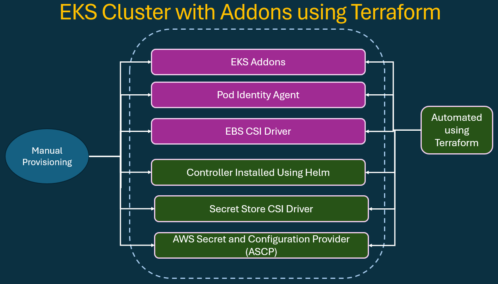
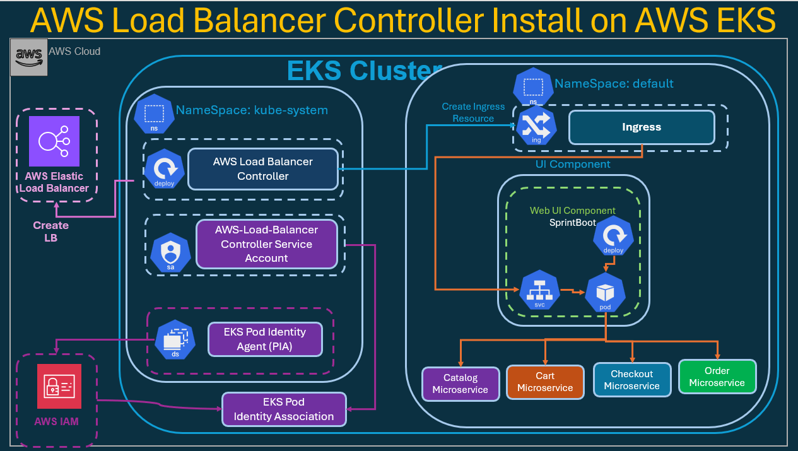
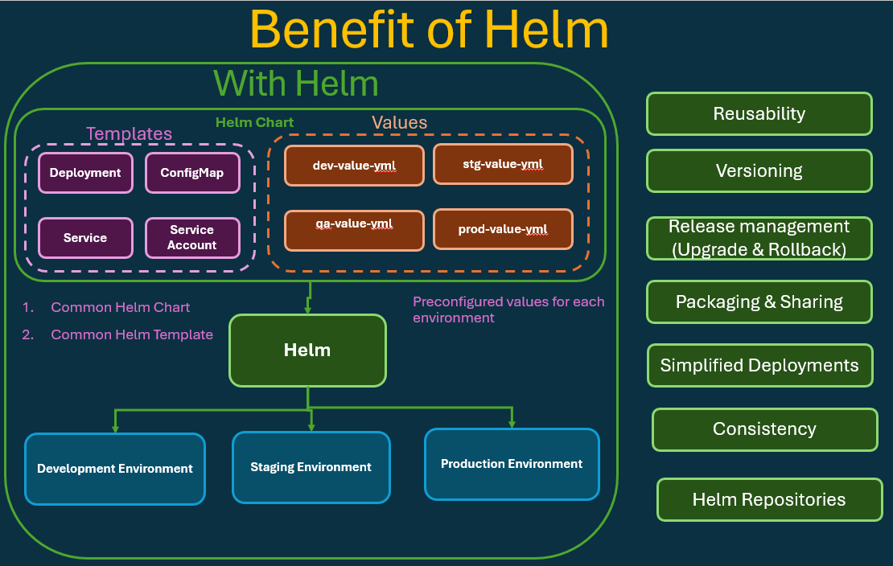
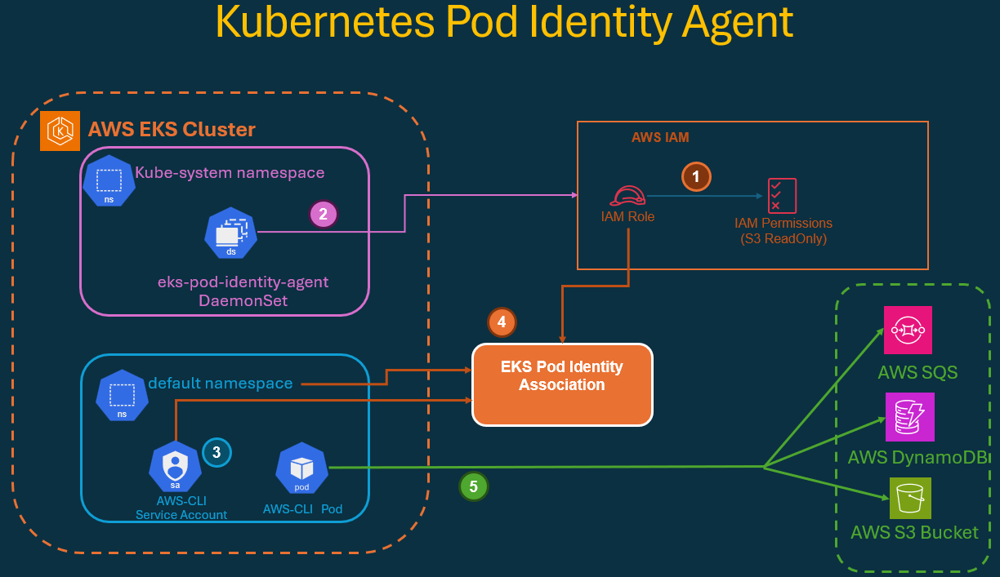

# AWS EKS Cluster Creation with Terraform

## Prerequisite: Create Custom VPC

```sh
#!/bin/bash

set -e  # Exit immediately if any command fails

echo "----------------------------------"
echo "STEP1:Creating VPC using Terraform"
echo "----------------------------------"

cd b04_VPC_Module/ || { echo "ERROR: VPC module directory not found"; exit 1; }

terraform init
terraform apply -auto-approve
```

##
# Terraform on AWS EKS Cluster with AddOns (LBC, EBS CSI, Secret Store CSI)

Here, I will build on top of my base EKS cluster from `b05_EKS_Cluster` and integrate `official AWS and Kubernetes add-ons` for `networking`, `storage`, `identity`, and `secret management`.

- AWS Load Balancer Controller (LBC) 
- Amazon EBS CSI Driver 
- Secrets Store CSI Driver (with ASCP) 
- EKS Pod Identity Agent






## Architecture Overview:

- This EKS architecture enhances my base EKS setup from `b05_EKS_Cluster` by integrating official AWS and Kubernetes add-ons that power modern workloads.

    - AddOn: Pod Identity Agent
    - Purpose: Enables Pods to assume IAM roles securely without storing credentials.

    - AddOn: AWS Load Balancer Controller (LBC)	
    - Purpose: Manages ALBs/NLBs for Ingress resources and Service type LoadBalancer.

    - AddOn: EBS CSI Driver	
    - Purpose: Enables dynamic provisioning of Amazon EBS volumes for Stateful workloads.

    - AddOn: Secrets Store CSI Driver + ASCP	
    - Purpose: Mounts AWS Secrets Manager / SSM Parameter Store secrets directly into Pods.


## Project Structure


```sh
# VPC
b04_VPC_Module/
|-- a01_01_Settings_Backend.tf
|-- a01_02_providers.tf
|-- a02_Global_Variables.tf
|-- a03_01_VPC.tf
|-- a03_02_VPC_Variables.tf
|-- a03_03_VPC_Outputs.tf
|-- b01_module
|   |-- README.md
|   `-- a01_vpc
|       |-- a01_Datasources.tf
|       |-- a02_02_VPC_Variables.tf
|       |-- a02_03_VPC_Locals.tf
|       |-- a02_04_VPC_Outputs.tf
|       |-- a03_Global_Variables.tf
|       |-- main.tf
|       `-- terraform.tfvars
`-- terraform.tfvars

# EKS Cluster
b05_EKS_Cluster
|-- a01_01_Settings_Backend.tf
|-- a01_02_providers.tf
|-- a02_01_Global_Variables.tf
|-- a02_02_Global_Locals.tf
|-- a03_01_Remote_State.tf
|-- a04_01_aws_ec2_tag.tf
|-- a05_EKS_IAM_Role.tf
|-- a06_02_EKS_Cluster_Variables.tf
|-- a07_eks_cluster.tf
|-- a08_EKS_Nodegroup_IAM_Role.tf
|-- a09_01_EKS_Nodegroup_Private.tf
|-- a09_02_EKS_Nodegroup_Private_Variables.tf
|-- a10_EKS_Outputs.tf
`-- terraform.tfvars

# EKS Cluster + Addons
|-- b01_01_data_eks_addon.tf
|-- b01_02_eks_addon.tf
|-- b01_03_eks_addon_outputs.tf
|-- b02_01_data_eks_cluster_auth.tf
|-- b02_02_helm_and_kubernetes_providers.tf
|-- b03_01_pod_identity_assume_role.tf
|-- b04_01_lbc_iam_policy_datasource.tf
|-- b04_02_lbc_iam_policy_datasource_output.tf
|-- b04_03_lbc_iam_policy_and_iam_role.tf
|-- b04_04_lbc_iam_policy_and_iam_role_outputs.tf
|-- b04_05_lbc_eks_pod_identity_association.tf
|-- b04_06_lbc_helm_install.tf
|-- 
|-- 
|-- 
|-- 
|-- 
|-- 
|-- 
|-- 
|-- 
|-- 
|-- 
|-- 
|-- 
|-- 
|-- 
`-- terraform.tfvars

```


