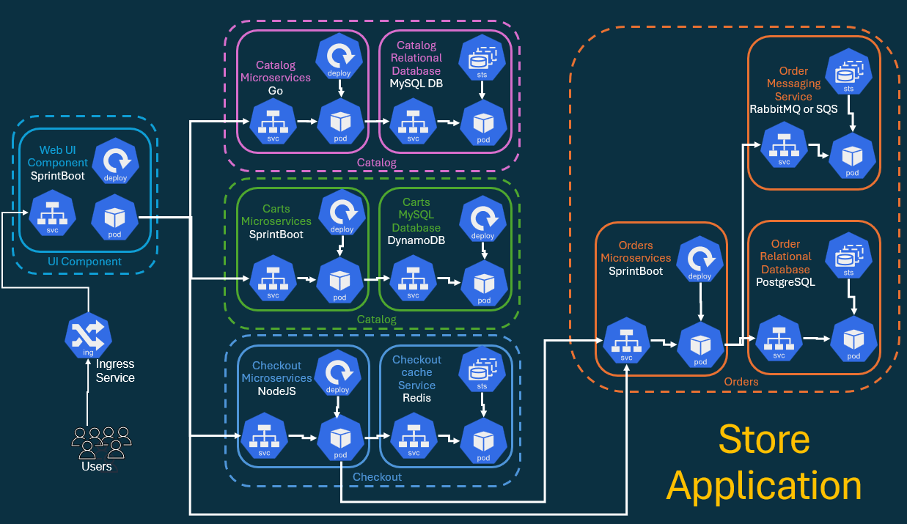
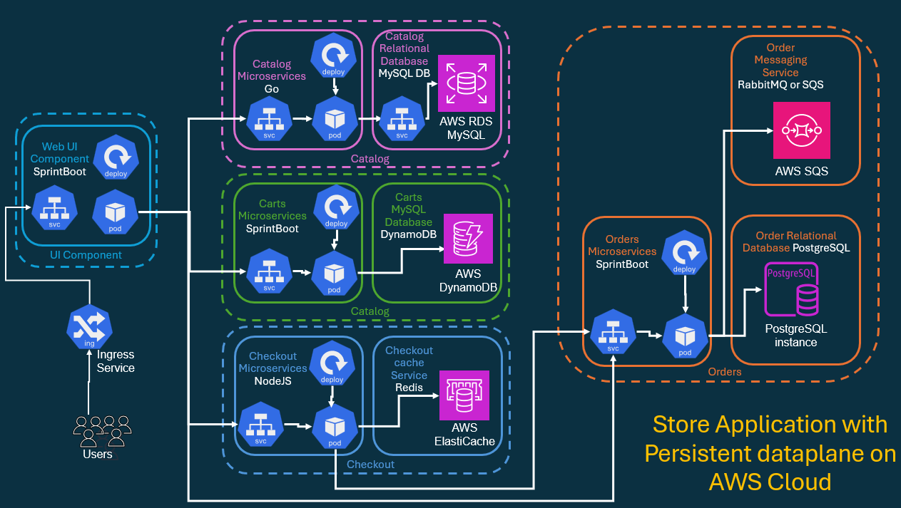
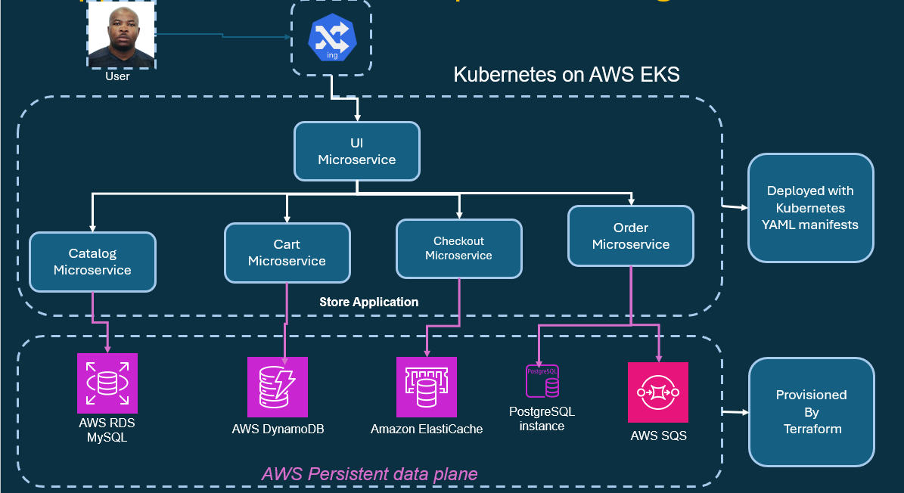
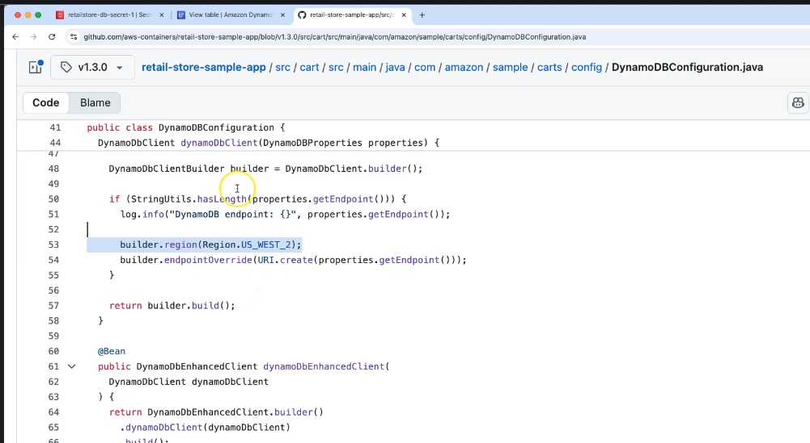

# Complete AWS Data Layer powering all the microservices fully automated by Terraform IaC and production-ready 

I provision all AWS data-plane services required by our Store Microservices using Terraform.

These include:

- Amazon RDS (MySQL + PostgreSQL) for persistent databases
- Amazon DynamoDB for serverless NoSQL persistence
- Amazon ElastiCache (Redis) for caching
- Amazon SQS for asynchronous messaging
- All linked with EKS Pod Identity Associations (PIA) for secure IAM-based access — no credentials inside Kubernetes!

## Application with Persistent Dataplane running on Kubernetes Cluster

> Persistent Dataplane running on Kubernetes Cluster



## Application with Persistent Dataplane running on AWS Cloud

> Persistent Dataplane offloaded to AWS Cloud



> Persistent Dataplane running on AWS Cloud - Automated using Terraform



## Folder Structure

```sh
f02_aws_dataplane_terraform_deployment/
|-- # ------------------------------------------------------------------------------------
|-- # Common Base Files (VPC/EKS Remote states, Variables and Locals)
|-- # ------------------------------------------------------------------------------------
|-- a01_01_settings_backend.tf                          ->      # Terraform Block Setting and S3 Backend 
|-- a01_02_providers.tf                                 ->      # AWS Provider
|-- a02_01_Global_Variables.tf                          ->      # Input Variables
|-- a02_02_Global_Locals.tf                             ->      # Local Block
|-- a03_01_Remote_State_vpc.tf                          ->      # terraform_remote_state
|-- a03_02_Remote_State_eks.tf                          ->      # terraform_remote_state
|-- # ------------------------------------------------------------------------------------
|-- # Common IAM and CSI Integration
|-- # ------------------------------------------------------------------------------------
|-- b01_01_datasource.tf                                ->      # Datasource Block
|-- c01_01_pod_identity_assume_role.tf                  ->      # aws_iam_policy_document
|-- d01_01_secret_store_csi_iam_policy.tf               ->      # aws_iam_policy
|-- # ------------------------------------------------------------------------------------
|-- # Catalog Microservice - Amazon RDS MySQL
|-- # ------------------------------------------------------------------------------------
|-- e01_01_catalog_rds_mysql_security_group.tf          ->      # SG for RDS MySQL
|-- e01_02_catalog_rds_mysql_subnet_group.tf            ->      # DB Subnet Group for RDS
|-- e01_03_catalog_rds_mysql_credentials.tf             ->      # Store DB credentials in AWS Secrets Manager
|-- e01_04_catalog_rds_mysql_db_instance.tf             ->      # RDS MySQL instance creation
|-- e01_05_catalog_sa_iam_role.tf                       ->      # IAM Role for Catalog SA (Pod Identity)
|-- e01_06_catalog_sa_eks_pod_identity_association.tf   ->      # Pod Identity Association
|-- # ------------------------------------------------------------------------------------
|-- # Cart Microservice - Amazon DynamoDB
|-- # ------------------------------------------------------------------------------------
|-- e02_01_cart_dynamodb_iam_policy_and_role.tf         ->       # IAM policy & role for Cart service
|-- e02_02_cart_dynamodb_identity_association.tf        ->       # Pod Identity for Cart              
|-- e02_03_cart_dynamodb_table.tf                       ->       # DynamoDB Table (Items)
|-- touch e02_01_cart_dynamodb_iam_policy_and_role.tf e02_02_cart_dynamodb_identity_association.tf e02_03_cart_dynamodb_table.tf
|-- # ------------------------------------------------------------------------------------
|-- # CHECKOUT MICROSERVICE — Amazon ElastiCache (Redis/Valkey)
|-- # ------------------------------------------------------------------------------------
|-- e03_01_checkout_redis_security_group.tf             ->      # SG for Redis cluster
|-- e03_02_checkout_redis_subnet_group.tf               ->      # Subnet group for Redis
|-- e03_03_checkout_redis_cluster.tf                    ->      # Redis cluster definition
|-- touch e03_01_checkout_redis_security_group.tf e03_02_checkout_redis_subnet_group.tf e03_03_checkout_redis_cluster.tf
|-- # ------------------------------------------------------------------------------------
|-- # ORDERS MICROSERVICE — Amazon RDS PostgreSQL + Amazon SQS
|-- # ------------------------------------------------------------------------------------
|-- e04_01_orders_postgresql_security_group.tf                   ->      # SG for PostgreSQL
|-- e04_02_orders_postgresql_db_subnet_group.tf                  ->      # Subnet group for RDS PostgreSQL
|-- e04_03_orders_postgresql_dbinstance.tf                       ->      # RDS PostgreSQL instance
|-- e04_04_orders_postgresql_sa_iam_role.tf                      ->      # IAM Role for Orders SA
|-- e04_05_orders_postgresql_sa_eks_pod_identity_association.tf  ->      # Pod Identity Association
|-- e04_06_orders_aws_sqs_queue.tf                               ->      # SQS queue for order events
|-- e04_07_orders_aws_sqs_iam_policy.tf                          ->      # IAM policy for Orders Pod to access SQS
|-- 


│
├── create-aws-dataplane.sh                           # Shell script to deploy all AWS Data Plane resources
├── delete-aws-dataplane.sh                           # Shell script to clean up resources after demo
└── README.md                                         # Full step-by-step documentation for this section
```


```sh
Apply complete! Resources: 24 added, 0 changed, 0 destroyed.

Outputs:

cart_dynamodb_pod_identity_association_arn = "arn:aws:eks:us-east-2:088354478627:podidentityassociation/south-jersey-eks-tchatua-dev-eks-control-plane/a-rxjw5i4shvoeskjje"
cart_dynamodb_policy_arn = "arn:aws:iam::088354478627:policy/south-jersey-eks-tchatua-dev-cart-dynamodb-policy"
cart_dynamodb_role_arn = "arn:aws:iam::088354478627:role/south-jersey-eks-tchatua-dev-cart-dynamodb-role"
catalog_rds_endpoint = "mydb3.c7oescqy4eh4.us-east-2.rds.amazonaws.com"
catalog_rds_sg_id = "sg-0c00d4b9faea01d1b"
catalog_sa_getsecrets_role_arn = "arn:aws:iam::088354478627:role/south-jersey-eks-tchatua-dev-catalog-getsecrets-role"
catalog_sa_pod_identity_association_arn = "arn:aws:eks:us-east-2:088354478627:podidentityassociation/south-jersey-eks-tchatua-dev-eks-control-plane/a-5mbp78naoucrcznpn"
checkout_redis_endpoint = "south-jersey-eks-tchatua-dev-checkout-redis.sx505s.0001.use2.cache.amazonaws.com"
debug_app_store_secret_password = <sensitive>
debug_app_store_secret_username = <sensitive>
eks_cluster_id = "south-jersey-eks-tchatua-dev-eks-control-plane"
eks_cluster_name = "south-jersey-eks-tchatua-dev-eks-control-plane"
eks_cluster_security_group_id = "sg-0d45c8b0631d232cb"
orders_postgresql_sa_getsecrets_role_arn = "arn:aws:iam::088354478627:role/south-jersey-eks-tchatua-dev-orders-postgresql-getsecrets-role"
orders_postgresql_sa_pod_identity_association_arn = "arn:aws:eks:us-east-2:088354478627:podidentityassociation/south-jersey-eks-tchatua-dev-eks-control-plane/a-4fhouk8egfu8giw8u"
orders_rds_postgresql_db_name = "ordersdb"
orders_rds_postgresql_endpoint = "orders-postgres-db.c7oescqy4eh4.us-east-2.rds.amazonaws.com:5432"
orders_sqs_policy_arn = "arn:aws:iam::088354478627:policy/south-jersey-eks-tchatua-dev-orders-sqs-policy"
orders_sqs_queue_arn = "arn:aws:sqs:us-east-2:088354478627:south-jersey-eks-tchatua-dev-orders-queue"
orders_sqs_queue_url = "https://sqs.us-east-2.amazonaws.com/088354478627/south-jersey-eks-tchatua-dev-orders-queue"
private_subnet_ids = [
  "subnet-0be44c3f4dd189677",
  "subnet-0e875113f27672d77",
  "subnet-0978cded7378a1d21",
]
public_subnet_ids = [
  "subnet-09cb97a1dc8ce8bd0",
  "subnet-0638a71359b62909f",
  "subnet-0d3f786c2002b0937",
]
store_db_secret_policy_arn = "arn:aws:iam::088354478627:policy/south-jersey-eks-tchatua-dev-retailstore-db-secret-policy"
vpc_id = "vpc-0bc0d17135b1f239d"
```


```sh
# -----------------------------------------------------------------------------------------------------------------

# -----------------------------------------------------------------------------------------------------------------

# -----------------------------------------------------------------------------------------------------------------

# -----------------------------------------------------------------------------------------------------------------

# -----------------------------------------------------------------------------------------------------------------

# -----------------------------------------------------------------------------------------------------------------

# -----------------------------------------------------------------------------------------------------------------

# -----------------------------------------------------------------------------------------------------------------

# -----------------------------------------------------------------------------------------------------------------

# -----------------------------------------------------------------------------------------------------------------

# -----------------------------------------------------------------------------------------------------------------

# -----------------------------------------------------------------------------------------------------------------


```