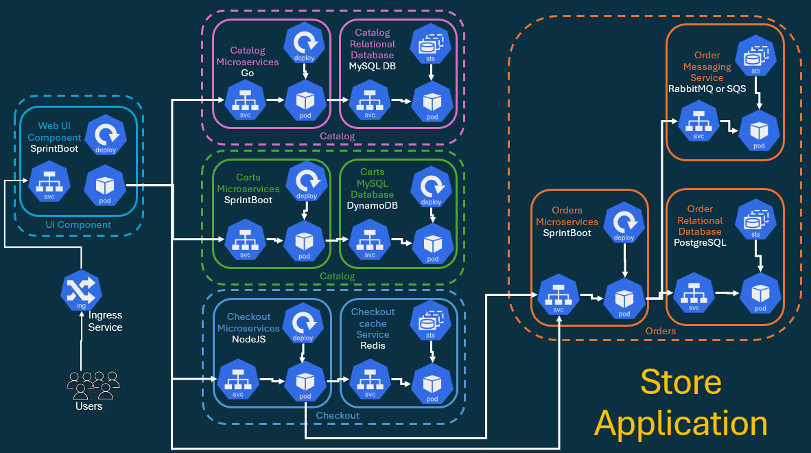
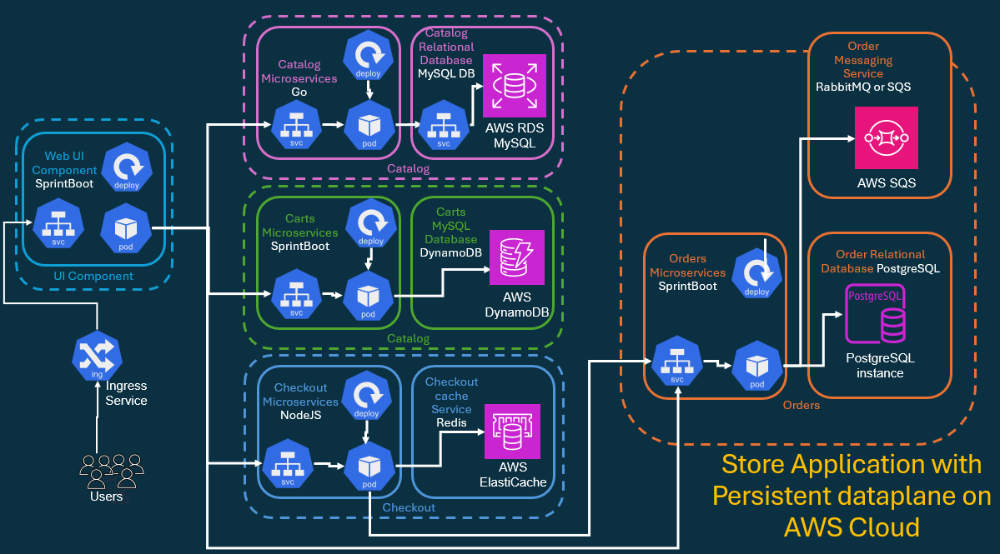
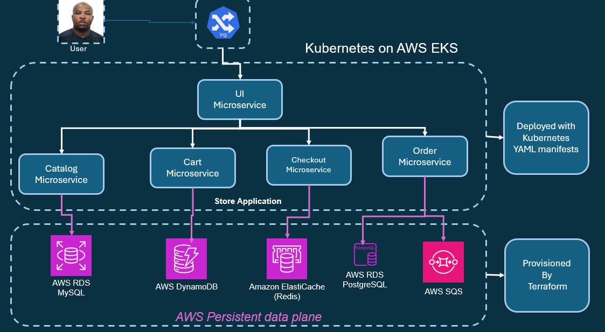
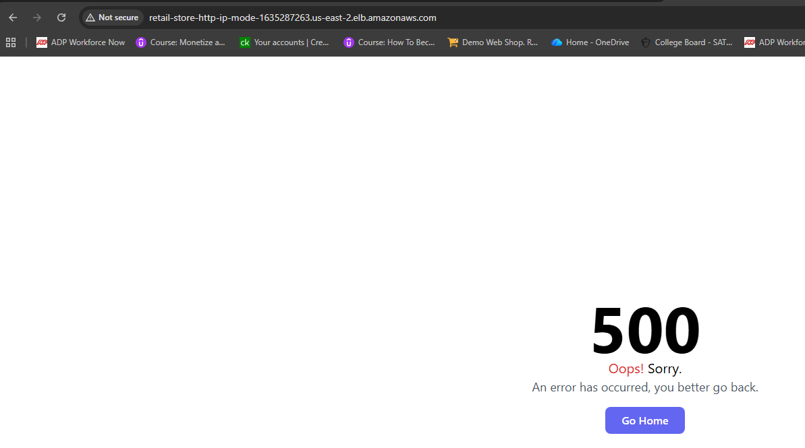
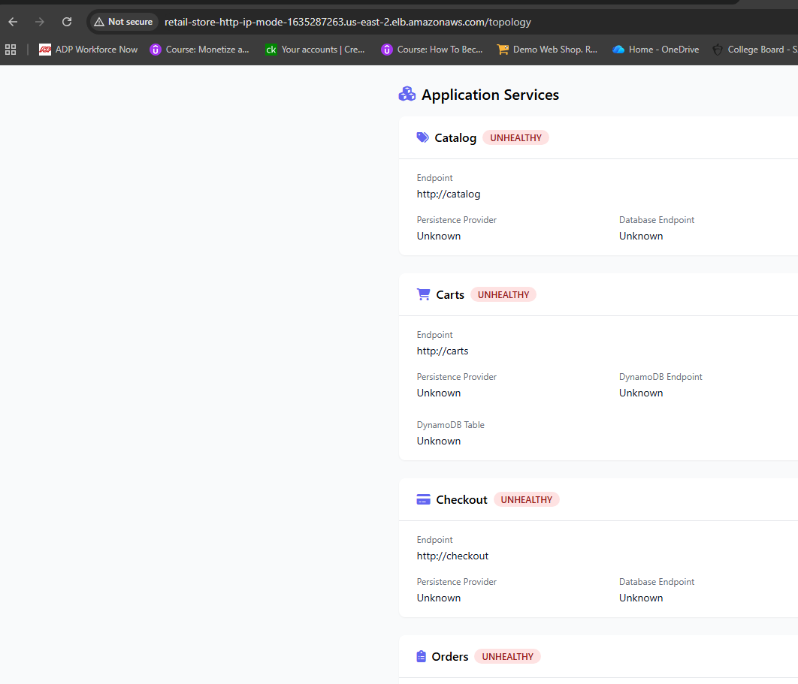

# Deploy Store Microservices with AWS Dataplane

## I will connect all Retail Store microservices to their equivalent AWS Data Plane components:
- Catalog, 
- Cart, 
- Checkout, 
- and Orders 

## The goal is to replace local in-cluster databases with fully managed AWS services for a production-grade architecture.

- Microservice:             **Catalog**
- AWS Data Plane Service:   **Amazon RDS MySQL**	
- Purpose:                  **Stores product catalog data**

- Microservice:             **Cart**
- AWS Data Plane Service:   **Amazon DynamoDB**		
- Purpose:                  **Manages user shopping cart data**

- Microservice:             **Checkout**
- AWS Data Plane Service:   **Amazon ElastiCache (Redis)** 	
- Purpose:                  **Caches shipping rates and checkout data**

- Microservice:             **Orders**
- AWS Data Plane Service:   **Amazon RDS PostgreSQL + Amazon SQS**
- Purpose:                  **Stores order data and handles order messaging events**

Each microservice will be configured to use:
- Its respective AWS service endpoint 
- Either via ConfigMap, 
- ExternalName Service, 
- or Secrets Store CSI for credentials.


## store Application with Persistent Dataplane running on Kubernetes Cluster

	

## Retailstore Application with Persistent Dataplane running on AWS Cloud


		
## Persistent Dataplane running on AWS Cloud - Automated using Terraform
		


## Deploy SecretProviderClass

### Folder structure: **a01_secret_provider_class**

```css
The AWS Secrets Manager CSI Driver and Pod Identity Agent are configured in the earlier steps.
Now, I’ll deploy the SecretProviderClass manifest that syncs secrets from AWS Secrets Manager into native Kubernetes secrets for Orders and Catalog microservices.
This allows the application pods to securely retrieve database credentials at runtime.
```

```sh
f03_deploy_store_microservices_with_aws_data_plane/
└-- a01_store_kubernetes_manifest_files_with_data-palne
    |
    └-- a01_secret_provider_class/                          # AWS Secrets Manager integration configs
        |-- a01_catalog_db_secretproviderclass.yaml         # Syncs catalog MySQL credentials from AWS Secrets Manager
        |-- a02_orders_db_secretproviderclass.yaml          # Syncs orders PostgreSQL credentials from AWS Secrets Manager
        └-- README.md                                       # Project overview and setup instructions

# -------------------------------------------------------------------

aws eks update-kubeconfig \
  --region us-east-2 \
  --name south-jersey-eks-tchatua-dev-eks-control-plane

# -------------------------------------------------------------------

kubectl get pods
No resources found in default namespace.

# -------------------------------------------------------------------

kubectl apply -f a01_secretproviderclass/
secretproviderclass.secrets-store.csi.x-k8s.io/catalog-db-secrets created
secretproviderclass.secrets-store.csi.x-k8s.io/orders-db-secrets created

# -------------------------------------------------------------------

kubectl get secretproviderclass
NAME                 AGE
catalog-db-secrets   36s
orders-db-secrets    36s
```

- This manifest ensures that:
    - The Secrets Store CSI driver fetches credentials from AWS Secrets Manager.
    - They are automatically synced to a native Kubernetes Secret (orders-db, catalog-db).
    - Pods mount these secrets directly as environment variables.

## Deploy UI Service and Ingress Service

### Folder structure: **a02_UI**

```sh
kubectl get pods
No resources found in default namespace.

# -------------------------------------------------------------------

kubectl get ingress
No resources found in default namespace.
```

```sh
f03_deploy_store_microservices_with_aws_data_plane/
└-- a01_store_kubernetes_manifest_files_with_data-palne
    |
    |-- a01_secret_provider_class/                          # AWS Secrets Manager integration configs
    |   |-- a01_catalog_db_secretproviderclass.yaml         # Syncs catalog MySQL credentials from AWS Secrets Manager
    |   |-- a02_orders_db_secretproviderclass.yaml          # Syncs orders PostgreSQL credentials from AWS Secrets Manager
    |   
    |-- a02_UI                                              # Frontend web application            
    |    |-- a01_UI_Service_Account.yml                      # ServiceAccount for UI pods
    |    |-- a02_UI_ConfigMap.yml                            # Backend service endpoints configuration
    |    |-- a03_UI_Deployment.yml                           # Frontend deployment
    |    |-- a04_ui_ClusterIP_Service.yml                    # Internal service for UI (exposed via Ingress)
    |    |
    └-- a03_ingress                                              # Frontend web application            
        |-- a01_ingress_http_ip_mode.yaml
        └-- README.md                                       # Project overview and setup instructions
```

```sh
kubectl apply -f a02_UI/
serviceaccount/ui created
configmap/ui created
deployment.apps/ui created
service/ui created

# -------------------------------------------------------------------

kubectl apply -f a03_ingress/
ingress.networking.k8s.io/retail-store-http-ip-mode created

# -------------------------------------------------------------------

kubectl get pods
NAME                  READY   STATUS    RESTARTS   AGE
ui-7d45fc58bf-lcgps   1/1     Running   0          7m17s

# -------------------------------------------------------------------

kubectl get ingress
NAME                        CLASS   HOSTS   ADDRESS   PORTS   AGE
retail-store-http-ip-mode   alb     *                 80      8m24s
```

## Toubleshooting 

```sh
aws ec2 create-tags \
  --resources subnet-0d3f786c2002b0937 subnet-0638a71359b62909f subnet-09cb97a1dc8ce8bd0 \
  --tags Key=kubernetes.io/role/elb,Value=1 \
         Key=kubernetes.io/cluster/south-jersey-eks-tchatua-dev-eks-control-plane,Value=shared

# -------------------------------------------------------------------

kubectl delete -f a03_ingress/
ingress.networking.k8s.io "retail-store-http-ip-mode" deleted

# -------------------------------------------------------------------

$ kubectl apply -f a03_ingress/
ingress.networking.k8s.io/retail-store-http-ip-mode created

# -------------------------------------------------------------------

kubectl get ingress
NAME                        CLASS   HOSTS   ADDRESS
PORTS   AGE
retail-store-http-ip-mode   alb     *       retail-store-http-ip-mode-1635287263.us-east-2.elb.amazonaws.com   80      33s

# -------------------------------------------------------------------

http://retail-store-http-ip-mode-1635287263.us-east-2.elb.amazonaws.com/
http://retail-store-http-ip-mode-1635287263.us-east-2.elb.amazonaws.com/topology

```




## Deploy Catalog Service 

### Folder structure: **a02_UI**

```sh
f03_deploy_store_microservices_with_aws_data_plane/
└-- a01_store_kubernetes_manifest_files_with_data-palne
    |
    |-- a01_secret_provider_class/                          # AWS Secrets Manager integration configs
    |   |-- a01_catalog_db_secretproviderclass.yaml         # Syncs catalog MySQL credentials from AWS Secrets Manager
    |   |-- a02_orders_db_secretproviderclass.yaml          # Syncs orders PostgreSQL credentials from AWS Secrets Manager
    |   
    |-- a02_UI                                               # Frontend web application            
    |    |-- a01_UI_Service_Account.yml                      # ServiceAccount for UI pods
    |    |-- a02_UI_ConfigMap.yml                            # Backend service endpoints configuration
    |    |-- a03_UI_Deployment.yml                           # Frontend deployment
    |    |-- a04_ui_ClusterIP_Service.yml                    # Internal service for UI (exposed via Ingress)
    |    |
    └-- a03_ingress                                           # Frontend web application            
    |   |-- a01_ingress_http_ip_mode.yaml
    |   |
    └-- a04_catalog                                     # Product catalog service (MySQL backend)                                               
        |-- a01_catalog_service_accout.yaml             # ServiceAccount with EKS Pod Identity for AWS Secrets Manager access
        |-- a02_catalog_configmap.yaml                  # Database connection configs (host, port, db name)
        |-- a03_catalog_deployment.yaml                 # Deployment with CSI secrets mount for secret readiness
        |-- a04_catalog_mysql_clusterip_service.yaml    # Internal service for catalog API (port 80)
        |-- a05_catalog_mysql_externalname_service.yaml # ExternalName service pointing to RDS MySQL endpoint
        └-- README.md                                   # Project overview and setup instructions
```

```sh
kubectl apply -f a04_catalog/
serviceaccount/catalog created
configmap/catalog created
deployment.apps/catalog created
service/catalog created
service/catalog-mysql created


# -------------------------------------------------------------------

kubectl patch csidriver secrets-store.csi.k8s.io \
  --type merge \
  -p '{"spec":{"tokenRequests":[{"audience":"sts.amazonaws.com"},{"audience":"pods.eks.amazonaws.com"}]}}'
csidriver.storage.k8s.io/secrets-store.csi.k8s.io patched

# -------------------------------------------------------------------

kubectl get csidriver secrets-store.csi.k8s.io -o yaml
apiVersion: storage.k8s.io/v1
kind: CSIDriver
metadata:
  annotations:
    meta.helm.sh/release-name: csi-secrets-store
    meta.helm.sh/release-namespace: kube-system
  creationTimestamp: "2026-06-18T13:03:55Z"
  generation: 2
  labels:
    app: secrets-store-csi-driver
    app.kubernetes.io/instance: csi-secrets-store
    app.kubernetes.io/managed-by: Helm
    app.kubernetes.io/name: secrets-store-csi-driver
    app.kubernetes.io/version: 1.6.0
    helm.sh/chart: secrets-store-csi-driver-1.6.0
  name: secrets-store.csi.k8s.io
  resourceVersion: "158168"
  uid: 86f3dca9-a4c3-493a-8354-ae6aa5371e4a
spec:
  attachRequired: false
  fsGroupPolicy: ReadWriteOnceWithFSType
  podInfoOnMount: true
  requiresRepublish: false
  seLinuxMount: false
  storageCapacity: false
  tokenRequests:
  - audience: sts.amazonaws.com
  - audience: pods.eks.amazonaws.com
  volumeLifecycleModes:
  - Ephemeral

# -------------------------------------------------------------------

kubectl get secret
NAME         TYPE     DATA   AGE
catalog-db   Opaque   2      25m

# -------------------------------------------------------------------

kubectl get pods
NAME                       READY   STATUS    RESTARTS   AGE
catalog-7b55c467cb-696dw   1/1     Running   0          17m
ui-7d45fc58bf-qpg62        1/1     Running   0          15m

# -------------------------------------------------------------------

kubectl logs catalog-7b55c467cb-696dw
Using mysql database catalog-mysql:3306
Running database migration...
Database migration complete

# -------------------------------------------------------------------

http://retail-store-http-ip-mode-1635287263.us-east-2.elb.amazonaws.com/
http://retail-store-http-ip-mode-1635287263.us-east-2.elb.amazonaws.com/topology

# -------------------------------------------------------------------

```
## Verification Pod


```sh
```sh
f03_deploy_store_microservices_with_aws_data_plane/
└-- a01_store_kubernetes_manifest_files_with_data-palne
    |
    |-- a01_secret_provider_class/                          # AWS Secrets Manager integration configs
    |   |-- a01_catalog_db_secretproviderclass.yaml         # Syncs catalog MySQL credentials from AWS Secrets Manager
    |   |-- a02_orders_db_secretproviderclass.yaml          # Syncs orders PostgreSQL credentials from AWS Secrets Manager
    |   
    |-- a02_UI                                               # Frontend web application            
    |    |-- a01_UI_Service_Account.yml                      # ServiceAccount for UI pods
    |    |-- a02_UI_ConfigMap.yml                            # Backend service endpoints configuration
    |    |-- a03_UI_Deployment.yml                           # Frontend deployment
    |    |-- a04_ui_ClusterIP_Service.yml                    # Internal service for UI (exposed via Ingress)
    |    |
    └-- a03_ingress                                           # Frontend web application            
    |   |-- a01_ingress_http_ip_mode.yaml
    |   |
    └-- a04_catalog                                     # Product catalog service (MySQL backend)                                               
    |   |-- a01_catalog_service_accout.yaml             # ServiceAccount with EKS Pod Identity for AWS Secrets Manager access
    |   |-- a02_catalog_configmap.yaml                  # Database connection configs (host, port, db name)
    |   |-- a03_catalog_deployment.yaml                 # Deployment with CSI secrets mount for secret readiness
    |   |-- a04_catalog_mysql_clusterip_service.yaml    # Internal service for catalog API (port 80)
    |   |-- a05_catalog_mysql_externalname_service.yaml # ExternalName service pointing to RDS MySQL endpoint
    |   |
    └-- b01_verification_pods
        |-- a01_catalog_mysql_client_pod.yaml
        |-- a02_cart_dynamodb_awscli_pod.yaml
        |-- a03_checkout_elasticache_redis_client_pod.yaml
        |-- a04_orders_postgresql_client_pod.yaml
        |-- a05_orders_sqs_awscli_pod.yaml
        └-- README.md                                   # Project overview and setup instructions
```

```sh
kubectl apply -f b01_verification_pods/a01_catalog_mysql_client_pod.yaml
pod/catalog-mysql-client created

tchat@247-Tchatua MINGW64 ~/OneDrive/Documents/2026/a09_Platform_Engineer/a04_Udemy/a13_Ultimate_DevOps_Real_World_Project_on_AWS_Cloud/drwp_aws_eks/f03_deploy_store_microservices_with_aws_data_plane (develop)
$ kubectl get pods
NAME                       READY   STATUS    RESTARTS   AGE
catalog-7b55c467cb-696dw   1/1     Running   0          34m
catalog-mysql-client       1/1     Running   0          26s
ui-7d45fc58bf-qpg62        1/1     Running   0          31m

# ---------------------------------------------------------------------

# Step-01: Create Pod
kubectl apply -f 01_catalog_mysql_client_pod.yaml
kubectl get pods

# Step-02: Connect to Pod
kubectl exec -it catalog-mysql-client -- bash

# Step-03: Verify Environment Variables
env
env | grep MYSQL
echo $MYSQL_HOST   # It has port appended (catalog-mysql:3306)

# Step-04: Connect to MySQL DB
mysql -h $(echo $MYSQL_HOST | cut -d: -f1) -u $MYSQL_USER -p$MYSQL_PASSWORD 
# (or)
# Connect directly using explicit endpoint or extenralname service
mysql -h catalog-mysql -u $MYSQL_USER -p$MYSQL_PASSWORD 

# Step-05: Verify Data
SHOW DATABASES;
USE catalogdb;
SHOW TABLES;
SELECT * FROM products;
SELECT * FROM products LIMIT 5;
EXIT

# Step-06: exit pod
exit
```

## Deploy Cart → AWS DynamoDB

The Cart microservice uses Amazon DynamoDB to persist shopping cart data.

I’ll update the ConfigMap to include:

- Real AWS DynamoDB endpoint
- Region (us-west-2)
- Table name and other parameters

```sh
kubectl apply -f a05_cart/
serviceaccount/carts created
configmap/carts created
deployment.apps/carts created
service/carts created

# -------------------------------------------------------------------

kubectl get pods
NAME                       READY   STATUS    RESTARTS      AGE
carts-5d4d59f667-dvrnn     1/1     Running   1 (46s ago)   68s
catalog-7b55c467cb-696dw   1/1     Running   0             61m
catalog-mysql-client       1/1     Running   0             27m
ui-7d45fc58bf-qpg62        1/1     Running   0             58m

# -------------------------------------------------------------------

kubectl get svc
NAME            TYPE           CLUSTER-IP       EXTERNAL-IP                                      PORT(S)    AGE
carts           ClusterIP      172.20.218.221   <none>                                           80/TCP     86s
catalog         ClusterIP      172.20.120.251   <none>                                           80/TCP     69m
catalog-mysql   ExternalName   <none>           mydb3.c7oescqy4eh4.us-east-2.rds.amazonaws.com   3306/TCP   69m
kubernetes      ClusterIP      172.20.0.1       <none>                                           443/TCP    11h
ui              ClusterIP      172.20.30.60     <none>                                           80/TCP     3h6m

# -------------------------------------------------------------------

kubectl get sa
NAME      SECRETS   AGE
carts     0         2m25s
catalog   0         70m
default   0         11h
ui        0         3h7m

# -------------------------------------------------------------------

kubectl get pods
NAME                       READY   STATUS    RESTARTS        AGE
carts-5d4d59f667-dvrnn     1/1     Running   1 (2m54s ago)   3m16s
catalog-7b55c467cb-696dw   1/1     Running   0               63m
catalog-mysql-client       1/1     Running   0               29m
ui-7d45fc58bf-qpg62        1/1     Running   0               60m
k
tchat@247-Tchatua MINGW64 ~/OneDrive/Documents/2026/a09_Platform_Engineer/a04_Udemy/a13_Ultimate_DevOps_Real_World_Project_on_AWS_Cloud/drwp_aws_eks/f03_deploy_store_microservices_with_aws_data_plane (develop)
$ kubectl logs -f carts-5d4d59f667-dvrnn
Picked up JAVA_TOOL_OPTIONS:
Standard Commons Logging discovery in action with spring-jcl: please remove commons-logging.jar from classpath in order to avoid potential conflicts

  .   ____          _            __ _ _
 /\\ / ___'_ __ _ _(_)_ __  __ _ \ \ \ \
( ( )\___ | '_ | '_| | '_ \/ _` | \ \ \ \
 \\/  ___)| |_)| | | | | || (_| |  ) ) ) )
  '  |____| .__|_| |_|_| |_\__, | / / / /
 =========|_|==============|___/=/_/_/_/

 :: Spring Boot ::                (v3.5.5)

2026-06-19T00:53:53.986Z  INFO 1 --- [           main] c.a.s.c.CartApplication                  : Starting CartApplication v0.0.1-SNAPSHOT using Java 21.0.8 with PID 1 (/app/app.jar started by appuser in /app)
2026-06-19T00:53:54.001Z  INFO 1 --- [           main] c.a.s.c.CartApplication                  : The following 1 profile is active: "prod"
2026-06-19T00:53:57.526Z  INFO 1 --- [           main] o.s.b.w.e.t.TomcatWebServer              : Tomcat initialized with port 8080 (http)
2026-06-19T00:53:57.551Z  INFO 1 --- [           main] o.a.c.c.StandardService                  : Starting service [Tomcat]
2026-06-19T00:53:57.552Z  INFO 1 --- [           main] o.a.c.c.StandardEngine                   : Starting Servlet engine: [Apache Tomcat/10.1.44]
2026-06-19T00:53:57.605Z  INFO 1 --- [           main] o.a.c.c.C.[.[.[/]                        : Initializing Spring embedded WebApplicationContext
2026-06-19T00:53:57.608Z  INFO 1 --- [           main] w.s.c.ServletWebServerApplicationContext : Root WebApplicationContext: initialization completed in 2876 ms
Standard Commons Logging discovery in action with spring-jcl: please remove commons-logging.jar from classpath in order to avoid potential conflicts
2026-06-19T00:53:57.929Z  INFO 1 --- [           main] c.a.s.c.c.DynamoDBConfiguration          : Using DynamoDB persistence
2026-06-19T00:53:57.932Z  INFO 1 --- [           main] c.a.s.c.c.DynamoDBConfiguration          : DynamoDB table: Items
2026-06-19T00:53:58.044Z  INFO 1 --- [           main] c.a.s.c.c.DynamoDBConfiguration          : DynamoDB endpoint: https://dynamodb.us-west-2.amazonaws.com
2026-06-19T00:53:58.898Z  INFO 1 --- [           main] i.o.a.GlobalOpenTelemetry                : AutoConfiguredOpenTelemetrySdk found on classpath but automatic configuration is disabled. To enable, run your JVM with -Dotel.java.global-autoconfigure.enabled=true
2026-06-19T00:54:00.416Z  WARN 1 --- [           main] c.a.s.c.s.DynamoDBCartService            : Dynamo table not found
2026-06-19T00:54:21.374Z  INFO 1 --- [           main] i.o.i.s.a.OpenTelemetryAutoConfiguration : OpenTelemetry Spring Boot starter has been disabled
2026-06-19T00:54:21.926Z  INFO 1 --- [           main] o.s.b.a.e.w.EndpointLinksResolver        : Exposing 4 endpoints beneath base path '/actuator'
2026-06-19T00:54:22.062Z  INFO 1 --- [           main] o.s.b.w.e.t.TomcatWebServer              : Tomcat started on port 8080 (http) with context path '/'
2026-06-19T00:54:22.090Z  INFO 1 --- [           main] c.a.s.c.CartApplication                  : Started CartApplication in 29.266 seconds (process running for 31.205)
2026-06-19T00:54:22.842Z  INFO 1 --- [nio-8080-exec-1] o.a.c.c.C.[.[.[/]                        : Initializing Spring DispatcherServlet 'dispatcherServlet'
2026-06-19T00:54:22.843Z  INFO 1 --- [nio-8080-exec-1] o.s.w.s.DispatcherServlet                : Initializing Servlet 'dispatcherServlet'
2026-06-19T00:54:22.845Z  INFO 1 --- [nio-8080-exec-1] o.s.w.s.DispatcherServlet                : Completed initialization in 2 ms
```

```sh
f03_deploy_store_microservices_with_aws_data_plane/
|-- README.md                                               # Project overview and setup instructions
└-- a01_store_kubernetes_manifest_files_with_data-palne
    |
    |-- a01_secret_provider_class/                          # AWS Secrets Manager integration configs
    |   |-- a01_catalog_db_secretproviderclass.yaml         # Syncs catalog MySQL credentials from AWS Secrets Manager
    |   |-- a02_orders_db_secretproviderclass.yaml          # Syncs orders PostgreSQL credentials from AWS Secrets Manager
    |   
    |-- a02_UI                                               # Frontend web application            
    |    |-- a01_UI_Service_Account.yml                      # ServiceAccount for UI pods
    |    |-- a02_UI_ConfigMap.yml                            # Backend service endpoints configuration
    |    |-- a03_UI_Deployment.yml                           # Frontend deployment
    |    |-- a04_ui_ClusterIP_Service.yml                    # Internal service for UI (exposed via Ingress)
    |    |
    └-- a03_ingress                                           # Frontend web application            
    |   |-- a01_ingress_http_ip_mode.yaml
    |   |
    └-- a04_catalog                                     # Product catalog service (MySQL backend)                                               
    |   |-- a01_catalog_service_accout.yaml             # ServiceAccount with EKS Pod Identity for AWS Secrets Manager access
    |   |-- a02_catalog_configmap.yaml                  # Database connection configs (host, port, db name)
    |   |-- a03_catalog_deployment.yaml                 # Deployment with CSI secrets mount for secret readiness
    |   |-- a04_catalog_mysql_clusterip_service.yaml    # Internal service for catalog API (port 80)
    |   |-- a05_catalog_mysql_externalname_service.yaml # ExternalName service pointing to RDS MySQL endpoint
    |   |
    └-- a05_cart /                                      # Shopping cart service (DynamoDB backend)                                               
    |   |-- a01_cart_service_account.yaml               # ServiceAccount with EKS Pod Identity for DynamoDB access
    |   |-- a02_cart_configmap.yaml                     # DynamoDB table name and region configs
    |   |-- a03_cart_deployment.yaml                    # Stateless deployment for cart operations
    |   |-- a04_cart_clusterip_service.yaml             # Internal service for cart API
    |   |    
    └-- a06_checkout /                                  # Checkout service (ElastiCache Redis backend)
    |   |-- a01_checkout_service_account.yaml           # ServiceAccount with EKS Pod Identity for ElastiCache access
    |   |-- a02_checkout_configmap.yaml                 # Redis endpoint and configuration
    |   |-- a03_checkout_deployment.yaml                # Handles order processing and payment workflows
    |   |-- a04_checkout_clusterip_service.yaml         # Internal service for checkout API
    |   |
    └-- b01_verification_pods /                             # Troubleshooting and debugging pods
        |-- a01_catalog_mysql_client_pod.yaml               # MySQL client pod to test catalog database connectivity
        |-- a02_cart_dynamodb_awscli_pod.yaml               # AWS CLI pod to test DynamoDB table access
        |-- a03_checkout_elasticache_redis_client_pod.yaml  # Redis CLI pod to test ElastiCache connectivity
        |-- a04_orders_postgresql_client_pod.yaml           # PostgreSQL client pod to test orders database connectivity
        |-- a05_orders_sqs_awscli_pod.yaml                  # AWS CLI pod to test SQS queue access
        └-- README.md                                       # Instructions for using verification pods
```

## Deploy Checkout → AWS ElastiCache (Redis)


```sh
kubectl apply -f a06_checkout/
serviceaccount/checkout created
configmap/checkout created
deployment.apps/checkout created
service/checkout created

# -------------------------------------------------------------------

kubectl get pods
NAME                        READY   STATUS    RESTARTS      AGE
carts-5d4d59f667-dvrnn      1/1     Running   1 (58m ago)   59m
catalog-7b55c467cb-696dw    1/1     Running   0             119m
catalog-mysql-client        1/1     Running   0             85m
checkout-5c78b886b4-9hqh4   1/1     Running   0             7m26s
ui-7d45fc58bf-qpg62         1/1     Running   0             116m

# -------------------------------------------------------------------

kubectl logs -f checkout-5c78b886b4-9hqh4
[Nest] 1  - 06/19/2026, 1:45:38 AM     LOG [NestFactory] Starting Nest application...
[Nest] 1  - 06/19/2026, 1:45:38 AM     LOG [InstanceLoader] OpenTelemetryModule dependencies initialized +44ms
[Nest] 1  - 06/19/2026, 1:45:38 AM     LOG [InstanceLoader] PrometheusModule dependencies initialized +1ms
[Nest] 1  - 06/19/2026, 1:45:38 AM     LOG [InstanceLoader] ConfigHostModule dependencies initialized +1ms
[Nest] 1  - 06/19/2026, 1:45:38 AM     LOG [InstanceLoader] OpenTelemetryCoreModule dependencies initialized +1ms
[Nest] 1  - 06/19/2026, 1:45:38 AM     LOG [InstanceLoader] TerminusModule dependencies initialized +1ms
[Nest] 1  - 06/19/2026, 1:45:38 AM     LOG [InstanceLoader] ConfigModule dependencies initialized +0ms
[Nest] 1  - 06/19/2026, 1:45:38 AM     LOG [InstanceLoader] ConfigModule dependencies initialized +0ms
[Nest] 1  - 06/19/2026, 1:45:38 AM     LOG Using redis persistence
[Nest] 1  - 06/19/2026, 1:45:38 AM     LOG [InstanceLoader] AppModule dependencies initialized +2ms
[Nest] 1  - 06/19/2026, 1:45:38 AM     LOG [InstanceLoader] CheckoutModule dependencies initialized +1ms
[Nest] 1  - 06/19/2026, 1:45:38 AM     LOG [RoutesResolver] AppController {/}: +49ms
[Nest] 1  - 06/19/2026, 1:45:38 AM     LOG [RouterExplorer] Mapped {/health, GET} route +4ms
[Nest] 1  - 06/19/2026, 1:45:38 AM     LOG [RouterExplorer] Mapped {/topology, GET} route +0ms
[Nest] 1  - 06/19/2026, 1:45:38 AM     LOG [RoutesResolver] ChaosController {/chaos}: +1ms
[Nest] 1  - 06/19/2026, 1:45:38 AM     LOG [RouterExplorer] Mapped {/chaos/latency/:ms, POST} route +1ms
[Nest] 1  - 06/19/2026, 1:45:38 AM     LOG [RouterExplorer] Mapped {/chaos/status/:code, POST} route +1ms
[Nest] 1  - 06/19/2026, 1:45:38 AM     LOG [RouterExplorer] Mapped {/chaos/latency, DELETE} route +0ms
[Nest] 1  - 06/19/2026, 1:45:38 AM     LOG [RouterExplorer] Mapped {/chaos/status, DELETE} route +1ms
[Nest] 1  - 06/19/2026, 1:45:38 AM     LOG [RouterExplorer] Mapped {/chaos/status, GET} route +0ms
[Nest] 1  - 06/19/2026, 1:45:38 AM     LOG [RouterExplorer] Mapped {/chaos/health, POST} route +1ms
[Nest] 1  - 06/19/2026, 1:45:38 AM     LOG [RouterExplorer] Mapped {/chaos/health, DELETE} route +1ms
[Nest] 1  - 06/19/2026, 1:45:38 AM     LOG [RoutesResolver] PrometheusController {/metrics}: +0ms
[Nest] 1  - 06/19/2026, 1:45:38 AM     LOG [RouterExplorer] Mapped {/metrics, GET} route +1ms
[Nest] 1  - 06/19/2026, 1:45:38 AM     LOG [RoutesResolver] CheckoutController {/checkout}: +0ms
[Nest] 1  - 06/19/2026, 1:45:38 AM     LOG [RouterExplorer] Mapped {/checkout/:customerId, GET} route +0ms
[Nest] 1  - 06/19/2026, 1:45:38 AM     LOG [RouterExplorer] Mapped {/checkout/:customerId/update, POST} route +1ms
[Nest] 1  - 06/19/2026, 1:45:38 AM     LOG [RouterExplorer] Mapped {/checkout/:customerId/submit, POST} route +0ms
[Nest] 1  - 06/19/2026, 1:45:38 AM     LOG [NestApplication] Nest application successfully started +5ms
```

## Deploy Orders → AWS RDS PostgreSQL + SQS

The Orders microservice connects to:

- Amazon RDS PostgreSQL for order data persistence
- Amazon SQS for order event messaging


```sh

# touch a01_orders_service_account.yaml
# touch a02_orders_configmap.yaml
# touch a03_orders_deployment.yaml
# touch a04_orders_clusterip_service.yaml

# -------------------------------------------------------------------

kubectl apply -f a07_orders/
serviceaccount/orders created
configmap/orders created
deployment.apps/orders created
service/orders created

# -------------------------------------------------------------------

kubectl get pods
NAME                        READY   STATUS    RESTARTS      AGE
carts-5d4d59f667-dvrnn      1/1     Running   1 (88m ago)   88m
catalog-7b55c467cb-696dw    1/1     Running   0             148m
catalog-mysql-client        1/1     Running   0             115m
checkout-5c78b886b4-9hqh4   1/1     Running   0             36m
orders-6c8cf86fc7-zdn2b     1/1     Running   0             31s
ui-7d45fc58bf-qpg62         1/1     Running   0             146m

# -------------------------------------------------------------------

kubectl get svc
NAME            TYPE           CLUSTER-IP       EXTERNAL-IP                                      PORT(S)    AGE
carts           ClusterIP      172.20.218.221   <none>                                           80/TCP     89m
catalog         ClusterIP      172.20.120.251   <none>                                           80/TCP     156m
catalog-mysql   ExternalName   <none>           mydb3.c7oescqy4eh4.us-east-2.rds.amazonaws.com   3306/TCP   156m
checkout        ClusterIP      172.20.241.21    <none>                                           80/TCP     37m
kubernetes      ClusterIP      172.20.0.1       <none>                                           443/TCP    13h
orders          ClusterIP      172.20.186.95    <none>                                           80/TCP     57s
ui              ClusterIP      172.20.30.60     <none>                                           80/TCP     4h34m

# -------------------------------------------------------------------

kubectl get secret
NAME         TYPE     DATA   AGE
catalog-db   Opaque   2      157m
orders-db    Opaque   2      72s

# -------------------------------------------------------------------

# -------------------------------------------------------------------

# -------------------------------------------------------------------

# -------------------------------------------------------------------

# -------------------------------------------------------------------

# -------------------------------------------------------------------

# -------------------------------------------------------------------

# -------------------------------------------------------------------

# -------------------------------------------------------------------

# -------------------------------------------------------------------

# -------------------------------------------------------------------

# -------------------------------------------------------------------
```sh

    │
    ├── 02_RetailStore_Microservices/                              # Core microservices deployments
    │   │
    │   │
    │   │
    │   │
    │   ├── 04_orders/                                             # Order management service (PostgreSQL + SQS backend)
    │   │   ├── 01_orders_service_account.yaml                    # ServiceAccount with EKS Pod Identity for AWS Secrets Manager + SQS access
    │   │   ├── 02_orders_configmap.yaml                          # PostgreSQL connection and SQS queue configs
    │   │   ├── 03_orders_deployment.yaml                         # Deployment with CSI secrets mount + init container for secret readiness
    │   │   └── 04_orders_clusterip_service.yaml                  # Internal service for orders API
    │   │
    │
    ├── a05_cart/                                                # External access configuration
    │   └── 01_ingress_http_ip_mode.yaml                          # AWS Load Balancer Controller Ingress (HTTP, IP mode for routing to UI)
    │   ├── 02_cart_dynamodb_awscli_pod.yaml                      # AWS CLI pod to test DynamoDB table access
    ├── 03_ingress/                                                # External access configuration
    │   └── 01_ingress_http_ip_mode.yaml                          # AWS Load Balancer Controller Ingress (HTTP, IP mode for routing to UI)
    │
    │
    └── Verification-Pods.md                                       # Top-level verification guide

# -------------------------------------------------------------------

kubectl delete -R -f f03_deploy_store_microservices_with_aws_data_plane/
secretproviderclass.secrets-store.csi.x-k8s.io "catalog-db-secrets" deleted
secretproviderclass.secrets-store.csi.x-k8s.io "orders-db-secrets" deleted
serviceaccount "ui" deleted
configmap "ui" deleted
deployment.apps "ui" deleted
service "ui" deleted
ingress.networking.k8s.io "retail-store-http-ip-mode" deleted
serviceaccount "catalog" deleted
configmap "catalog" deleted
deployment.apps "catalog" deleted
service "catalog" deleted
service "catalog-mysql" deleted
serviceaccount "carts" deleted
configmap "carts" deleted
deployment.apps "carts" deleted
service "carts" deleted
serviceaccount "checkout" deleted
configmap "checkout" deleted
deployment.apps "checkout" deleted
service "checkout" deleted
serviceaccount "orders" deleted
configmap "orders" deleted
deployment.apps "orders" deleted
service "orders" deleted
pod "catalog-mysql-client" deleted
Error from server (NotFound): error when deleting "f03_deploy_store_microservices_with_aws_data_plane\\b01_verification_pods\\a02_cart_dynamodb_awscli_pod.yaml": pods "carts-dynamodb-client" not found
Error from server (NotFound): error when deleting "f03_deploy_store_microservices_with_aws_data_plane\\b01_verification_pods\\a03_checkout_elasticache_redis_client_pod.yaml": pods "checkout-redis-client" not found
Error from server (NotFound): error when deleting "f03_deploy_store_microservices_with_aws_data_plane\\b01_verification_pods\\a04_orders_postgresql_client_pod.yaml": pods "orders-postgresql-client" not found
Error from server (NotFound): error when deleting "f03_deploy_store_microservices_with_aws_data_plane\\b01_verification_pods\\a05_orders_sqs_awscli_pod.yaml": pods "orders-sqs-client" not found


cd f02_aws_dataplane_terraform_deployment

terraform destroy --auto-approve

```