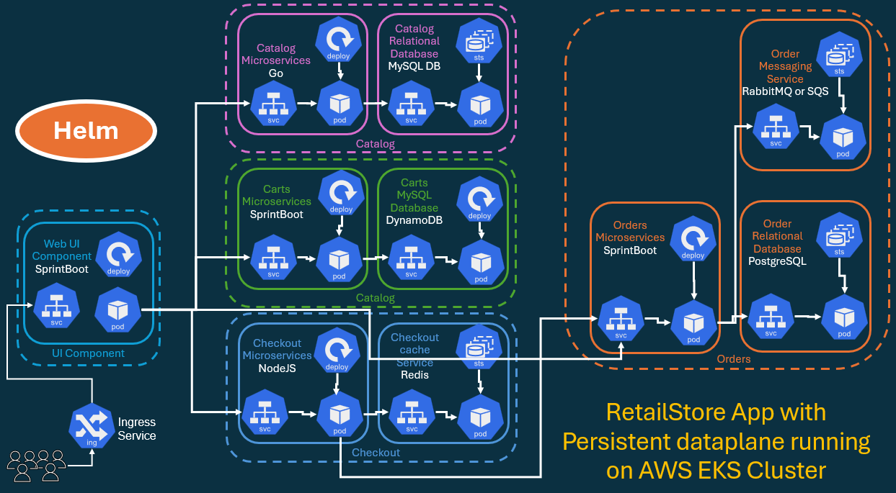
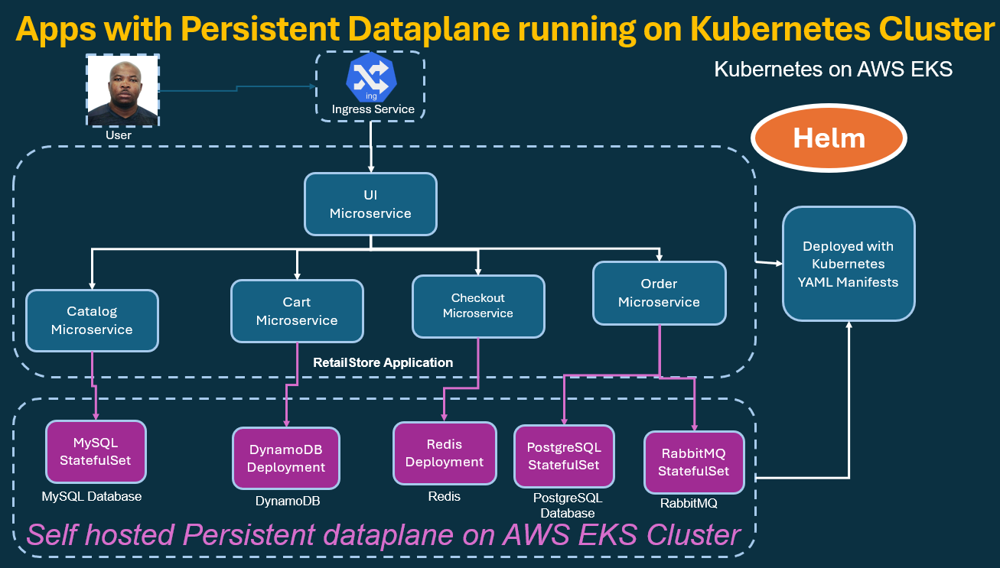

# RetailStore Application with Persistent Dataplane running on AWS EKS using Helm

## Install Helm with package manager (Best Practice to avoid multiple bugs)

- [Download Helm v4.2.2. The common platform binaries are here:](https://github.com/helm/helm/releases/tag/v4.2.2) 

## Architecture Diagrams





## Download and Review Helm Charts

```sh
# Download Charts
cd retailstore-charts
./a01_downoad_and_untar_hel_chart.sh
# -------------------------------------------------------------------------------------------------------------------------
# Review all charts code
├── retail-store-sample-cart-chart
│   ├── Chart.yaml
│   ├── templates
│   └── values.yaml
├── retail-store-sample-catalog-chart
│   ├── Chart.yaml
│   ├── templates
│   └── values.yaml
├── retail-store-sample-checkout-chart
│   ├── Chart.yaml
│   ├── templates
│   └── values.yaml
├── retail-store-sample-orders-chart
│   ├── Chart.yaml
│   ├── templates
│   └── values.yaml
└── retail-store-sample-ui-chart
    ├── Chart.yaml
    ├── README.md
    ├── templates
    └── values.yaml
```

```sh
#!/bin/bash

export DOCKER_CONFIG="/c/Users/tchat/.helm-docker"


set -e
echo "--------------------------------------------"
echo "Authenticating to Amazon Public ECR for Helm..."
echo "--------------------------------------------"

# # Authenticate to Amazon Public ECR (token valid for 12 hours)
# aws ecr-public get-login-password --region us-east-1 | \
# helm registry login -u AWS --password-stdin public.ecr.aws

aws ecr-public get-login-password --region us-east-1 | \
helm registry login public.ecr.aws -u AWS --password-stdin

echo
echo "--------------------------------------------"
echo "Downloading & Extracting Helm Charts for Retail Store App"
echo "--------------------------------------------"

# Create charts directory
mkdir -p charts
cd charts

# Common variables
VERSION="1.3.0"
REGISTRY="oci://public.ecr.aws/aws-containers"

# Step 01 - Catalog
echo "Downloading & Extracting Catalog Chart..."
helm pull $REGISTRY/retail-store-sample-catalog-chart --version $VERSION --untar --untardir .

# Step 02 - Cart
echo "Downloading & Extracting Cart Chart..."
helm pull $REGISTRY/retail-store-sample-cart-chart --version $VERSION --untar --untardir .

# Step 03 - Checkout
echo "Downloading & Extracting Checkout Chart..."
helm pull $REGISTRY/retail-store-sample-checkout-chart --version $VERSION --untar --untardir .

# Step 04 - Orders
echo "Downloading & Extracting Orders Chart..."
helm pull $REGISTRY/retail-store-sample-orders-chart --version $VERSION --untar --untardir .

# Step 05 - UI
echo "Downloading & Extracting UI Chart..."
helm pull $REGISTRY/retail-store-sample-ui-chart --version $VERSION --untar --untardir .

echo
echo "✅ All charts downloaded and extracted successfully into ./charts directory"
echo "--------------------------------------------"
tree -L 2 || ls -1
```


```sh
ll charts/
drwxr-xr-x 1 tchat 197609 0 Jul  5 08:07 retail-store-sample-cart-chart/
drwxr-xr-x 1 tchat 197609 0 Jul  5 08:07 retail-store-sample-catalog-chart/
drwxr-xr-x 1 tchat 197609 0 Jul  5 08:07 retail-store-sample-checkout-chart/
drwxr-xr-x 1 tchat 197609 0 Jul  5 08:07 retail-store-sample-orders-chart/
drwxr-xr-x 1 tchat 197609 0 Jul  5 08:07 retail-store-sample-ui-chart/

# -------------------------------------------------------------------------------------------------------------------------

ll charts/retail-store-sample-catalog-chart/
-rw-r--r-- 1 tchat 197609  187 Jul  5 08:07 Chart.yaml
drwxr-xr-x 1 tchat 197609    0 Jul  5 08:07 templates/
-rw-r--r-- 1 tchat 197609 2086 Jul  5 08:07 values.yaml

# -------------------------------------------------------------------------------------------------------------------------

ll charts/retail-store-sample-catalog-chart/templates/
-rw-r--r-- 1 tchat 197609 1380 Jul  5 08:07 NOTES.txt
-rw-r--r-- 1 tchat 197609 4158 Jul  5 08:07 _helpers.tpl
-rw-r--r-- 1 tchat 197609  448 Jul  5 08:07 configmap.yml
-rw-r--r-- 1 tchat 197609 2679 Jul  5 08:07 deployment.yaml
-rw-r--r-- 1 tchat 197609  983 Jul  5 08:07 hpa.yaml
-rw-r--r-- 1 tchat 197609  434 Jul  5 08:07 mysql-service.yaml
-rw-r--r-- 1 tchat 197609 3068 Jul  5 08:07 mysql-statefulset.yaml
-rw-r--r-- 1 tchat 197609  578 Jul  5 08:07 pdb.yaml
-rw-r--r-- 1 tchat 197609  338 Jul  5 08:07 secret.yaml
-rw-r--r-- 1 tchat 197609  432 Jul  5 08:07 security-group.yaml
-rw-r--r-- 1 tchat 197609  353 Jul  5 08:07 service.yaml
-rw-r--r-- 1 tchat 197609  320 Jul  5 08:07 serviceaccount.yaml
drwxr-xr-x 1 tchat 197609    0 Jul  5 08:07 tests/
```

## Install Manually Each service

>> Prerequisite: Authenticate to Amazon Public ECR (token valid for 12 hours)

> Step 01 - Catalog Service - Installing Catalog Service...

```sh

cd a02_retail_apps

# -------------------------------------------------------------------------------------------------------------------------
 
helm install catalog oci://public.ecr.aws/aws-containers/retail-store-sample-catalog-chart --version 1.3.0 -f a02_values_catalog.yml
```sh

- Outputs

```sh
helm install catalog oci://public.ecr.aws/aws-containers/retail-store-sample-catalog-chart --version 1.3.0 -f a02_values_catalog.yml
Pulled: public.ecr.aws/aws-containers/retail-store-sample-catalog-chart:1.3.0
Digest: sha256:9852a775679db155db7695377b1fcf8f81ac9134e7fc6d3e965acc53e5ec7540
NAME: catalog
LAST DEPLOYED: Sun Jul  5 09:23:01 2026
NAMESPACE: default
STATUS: deployed
REVISION: 1
DESCRIPTION: Install complete
NOTES:
1. Get the application URL by running these commands:
  export POD_NAME=$(kubectl get pods --namespace default -l "app.kubernetes.io/name=catalog,app.kubernetes.io/instance=catalog" -o jsonpath="{.items[0].metadata.name}")
  echo "Visit http://127.0.0.1:8080 to use your application"
  kubectl --namespace default port-forward $POD_NAME 8080:80

# -------------------------------------------------------------------------------------------------------------------------

helm list
NAME    NAMESPACE       REVISION        UPDATED                                 STATUS          CHART                                   APP VERSION
catalog default         1               2026-07-05 09:23:01.764705 -0400 EDT    deployed        retail-store-sample-catalog-chart-1.3.0

# -------------------------------------------------------------------------------------------------------------------------

helm status catalog
NAME: catalog
LAST DEPLOYED: Sun Jul  5 09:23:01 2026
NAMESPACE: default
STATUS: deployed
REVISION: 1
DESCRIPTION: Install complete
RESOURCES:
==> v1/Pod(related)
NAME                       READY   STATUS    RESTARTS      AGE
catalog-5f44667799-rrwbl   1/1     Running   2 (12m ago)   12m
catalog-mysql-0   1/1   Running   0     12m

==> v1/StatefulSet
NAME            READY   AGE
catalog-mysql   1/1     12m

==> v1/ServiceAccount
NAME      SECRETS   AGE
catalog   0         12m

==> v1/Secret
NAME         TYPE     DATA   AGE
catalog-db   Opaque   2      12m

==> v1/ConfigMap
NAME      DATA   AGE
catalog   3      12m

==> v1/Service
NAME            TYPE        CLUSTER-IP      EXTERNAL-IP   PORT(S)    AGE
catalog-mysql   ClusterIP   172.20.15.214   <none>        3306/TCP   12m
catalog   ClusterIP   172.20.167.162   <none>   80/TCP   12m

==> v1/Deployment
NAME      READY   UP-TO-DATE   AVAILABLE   AGE
catalog   1/1     1            1           12m


NOTES:
1. Get the application URL by running these commands:
  export POD_NAME=$(kubectl get pods --namespace default -l "app.kubernetes.io/name=catalog,app.kubernetes.io/instance=catalog" -o jsonpath="{.items[0].metadata.name}")
  echo "Visit http://127.0.0.1:8080 to use your application"
  kubectl --namespace default port-forward $POD_NAME 8080:80

catalog (Helm Release)
│
├── Deployment: catalog
│   │
│   └── Pod: catalog-5f44667799-rrwbl [Running]
│
├── StatefulSet: catalog-mysql
│   │
│   └── Pod: catalog-mysql-0 [Running]
│
├── Services
│   │
│   ├── catalog
│   │   ├── Type: ClusterIP
│   │   ├── IP: 172.20.167.162
│   │   └── Port: 80
│   │
│   └── catalog-mysql
│       ├── Type: ClusterIP
│       ├── IP: 172.20.15.214
│       └── Port: 3306
│
├── Configuration
│   │
│   ├── ConfigMap: catalog
│   └── Secret: catalog-db
│
├── Security
│   │
│   └── ServiceAccount: catalog
│
└── Application Flow
    │
    ├── User Request
    │       │
    │       ▼
    │   Service: catalog (Port 80)
    │       │
    │       ▼
    │   Pod: catalog-5f44667799-rrwbl
    │       │
    │       ▼
    │   Service: catalog-mysql (Port 3306)
    │       │
    │       ▼
    │   Pod: catalog-mysql-0
    │
    └── Persistent Data Storage (MySQL)

# -------------------------------------------------------------------------------------------------------------------------

kubectl get pods
NAME                       READY   STATUS    RESTARTS      AGE
catalog-5f44667799-rrwbl   1/1     Running   2 (15m ago)   16m
catalog-mysql-0            1/1     Running   0             16m
```

> Step 02 - Cart Service - Installing Cart Service...


```sh
helm install cart oci://public.ecr.aws/aws-containers/retail-store-sample-cart-chart --version 1.3.0 -f a03_values_cart.yml
```

> Outputs

```sh
helm install cart oci://public.ecr.aws/aws-containers/retail-store-sample-cart-chart --version 1.3.0 -f a03_values_cart.yml
Pulled: public.ecr.aws/aws-containers/retail-store-sample-cart-chart:1.3.0
Digest: sha256:916612f8e5d2d205f406422e46d87ef06ca702982eada4ea3969ce45da1f7cdf
NAME: cart
LAST DEPLOYED: Sun Jul  5 09:47:25 2026
NAMESPACE: default
STATUS: deployed
REVISION: 1
DESCRIPTION: Install complete
NOTES:
1. Get the application URL by running these commands:
  export POD_NAME=$(kubectl get pods --namespace default -l "app.kubernetes.io/name=carts,app.kubernetes.io/instance=cart" -o jsonpath="{.items[0].metadata.name}")
  echo "Visit http://127.0.0.1:8080 to use your application"
  kubectl --namespace default port-forward $POD_NAME 8080:80

# -------------------------------------------------------------------------------------------------------------------------

 helm list
NAME    NAMESPACE       REVISION        UPDATED                                 STATUS          CHART                                   APP VERSION
cart    default         1               2026-07-05 09:47:25.5403053 -0400 EDT   deployed        retail-store-sample-cart-chart-1.3.0
catalog default         1               2026-07-05 09:23:01.764705 -0400 EDT    deployed        retail-store-sample-catalog-chart-1.3.0

# -------------------------------------------------------------------------------------------------------------------------

helm status cart
NAME: cart
LAST DEPLOYED: Sun Jul  5 09:47:25 2026
NAMESPACE: default
STATUS: deployed
REVISION: 1
DESCRIPTION: Install complete
RESOURCES:
==> v1/Deployment
NAME         READY   UP-TO-DATE   AVAILABLE   AGE
cart-carts   1/1     1            1           87s
cart-carts-dynamodb   1/1   1     1     87s

==> v1/Pod(related)
NAME                          READY   STATUS    RESTARTS   AGE
cart-carts-756c5c95fc-fnn94   1/1     Running   0          87s
cart-carts-dynamodb-77ffcdf749-nk7kf   1/1   Running   0     87s

==> v1/ServiceAccount
NAME         SECRETS   AGE
cart-carts   0         87s

==> v1/ConfigMap
NAME         DATA   AGE
cart-carts   6      87s

==> v1/Service
NAME                  TYPE        CLUSTER-IP      EXTERNAL-IP   PORT(S)    AGE
cart-carts-dynamodb   ClusterIP   172.20.77.247   <none>        8000/TCP   87s
cart-carts   ClusterIP   172.20.39.68   <none>   80/TCP   87s


NOTES:
1. Get the application URL by running these commands:
  export POD_NAME=$(kubectl get pods --namespace default -l "app.kubernetes.io/name=carts,app.kubernetes.io/instance=cart" -o jsonpath="{.items[0].metadata.name}")
  echo "Visit http://127.0.0.1:8080 to use your application"
  kubectl --namespace default port-forward $POD_NAME 8080:80

# -------------------------------------------------------------------------------------------------------------------------

cart (Helm Release)
│
├── Deployment: cart-carts
│   │
│   └── Pod: cart-carts-756c5c95fc-fnn94 [Running]
│
├── Deployment: cart-carts-dynamodb
│   │
│   └── Pod: cart-carts-dynamodb-77ffcdf749-nk7kf [Running]
│
├── Services
│   │
│   ├── cart-carts
│   │   ├── Type: ClusterIP
│   │   ├── IP: 172.20.39.68
│   │   └── Port: 80
│   │
│   └── cart-carts-dynamodb
│       ├── Type: ClusterIP
│       ├── IP: 172.20.77.247
│       └── Port: 8000
│
├── Configuration
│   │
│   └── ConfigMap: cart-carts
│
├── Security
│   │
│   └── ServiceAccount: cart-carts
│
└── Application Flow
    │
    ├── User Request
    │       │
    │       ▼
    │   Service: cart-carts (Port 80)
    │       │
    │       ▼
    │   Pod: cart-carts-756c5c95fc-fnn94
    │       │
    │       ▼
    │   Service: cart-carts-dynamodb (Port 8000)
    │       │
    │       ▼
    │   Pod: cart-carts-dynamodb-77ffcdf749-nk7kf
    │
    └── Cart Data Storage (DynamoDB Local)
# -------------------------------------------------------------------------------------------------------------------------

kubectl get pods
NAME                                   READY   STATUS    RESTARTS      AGE
cart-carts-756c5c95fc-fnn94            1/1     Running   0             3m20s
cart-carts-dynamodb-77ffcdf749-nk7kf   1/1     Running   0             3m20s
catalog-5f44667799-rrwbl               1/1     Running   2 (27m ago)   27m
catalog-mysql-0                        1/1     Running   0             27m
```

> Step 03 - Checkout Service - Installing Checkout Service...

```sh
helm install checkout oci://public.ecr.aws/aws-containers/retail-store-sample-checkout-chart --version 1.3.0 -f a04_checkout_values.yml
```

> Outputs

```sh
helm install checkout oci://public.ecr.aws/aws-containers/retail-store-sample-checkout-chart --version 1.3.0 -f a04_checkout_values.yml
Pulled: public.ecr.aws/aws-containers/retail-store-sample-checkout-chart:1.3.0
Digest: sha256:3e37534b76ffa6377161dcfeedaaee70be660e1cf74331871b25252a2071ec1b
NAME: checkout
LAST DEPLOYED: Sun Jul  5 10:13:57 2026
NAMESPACE: default
STATUS: deployed
REVISION: 1
DESCRIPTION: Install complete
NOTES:
1. Get the application URL by running these commands:
  export POD_NAME=$(kubectl get pods --namespace default -l "app.kubernetes.io/name=checkout,app.kubernetes.io/instance=checkout" -o jsonpath="{.items[0].metadata.name}")
  echo "Visit http://127.0.0.1:8080 to use your application"
  kubectl --namespace default port-forward $POD_NAME 8080:80

# -------------------------------------------------------------------------------------------------------------------------

helm list
NAME            NAMESPACE       REVISION        UPDATED                                 STATUS          CHART                                           APP VERSION
cart            default         1               2026-07-05 09:47:25.5403053 -0400 EDT   deployed        retail-store-sample-cart-chart-1.3.0
catalog         default         1               2026-07-05 09:23:01.764705 -0400 EDT    deployed        retail-store-sample-catalog-chart-1.3.0
checkout        default         1               2026-07-05 10:13:57.9081325 -0400 EDT   deployed        retail-store-sample-checkout-chart-1.3.0

# -------------------------------------------------------------------------------------------------------------------------

 helm status checkout
NAME: checkout
LAST DEPLOYED: Sun Jul  5 10:13:57 2026
NAMESPACE: default
STATUS: deployed
REVISION: 1
DESCRIPTION: Install complete
RESOURCES:
==> v1/Pod(related)
NAME                        READY   STATUS    RESTARTS   AGE
checkout-5c78b886b4-2r6p9   1/1     Running   0          54s
checkout-redis-5ffd844f7-hdd5s   1/1   Running   0     55s

==> v1/ServiceAccount
NAME       SECRETS   AGE
checkout   0         54s

==> v1/ConfigMap
NAME       DATA   AGE
checkout   3      54s

==> v1/Service
NAME             TYPE        CLUSTER-IP      EXTERNAL-IP   PORT(S)    AGE
checkout-redis   ClusterIP   172.20.55.110   <none>        6379/TCP   54s
checkout   ClusterIP   172.20.214.14   <none>   80/TCP   54s

==> v1/Deployment
NAME       READY   UP-TO-DATE   AVAILABLE   AGE
checkout   1/1     1            1           54s
checkout-redis   1/1   1     1     55s


NOTES:
1. Get the application URL by running these commands:
  export POD_NAME=$(kubectl get pods --namespace default -l "app.kubernetes.io/name=checkout,app.kubernetes.io/instance=checkout" -o jsonpath="{.items[0].metadata.name}")
  echo "Visit http://127.0.0.1:8080 to use your application"
  kubectl --namespace default port-forward $POD_NAME 8080:80

# -------------------------------------------------------------------------------------------------------------------------

checkout (Helm Release)
│
├── Deployment: checkout
│   │
│   └── Pod: checkout-5c78b886b4-2r6p9 [Running]
│
├── Deployment: checkout-redis
│   │
│   └── Pod: checkout-redis-5ffd844f7-hdd5s [Running]
│
├── Services
│   │
│   ├── checkout
│   │   ├── Type: ClusterIP
│   │   ├── IP: 172.20.214.14
│   │   └── Port: 80
│   │
│   └── checkout-redis
│       ├── Type: ClusterIP
│       ├── IP: 172.20.55.110
│       └── Port: 6379
│
├── Configuration
│   │
│   └── ConfigMap: checkout
│
├── Security
│   │
│   └── ServiceAccount: checkout
│
└── Application Flow
    │
    ├── User Request
    │       │
    │       ▼
    │   Service: checkout (Port 80)
    │       │
    │       ▼
    │   Pod: checkout-5c78b886b4-2r6p9
    │       │
    │       ▼
    │   Service: checkout-redis (Port 6379)
    │       │
    │       ▼
    │   Pod: checkout-redis-5ffd844f7-hdd5s
    │
    └── Session / Cache Storage (Redis)

# -------------------------------------------------------------------------------------------------------------------------

kubectl get pods
NAME                                   READY   STATUS    RESTARTS      AGE
cart-carts-756c5c95fc-fnn94            1/1     Running   0             29m
cart-carts-dynamodb-77ffcdf749-nk7kf   1/1     Running   0             29m
catalog-5f44667799-rrwbl               1/1     Running   2 (53m ago)   53m
catalog-mysql-0                        1/1     Running   0             53m
checkout-5c78b886b4-2r6p9              1/1     Running   0             2m40s
checkout-redis-5ffd844f7-hdd5s         1/1     Running   0             2m40s

# -------------------------------------------------------------------------------------------------------------------------

 kubectl get cm
NAME               DATA   AGE
cart-carts         6      31m
catalog            3      55m
checkout           3      4m28s
kube-root-ca.crt   1      3h35m

# -------------------------------------------------------------------------------------------------------------------------

kubectl get cm checkout
NAME       DATA   AGE
checkout   3      4m46s

# -------------------------------------------------------------------------------------------------------------------------

 kubectl get cm checkout -o yaml
apiVersion: v1
data:
  RETAIL_CHECKOUT_ENDPOINTS_ORDERS: http://orders.default.svc.cluster.local:80
  RETAIL_CHECKOUT_PERSISTENCE_PROVIDER: redis
  RETAIL_CHECKOUT_PERSISTENCE_REDIS_URL: redis://checkout-redis:6379
kind: ConfigMap
metadata:
  annotations:
    meta.helm.sh/release-name: checkout
    meta.helm.sh/release-namespace: default
  creationTimestamp: "2026-07-05T14:13:59Z"
  labels:
    app.kubernetes.io/managed-by: Helm
  name: checkout
  namespace: default
  resourceVersion: "52183"
  uid: 37444815-98d0-41f9-b5ad-4d40e0ba125f

# -------------------------------------------------------------------------------------------------------------------------

kubectl get svc
NAME                  TYPE        CLUSTER-IP       EXTERNAL-IP   PORT(S)    AGE
cart-carts            ClusterIP   172.20.39.68     <none>        80/TCP     32m
cart-carts-dynamodb   ClusterIP   172.20.77.247    <none>        8000/TCP   32m
catalog               ClusterIP   172.20.167.162   <none>        80/TCP     57m
catalog-mysql         ClusterIP   172.20.15.214    <none>        3306/TCP   57m
checkout              ClusterIP   172.20.214.14    <none>        80/TCP     6m25s
checkout-redis        ClusterIP   172.20.55.110    <none>        6379/TCP   6m25s
kubernetes            ClusterIP   172.20.0.1       <none>        443/TCP    3h37m
```

> Step 04 - Orders Service - Installing Orders Service...

```sh
helm install orders oci://public.ecr.aws/aws-containers/retail-store-sample-orders-chart --version 1.3.0 -f a05_values_orders.yml
```

> Outputs

```sh
helm install orders oci://public.ecr.aws/aws-containers/retail-store-sample-orders-chart --version 1.3.0 -f a05_values_orders.yml
Pulled: public.ecr.aws/aws-containers/retail-store-sample-orders-chart:1.3.0
Digest: sha256:b67b12bea2e3dd8535b5272016646bb28c6b81dedc311e5a949beaae40469e30
NAME: orders
LAST DEPLOYED: Sun Jul  5 10:44:27 2026
NAMESPACE: default
STATUS: deployed
REVISION: 1
DESCRIPTION: Install complete
NOTES:
1. Get the application URL by running these commands:
  export POD_NAME=$(kubectl get pods --namespace default -l "app.kubernetes.io/name=orders,app.kubernetes.io/instance=orders" -o jsonpath="{.items[0].metadata.name}")
  echo "Visit http://127.0.0.1:8080 to use your application"
  kubectl --namespace default port-forward $POD_NAME 8080:80

# -------------------------------------------------------------------------------------------------------------------------

helm list
NAME            NAMESPACE       REVISION        UPDATED                                 STATUS          CHART                         APP VERSION
cart            default         1               2026-07-05 09:47:25.5403053 -0400 EDT   deployed        retail-store-sample-cart-chart-1.3.0
catalog         default         1               2026-07-05 09:23:01.764705 -0400 EDT    deployed        retail-store-sample-catalog-chart-1.3.0
checkout        default         1               2026-07-05 10:13:57.9081325 -0400 EDT   deployed        retail-store-sample-checkout-chart-1.3.0
orders          default         1               2026-07-05 10:44:27.5445575 -0400 EDT   deployed        retail-store-sample-orders-chart-1.3.0

# -------------------------------------------------------------------------------------------------------------------------

helm status orders
NAME: orders
LAST DEPLOYED: Sun Jul  5 10:44:27 2026
NAMESPACE: default
STATUS: deployed
REVISION: 1
DESCRIPTION: Install complete
RESOURCES:
==> v1/Pod(related)
NAME                      READY   STATUS    RESTARTS   AGE
orders-6549fc9484-szjx6   1/1     Running   0          6m
orders-postgresql-0   1/1   Running   0     6m
orders-rabbitmq-0   1/1   Running   0     6m

==> v1/StatefulSet
NAME                READY   AGE
orders-postgresql   1/1     6m1s
orders-rabbitmq   1/1   6m1s

==> v1/ServiceAccount
NAME     SECRETS   AGE
orders   0         6m1s

==> v1/Secret
NAME              TYPE     DATA   AGE
orders-rabbitmq   Opaque   2      6m1s
orders-db   Opaque   2     6m1s

==> v1/ConfigMap
NAME     DATA   AGE
orders   5      6m1s

==> v1/Service
NAME                TYPE        CLUSTER-IP     EXTERNAL-IP   PORT(S)    AGE
orders-postgresql   ClusterIP   172.20.164.2   <none>        5432/TCP   6m1s
orders-rabbitmq   ClusterIP   172.20.45.164   <none>   5672/TCP,15672/TCP   6m1s
orders   ClusterIP   172.20.48.76   <none>   80/TCP   6m1s

==> v1/Deployment
NAME     READY   UP-TO-DATE   AVAILABLE   AGE
orders   1/1     1            1           6m1s


NOTES:
1. Get the application URL by running these commands:
  export POD_NAME=$(kubectl get pods --namespace default -l "app.kubernetes.io/name=orders,app.kubernetes.io/instance=orders" -o jsonpath="{.items[0].metadata.name}")
  echo "Visit http://127.0.0.1:8080 to use your application"
  kubectl --namespace default port-forward $POD_NAME 8080:80

# -------------------------------------------------------------------------------------------------------------------------
orders (Helm Release)
│
├── Deployment: orders
│   │
│   └── Pod: orders-6549fc9484-szjx6 [Running]
│
├── StatefulSet: orders-postgresql
│   │
│   └── Pod: orders-postgresql-0 [Running]
│
├── StatefulSet: orders-rabbitmq
│   │
│   └── Pod: orders-rabbitmq-0 [Running]
│
├── Services
│   │
│   ├── orders
│   │   ├── Type: ClusterIP
│   │   ├── IP: 172.20.48.76
│   │   └── Port: 80
│   │
│   ├── orders-postgresql
│   │   ├── Type: ClusterIP
│   │   ├── IP: 172.20.164.2
│   │   └── Port: 5432
│   │
│   └── orders-rabbitmq
│       ├── Type: ClusterIP
│       ├── IP: 172.20.45.164
│       ├── Port: 5672 (AMQP)
│       └── Port: 15672 (Management UI)
│
├── Configuration
│   │
│   └── ConfigMap: orders
│
├── Secrets
│   │
│   ├── orders-db
│   └── orders-rabbitmq
│
├── Security
│   │
│   └── ServiceAccount: orders
│
└── Application Flow
    │
    ├── User Request
    │       │
    │       ▼
    │   Service: orders (Port 80)
    │       │
    │       ▼
    │   Pod: orders-6549fc9484-szjx6
    │       │
    │       ├──────────────► PostgreSQL
    │       │                  │
    │       │                  ▼
    │       │          Service: orders-postgresql
    │       │                  │
    │       │                  ▼
    │       │          Pod: orders-postgresql-0
    │       │
    │       └──────────────► RabbitMQ
    │                          │
    │                          ▼
    │                  Service: orders-rabbitmq
    │                          │
    │                          ▼
    │                  Pod: orders-rabbitmq-0
    │
    ├── Persistent Data Storage
    │   └── PostgreSQL
    │
    └── Messaging Layer
        └── RabbitMQ
# -------------------------------------------------------------------------------------------------------------------------

                    ┌─────────────────┐
                    │ Orders Client   │
                    └────────┬────────┘
                             │
                             ▼
                    ┌─────────────────┐
                    │ Service: Orders │
                    │    Port 80      │
                    └────────┬────────┘
                             │
                             ▼
                    ┌─────────────────┐
                    │ Orders Pod      │
                    │ (Deployment)    │
                    └───────┬─────────┘
                            │
            ┌───────────────┴────────────────┐
            │                                │
            ▼                                ▼
 ┌─────────────────────┐         ┌─────────────────────┐
 │ Service: PostgreSQL │         │ Service: RabbitMQ   │
 │     Port 5432       │         │ 5672 / 15672        │
 └──────────┬──────────┘         └──────────┬──────────┘
            │                               │
            ▼                               ▼
 ┌─────────────────────┐         ┌─────────────────────┐
 │ PostgreSQL Pod      │         │ RabbitMQ Pod        │
 │  (StatefulSet)      │         │  (StatefulSet)      │
 └─────────────────────┘         └─────────────────────┘
# -------------------------------------------------------------------------------------------------------------------------

Retail Store Application
│
├── Catalog Service
│   └── MySQL (StatefulSet)
│
├── Cart Service
│   └── DynamoDB Local (Deployment)
│
├── Checkout Service
│   └── Redis (Deployment)
│
└── Orders Service
    ├── PostgreSQL (StatefulSet)
    └── RabbitMQ (StatefulSet)
# -------------------------------------------------------------------------------------------------------------------------

kubectl get pods
NAME                                   READY   STATUS    RESTARTS      AGE
cart-carts-756c5c95fc-fnn94            1/1     Running   0             69m
cart-carts-dynamodb-77ffcdf749-nk7kf   1/1     Running   0             69m
catalog-5f44667799-rrwbl               1/1     Running   2 (93m ago)   94m
catalog-mysql-0                        1/1     Running   0             94m
checkout-5c78b886b4-2r6p9              1/1     Running   0             43m
checkout-redis-5ffd844f7-hdd5s         1/1     Running   0             43m
orders-6549fc9484-szjx6                1/1     Running   0             12m
orders-postgresql-0                    1/1     Running   0             12m
orders-rabbitmq-0                      1/1     Running   0             12m

# -------------------------------------------------------------------------------------------------------------------------

kubectl get cm
NAME               DATA   AGE
cart-carts         6      73m
catalog            3      97m
checkout           3      46m
kube-root-ca.crt   1      4h17m
orders             5      16m

# -------------------------------------------------------------------------------------------------------------------------

kubectl get cm orders -o yaml
apiVersion: v1
data:
  RETAIL_ORDERS_MESSAGING_PROVIDER: rabbitmq
  RETAIL_ORDERS_MESSAGING_RABBITMQ_ADDRESSES: orders-rabbitmq:5672
  RETAIL_ORDERS_PERSISTENCE_ENDPOINT: orders-postgresql:5432
  RETAIL_ORDERS_PERSISTENCE_NAME: orders
  RETAIL_ORDERS_PERSISTENCE_PROVIDER: postgres
kind: ConfigMap
metadata:
  annotations:
    meta.helm.sh/release-name: orders
    meta.helm.sh/release-namespace: default
  creationTimestamp: "2026-07-05T14:44:29Z"
  labels:
    app.kubernetes.io/managed-by: Helm
  name: orders
  namespace: default
  resourceVersion: "59643"
  uid: ea0521f6-54af-4e6b-9731-856f5d09c23e

# -------------------------------------------------------------------------------------------------------------------------

kubectl get svc
NAME                  TYPE        CLUSTER-IP       EXTERNAL-IP   PORT(S)              AGE
cart-carts            ClusterIP   172.20.39.68     <none>        80/TCP               75m
cart-carts-dynamodb   ClusterIP   172.20.77.247    <none>        8000/TCP             75m
catalog               ClusterIP   172.20.167.162   <none>        80/TCP               99m
catalog-mysql         ClusterIP   172.20.15.214    <none>        3306/TCP             99m
checkout              ClusterIP   172.20.214.14    <none>        80/TCP               48m
checkout-redis        ClusterIP   172.20.55.110    <none>        6379/TCP             48m
kubernetes            ClusterIP   172.20.0.1       <none>        443/TCP              4h20m
orders                ClusterIP   172.20.48.76     <none>        80/TCP               18m
orders-postgresql     ClusterIP   172.20.164.2     <none>        5432/TCP             18m
orders-rabbitmq       ClusterIP   172.20.45.164    <none>        5672/TCP,15672/TCP   18m
```

>  Step 05 - UI Service - Installing UI Service


```sh
helm install ui oci://public.ecr.aws/aws-containers/retail-store-sample-ui-chart --version 1.3.0 -f a06_values_ui.yml
```

> Outputs

```sh
helm install ui oci://public.ecr.aws/aws-containers/retail-store-sample-ui-chart --version 1.3.0 -f a06_values_ui.yml
Pulled: public.ecr.aws/aws-containers/retail-store-sample-ui-chart:1.3.0
Digest: sha256:67d6422cb2a52bb0955022ef60cab027031d631c85807418b24f90ae03e2f0a4
NAME: ui
LAST DEPLOYED: Sun Jul  5 12:39:12 2026
NAMESPACE: default
STATUS: deployed
REVISION: 1
DESCRIPTION: Install complete
NOTES:
1. Get the application URL by running these commands:
  export POD_NAME=$(kubectl get pods --namespace default -l "app.kubernetes.io/name=ui,app.kubernetes.io/instance=ui" -o jsonpath="{.items[0].metadata.name}")
  echo "Visit http://127.0.0.1:8080 to use your application"
  kubectl --namespace default port-forward $POD_NAME 8080:80

# -------------------------------------------------------------------------------------------------------------------------

 helm list
NAME            NAMESPACE       REVISION        UPDATED                                 STATUS          CHART                                           APP VERSION
cart            default         1               2026-07-05 09:47:25.5403053 -0400 EDT   deployed        retail-store-sample-cart-chart-1.3.0
catalog         default         1               2026-07-05 09:23:01.764705 -0400 EDT    deployed        retail-store-sample-catalog-chart-1.3.0
checkout        default         1               2026-07-05 10:13:57.9081325 -0400 EDT   deployed        retail-store-sample-checkout-chart-1.3.0
orders          default         1               2026-07-05 10:44:27.5445575 -0400 EDT   deployed        retail-store-sample-orders-chart-1.3.0
ui              default         1               2026-07-05 12:39:12.883955 -0400 EDT    deployed        retail-store-sample-ui-chart-1.3.0

# -------------------------------------------------------------------------------------------------------------------------

helm status ui
NAME: ui
LAST DEPLOYED: Sun Jul  5 12:39:12 2026
NAMESPACE: default
STATUS: deployed
REVISION: 1
DESCRIPTION: Install complete
RESOURCES:
==> v1/Service
NAME   TYPE        CLUSTER-IP       EXTERNAL-IP   PORT(S)   AGE
ui     ClusterIP   172.20.240.234   <none>        80/TCP    46s

==> v1/Deployment
NAME   READY   UP-TO-DATE   AVAILABLE   AGE
ui     1/1     1            1           46s

==> v1/Pod(related)
NAME                  READY   STATUS    RESTARTS   AGE
ui-7d45fc58bf-k5hzq   1/1     Running   0          46s

==> v1/Ingress
NAME   CLASS   HOSTS   ADDRESS                                                            PORTS   AGE
ui     alb     *       k8s-default-ui-38a5e1b50a-1450636083.us-east-2.elb.amazonaws.com   80      46s

==> v1/ServiceAccount
NAME   SECRETS   AGE
ui     0         46s

==> v1/ConfigMap
NAME   DATA   AGE
ui     5      46s


NOTES:
1. Get the application URL by running these commands:
  export POD_NAME=$(kubectl get pods --namespace default -l "app.kubernetes.io/name=ui,app.kubernetes.io/instance=ui" -o jsonpath="{.items[0].metadata.name}")
  echo "Visit http://127.0.0.1:8080 to use your application"
  kubectl --namespace default port-forward $POD_NAME 8080:80


# -------------------------------------------------------------------------------------------------------------------------

ui (Helm Release)
│
├── Deployment: ui
│   │
│   └── Pod: ui-7d45fc58bf-k5hzq [Running]
│
├── Service: ui
│   ├── Type: ClusterIP
│   ├── IP: 172.20.240.234
│   └── Port: 80
│
├── Ingress: ui
│   ├── Class: alb
│   ├── Host: *
│   ├── Port: 80
│   └── ALB Endpoint:
│       k8s-default-ui-38a5e1b50a-1450636083.us-east-2.elb.amazonaws.com
│
├── Configuration
│   │
│   └── ConfigMap: ui
│
├── Security
│   │
│   └── ServiceAccount: ui
│
└── Application Flow
    │
    ├── User Browser
    │       │
    │       ▼
    │   AWS Application Load Balancer
    │       │
    │       ▼
    │   Ingress: ui
    │       │
    │       ▼
    │   Service: ui (Port 80)
    │       │
    │       ▼
    │   Pod: ui-7d45fc58bf-k5hzq
    │
    └── Frontend UI
            │
            ├── Catalog Service
            ├── Cart Service
            ├── Checkout Service
            └── Orders Service
# -------------------------------------------------------------------------------------------------------------------------
## Complete Retail Store Architecture

                                Internet
                                    │
                                    ▼
                     ┌──────────────────────────┐
                     │ AWS ALB Ingress (ui)     │
                     └────────────┬─────────────┘
                                  │
                                  ▼
                        ┌──────────────────┐
                        │ UI Service       │
                        │ UI Pod           │
                        └────────┬─────────┘
                                 │
      ┌──────────────────────────┼──────────────────────────┐
      │                          │                          │
      ▼                          ▼                          ▼
┌─────────────┐          ┌─────────────┐          ┌─────────────┐
│ Catalog     │          │ Cart        │          │ Checkout    │
│ Service     │          │ Service     │          │ Service     │
└──────┬──────┘          └──────┬──────┘          └──────┬──────┘
       │                        │                        │
       ▼                        ▼                        ▼
┌─────────────┐        ┌─────────────┐        ┌─────────────┐
│ MySQL       │        │ DynamoDB    │        │ Redis       │
│ StatefulSet │        │ Deployment  │        │ Deployment  │
└─────────────┘        └─────────────┘        └─────────────┘
                                 │
                                 ▼
                         ┌─────────────┐
                         │ Orders      │
                         │ Service     │
                         └──────┬──────┘
                                │
                ┌───────────────┴───────────────┐
                ▼                               ▼
        ┌─────────────┐                 ┌─────────────┐
        │ PostgreSQL  │                 │ RabbitMQ    │
        │ StatefulSet │                 │ StatefulSet │
        └─────────────┘                 └─────────────┘

# -------------------------------------------------------------------------------------------------------------------------
## Helm Releases Deployed

Retail Store Application
│
├── ui
│   └── AWS ALB Ingress + Frontend UI
│
├── catalog
│   ├── Catalog Microservice
│   └── MySQL (StatefulSet)
│
├── cart
│   ├── Cart Microservice
│   └── DynamoDB Local (Deployment)
│
├── checkout
│   ├── Checkout Microservice
│   └── Redis (Deployment)
│
└── orders
    ├── Orders Microservice
    ├── PostgreSQL (StatefulSet)
    └── RabbitMQ (StatefulSet)
```

This represents the complete self-hosted persistent data plane on Amazon EKS, with all microservices, databases, and messaging components deployed and managed through Helm.

```sh
kubectl get pods -n kube-system
NAME                                                              READY   STATUS    RESTARTS   AGE
aws-load-balancer-controller-585c8d8457-7dq47                     1/1     Running   0          6h11m
aws-load-balancer-controller-585c8d8457-tn8rg                     1/1     Running   0          6h11m
aws-node-dq24r                                                    2/2     Running   0          6h12m
aws-node-vf882                                                    2/2     Running   0          6h12m
coredns-6d6c454fdb-ngcx4                                          1/1     Running   0          6h14m
coredns-6d6c454fdb-xr566                                          1/1     Running   0          6h14m
csi-secrets-store-secrets-store-csi-driver-9czgn                  3/3     Running   0          6h11m
csi-secrets-store-secrets-store-csi-driver-b75zw                  3/3     Running   0          6h11m
ebs-csi-controller-76586b6fb-2pcz9                                6/6     Running   0          6h11m
ebs-csi-controller-76586b6fb-bd47b                                6/6     Running   0          6h11m
ebs-csi-node-bmvvf                                                3/3     Running   0          6h11m
ebs-csi-node-mzndf                                                3/3     Running   0          6h11m
eks-pod-identity-agent-59pbx                                      1/1     Running   0          6h11m
eks-pod-identity-agent-bxpsv                                      1/1     Running   0          6h11m
kube-proxy-4ntbg                                                  1/1     Running   0          6h12m
kube-proxy-hcbz8                                                  1/1     Running   0          6h12m
secrets-provider-aws-secrets-store-csi-driver-provider-awshnn9f   1/1     Running   0          6h10m
secrets-provider-aws-secrets-store-csi-driver-provider-awsq6cck   1/1     Running   0          6h10m
```

```css
http://k8s-default-ui-38a5e1b50a-1450636083.us-east-2.elb.amazonaws.com/
http://k8s-default-ui-38a5e1b50a-1450636083.us-east-2.elb.amazonaws.com/topology
```

```sh
kubectl logs -f catalog-5f44667799-6nwq8
Using mysql database catalog-mysql:3306
Running database migration...
Database migration complete
```
