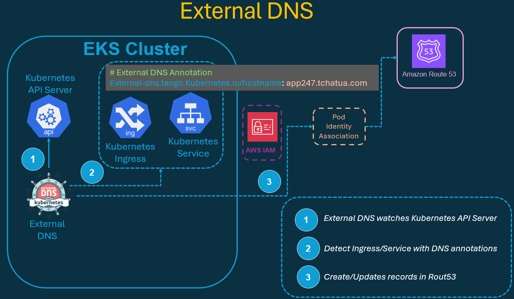
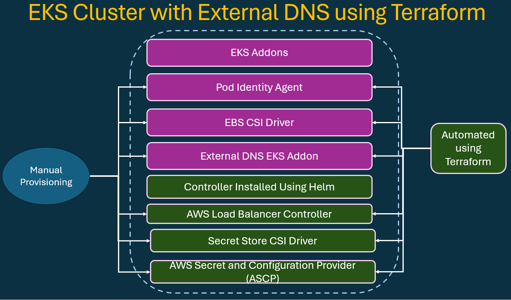
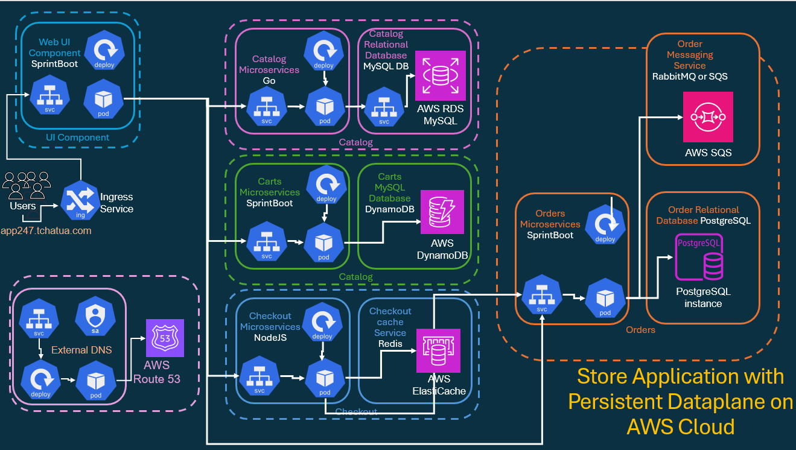
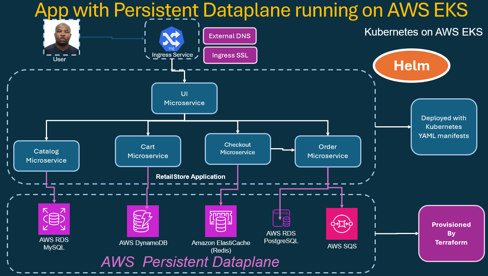
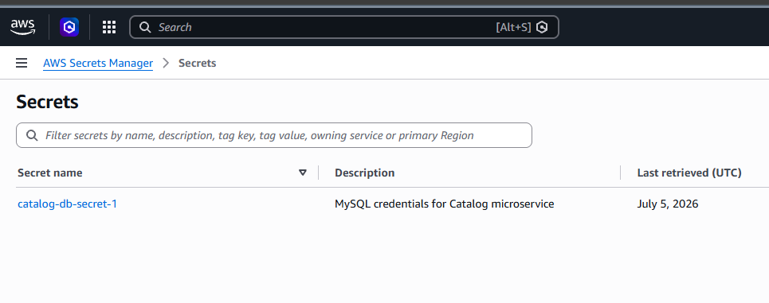

# External DNS - Ingress SSL  - Retail Store Microservices

In this lab, I'm enabling automatic DNS record management for my RetailStore app running on EKS. 
Using ExternalDNS, my cluster will auto-create and auto-update DNS records in Route53 based on Kubernetes Ingress annotations.

> Deploy Ingress → ExternalDNS detects → DNS record created for me.

## Architecture - AWS EKS cluster with External DNS





## ReatailStor Application with Persistent Dataplane and External DNS





## Prerequisites Checks

1. AWS Secret Manager exist:
    
2. AWS Dataplane for RetailStore is already provisioned
```sh
# Outputs:

cart_dynamodb_pod_identity_association_arn = "arn:aws:eks:us-east-2:088354478627:podidentityassociation/south-jersey-eks-tchatua-dev-eks-control-plane/a-d51mxdmstp3ifvgdr"
cart_dynamodb_policy_arn = "arn:aws:iam::088354478627:policy/south-jersey-eks-tchatua-dev-cart-dynamodb-policy"
cart_dynamodb_role_arn = "arn:aws:iam::088354478627:role/south-jersey-eks-tchatua-dev-cart-dynamodb-role"
catalog_rds_endpoint = "mydb3.c7oescqy4eh4.us-east-2.rds.amazonaws.com"
catalog_rds_sg_id = "sg-09d186fd2b7b8963f"
catalog_sa_getsecrets_role_arn = "arn:aws:iam::088354478627:role/south-jersey-eks-tchatua-dev-catalog-getsecrets-role"
catalog_sa_pod_identity_association_arn = "arn:aws:eks:us-east-2:088354478627:podidentityassociation/south-jersey-eks-tchatua-dev-eks-control-plane/a-erz0lghcwwwnmfcum"
checkout_redis_endpoint = "south-jersey-eks-tchatua-dev-checkout-redis.sx505s.0001.use2.cache.amazonaws.com"
debug_app_store_secret_password = <sensitive>
debug_app_store_secret_username = <sensitive>
eks_cluster_id = "south-jersey-eks-tchatua-dev-eks-control-plane"
eks_cluster_name = "south-jersey-eks-tchatua-dev-eks-control-plane"
eks_cluster_security_group_id = "sg-061b4724534104557"
orders_postgresql_sa_getsecrets_role_arn = "arn:aws:iam::088354478627:role/south-jersey-eks-tchatua-dev-orders-postgresql-getsecrets-role"
orders_postgresql_sa_pod_identity_association_arn = "arn:aws:eks:us-east-2:088354478627:podidentityassociation/south-jersey-eks-tchatua-dev-eks-control-plane/a-vrhl4wkn2uuzumthf"
orders_rds_postgresql_db_name = "ordersdb"
orders_rds_postgresql_endpoint = "orders-postgres-db.c7oescqy4eh4.us-east-2.rds.amazonaws.com:5432"
orders_sqs_policy_arn = "arn:aws:iam::088354478627:policy/south-jersey-eks-tchatua-dev-orders-sqs-policy"
orders_sqs_queue_arn = "arn:aws:sqs:us-east-2:088354478627:south-jersey-eks-tchatua-dev-orders-queue"
orders_sqs_queue_url = "https://sqs.us-east-2.amazonaws.com/088354478627/south-jersey-eks-tchatua-dev-orders-queue"

private_subnet_ids = [
  "subnet-098c10f580ef67547",
  "subnet-00eaf2d430c5a24eb",
  "subnet-07effeab5924e4c21",
]
public_subnet_ids = [
  "subnet-0af0cb0b751eb6ddc",
  "subnet-08777d0a05b570f43",
  "subnet-00b575ec34f1e41fc",
]
store_db_secret_policy_arn = "arn:aws:iam::088354478627:policy/south-jersey-eks-tchatua-dev-retailstore-db-secret-policy"

vpc_id = "vpc-094fa6f50355d31b0"

```
3. All microservices are already updated with persistent aws endpoints
    - Catalog:
    - Cart:
    - Checkout:
    - Orders:
4. Own the domain is superimportant. ExternalDNS can only work if:
    - Hosted zone exist in AWS Route53
    - The domain can be registered elsewhere (Goddady, Namecheap) but delegated to Route53

## Update HTTP Ingress with ExternalDNS Annotation

Edit file `g03_ingress/a01_ingress_http_ip_mode.yaml` and add
```yml
# External DNS Annotation
external-dns.alpha.kubernetes.io/hostname: retailstore1.stacksimplify.com
```
This tells ExternalDNS to create a Route53 record for this hostname.

## Enable HTTPS Using ACM Certificate

### Create SSL Certificate (ACM)

- Open AWS Certificate Manager (ACM)
- Request a certificate: retailstore2.tchatua.com
- Validate the DNS entry
- Copy the Certificate ARN

## Update HTTPS Ingress with Certificate ARN

```sh
## SSL Settings
alb.ingress.kubernetes.io/listen-ports: '[{"HTTPS":443}, {"HTTP":80}]'

# Replace below with YOUR ACM Certificate ARN
alb.ingress.kubernetes.io/certificate-arn: arn:aws:acm:us-east-1:180789647333:certificate/60a5bccd-5cb1-426a-b792-4d6d6c459edf

# Force HTTPS
alb.ingress.kubernetes.io/ssl-redirect: '443'

# External DNS Annotation
external-dns.alpha.kubernetes.io/hostname: retailstore2.tchatua.com
```

## Deploy RetailStore App

```sh
# Go to manifests root
cd RetailStore_k8s_manifests_with_Data_Plane

# Deploy SecretProviderClass (MySQL + PostgreSQL secrets)
kubectl apply -f 01_secretproviderclass

# Deploy all microservices
kubectl apply -R -f 02_RetailStore_Microservices

# Deploy both Ingress resources
kubectl apply -f 03_ingress
```

> Outputs

```sh
 kubectl apply -f g01_secretproviderclass/
secretproviderclass.secrets-store.csi.x-k8s.io/catalog-db-secrets created
secretproviderclass.secrets-store.csi.x-k8s.io/orders-db-secrets created

# ---------------------------------------------------------------------------------------------

kubectl get secretproviderclass
NAME                 AGE
catalog-db-secrets   28s
orders-db-secrets    28s

# ---------------------------------------------------------------------------------------------

kubectl apply -R -f g02_RetailStore_Microservices/
serviceaccount/catalog created
configmap/catalog created
deployment.apps/catalog created
service/catalog created
service/catalog-mysql created
serviceaccount/carts created
configmap/carts created
deployment.apps/carts created
service/carts created
serviceaccount/checkout created
configmap/checkout created
deployment.apps/checkout created
service/checkout created
serviceaccount/orders created
configmap/orders created
deployment.apps/orders created
service/orders created
serviceaccount/ui created
configmap/ui created
deployment.apps/ui created
service/ui created

# ---------------------------------------------------------------------------------------------
kubectl get pods,deploy,svc,sa,cm
NAME                            READY   STATUS              RESTARTS      AGE
pod/carts-5d4d59f667-wgcps      1/1     Running             1 (66s ago)   100s
pod/catalog-7b55c467cb-dvsf9    0/1     ContainerCreating   0             100s
pod/checkout-5c78b886b4-fm8sl   1/1     Running             0             100s
pod/orders-6c8cf86fc7-s9q27     0/1     ContainerCreating   0             99s
pod/ui-7d45fc58bf-62sdh         1/1     Running             0             99s

NAME                       READY   UP-TO-DATE   AVAILABLE   AGE
deployment.apps/carts      1/1     1            1           100s
deployment.apps/catalog    0/1     1            0           100s
deployment.apps/checkout   1/1     1            1           100s
deployment.apps/orders     0/1     1            0           99s
deployment.apps/ui         1/1     1            1           99s

NAME                    TYPE           CLUSTER-IP       EXTERNAL-IP                                      PORT(S)    AGE
service/carts           ClusterIP      172.20.60.65     <none>                                           80/TCP     100s
service/catalog         ClusterIP      172.20.240.147   <none>                                           80/TCP     100s
service/catalog-mysql   ExternalName   <none>           mydb3.c7oescqy4eh4.us-east-2.rds.amazonaws.com   3306/TCP   100s
service/checkout        ClusterIP      172.20.141.186   <none>                                           80/TCP     100s
service/kubernetes      ClusterIP      172.20.0.1       <none>                                           443/TCP    3h18m
service/orders          ClusterIP      172.20.89.151    <none>                                           80/TCP     99s
service/ui              ClusterIP      172.20.17.22     <none>                                           80/TCP     99s

NAME                      SECRETS   AGE
serviceaccount/carts      0         100s
serviceaccount/catalog    0         101s
serviceaccount/checkout   0         100s
serviceaccount/default    0         3h18m
serviceaccount/orders     0         100s
serviceaccount/ui         0         99s

NAME                         DATA   AGE
configmap/carts              6      100s
configmap/catalog            3      100s
configmap/checkout           3      100s
configmap/kube-root-ca.crt   1      3h18m
configmap/orders             5      99s
configmap/ui                 4      99s

# ---------------------------------------------------------------------------------------------

kubectl get secret
No resources found in default namespace.

# ---------------------------------------------------------------------------------------------

kubectl apply -f g03_ingress/a01_ingress_http_ip_mode.yaml
ingress.networking.k8s.io/retail-store-http-ip-mode created

# ---------------------------------------------------------------------------------------------

# ---------------------------------------------------------------------------------------------

# ---------------------------------------------------------------------------------------------

# ---------------------------------------------------------------------------------------------

```

