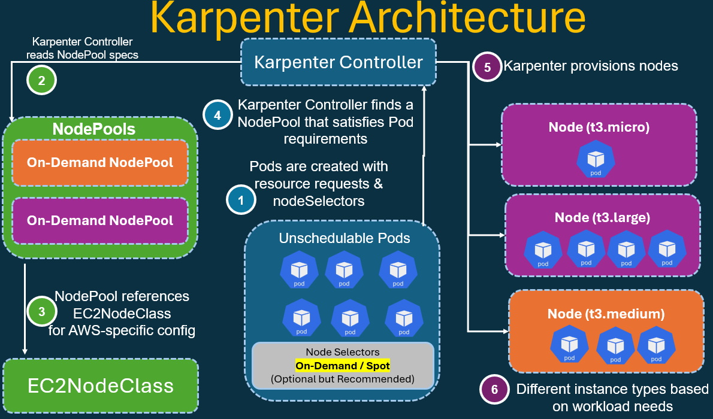

# Karpenter on AWS EKS

I'm installing and configure Karpenter a **Kubernetes cluster autoscaler designed for AWS EKS**. 
Karpenter automatically **provisions and manages EC2 instances based on pod scheduling requirements**, 
offering **faster scaling**, **better bin-packing**, and **cost optimization** compared to traditional Cluster Autoscaler.

## About Karpenter

Karpenter is an open-source, flexible, high-performance Kubernetes cluster autoscaler that:

- Provisions nodes in seconds, not minutes
- Automatically selects optimal instance types based on Pod requirements
- Supports **Spot instances** with graceful interruption handling
- Consolidates nodes to reduce costs when capacity is underutilized
- Eliminates the need for managing Auto Scaling Groups (ASGs)

## Karpenter Architecture Diagram




## Karpenter All Project Files

```sh
b01_VPC_Module/
├── a01_01_Settings_Backend.tf
├── a01_02_Providers.tf
├── a02_Global_Variables.tf
├── a03_01_VPC.tf
├── a03_02_VPC_Variables.tf
├── a03_03_VPC_Outputs.tf
├── terraform.tfvars
│
└── b01_module/
    └── a01_vpc/
        ├── a01_Datasources.tf
        ├── a02_02_VPC_Variables.tf
        ├── a02_03_VPC_Locals.tf
        ├── a02_04_VPC_Outputs.tf
        ├── a03_Global_Variables.tf
        ├── main.tf
        └── terraform.tfvars
b02_EKS_Cluster_Addons_ExternalDNS/
├── a01_01_Settings_Backend.tf
├── a01_02_Providers.tf
├── a02_01_Global_Variables.tf
├── a02_02_Global_Locals.tf
├── a03_01_Remote_State.tf
├── a04_01_AWS_EC2_Tag.tf
├── a05_EKS_IAM_Role.tf
├── a06_02_EKS_Cluster_Variables.tf
├── a07_EKS_Cluster.tf
├── a08_EKS_NodeGroup_IAM_Role.tf
├── a09_01_EKS_NodeGroup_Private.tf
├── a09_02_EKS_NodeGroup_Private_Variables.tf
├── a10_EKS_Outputs.tf
│
├── b01_01_Data_EKS_Addon.tf
├── b01_02_EKS_Addon.tf
├── b01_03_EKS_Addon_Outputs.tf
├── b02_01_Data_EKS_Cluster_Auth.tf
│
├── b03_01_Pod_Identity_Assume_Role.tf
│
├── b04_01_LBC_IAM_Policy_Datasource.tf
├── b04_02_LBC_IAM_Policy_Datasource_Outputs.tf
├── b04_03_LBC_IAM_Policy_and_IAM_Role.tf
├── b04_04_LBC_IAM_Policy_and_IAM_Role_Outputs.tf
├── b04_05_LBC_EKS_Pod_Identity_Association.tf
├── b04_06_LBC_Helm_Install.tf
│
├── b05_01_EBS_CSI_IAM_Policy_and_Role.tf
├── b05_02_EBS_CSI_EKS_Pod_Identity_Association.tf
├── b05_03_EBS_CSI_EKS_Addon.tf
│
├── b06_01_Secret_Store_CSI_Helm_Install.tf
├── b06_02_Secret_Store_CSI_ASCP_Helm_Install.tf
│
├── c01_ExternalDNS_IAM_Policy_and_Role.tf
├── c02_ExternalDNS_Pod_Identity_Association.tf
└── c03_ExternalDNS_EKS_Addon.tf

b03_Patch_Public_Subnet/
└── sh03_patch_public_subnet.sh

```

## Use Terraform to build Karpenter Controller on EKS Cluster


